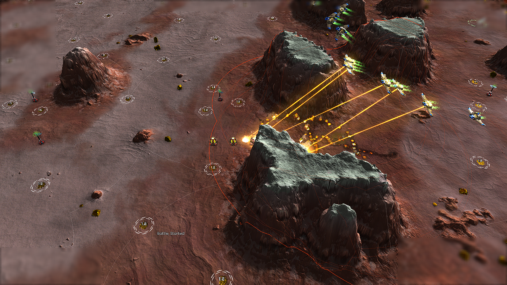

# Bomber cleanup verification (D-173)

Experimental AIR now continues attacking lower-priority targets after its
strategic targets disappear. On Glitters, the baseline killed the advanced
converter but left all three energy stores alive. The repaired Phoenix,
Armada and Cortex waves killed the converter, selected the stores explicitly,
destroyed all three, and continued to enemy radars.

The reported landing itself was **not reproduced**. Both baseline and repaired
launched cohorts had `autoland=0` and no observed `landing`/`landed` state.
This fixes confirmed target starvation; it does not establish the cause of
the owner's exact late-game landing incident. A replay or command-state
capture from that incident would distinguish an older deployed DLL, task
handoff, manual orders, or a separate flight-state defect. These are possible
investigation paths, not diagnosed causes.

## Policy and scope

The script supplies native target classes in priority order. T2 primary targets
remain AFUS, advanced converters and factories; T1 primaries remain mex/wind.
The previous armed-static fallback is retained, followed by other economy and
support buildings, approved heavy ground units and remaining structures.
`StrikeCleanupMobile` defaults to false, preserving the owner's earlier ban on
T2 attacks against T1 ground units. Enabling it admits remaining surface mobile
units only as the last tier. Aircraft and deeply submerged contacts are excluded.

Launch admission and surviving operations share the same picker. Fallback tiers
exclude the primary class, so a strategic target rejected for route risk or the
opening draw cannot be retried under looser fallback rules. Remembered hidden
contacts cannot trap a wave in repeated target/search transitions. With no known
attackable target, survivors continue airborne reconnaissance. Flight commands
were already set to fly on operation entry; no periodic flight-order spam was added.

An unlaunched wave waits when a known nearby T3 requires more bombers than are
available. It cannot spend that incomplete defensive force on cheap radar cleanup.
Already committed offensive waves retain their fighters and do not return.
Defensive sorties still return after their target dies.

TECH, legacy wave policy, constructor/economy code and shared UnitDef
classifications are unchanged. The picker adds a bounded number of target scans,
not per-aircraft polling or recurring orders. The existing nested candidate/AA
scan cost remains [KI-474](known-issues.md); no FPS improvement is claimed.

## Rendered combat tests

All runs supplied aircraft and energy, froze construction/production, and used
real damage/death events and engine flight-state observations. These are combat
regressions, not natural economy benchmarks or a replay of the original match.
Engine: `recoil_2026.07.04`; game: `Beyond All Reason test-31479-433a460`.
Final DLL SHA-256: `411a8924354ef767dd49a8999d8b487fcbe668682d87169766bd4e2ca5dfb65a`.

| Case | Result |
| --- | --- |
| Old DLL, Phoenix, Glitters, ten minutes | Behavior failure: converter destroyed, three stores survive; no observed landing. Generic fixture checks pass, which is not behavior acceptance. |
| Final DLL, Phoenix, Glitters, ten minutes | PASS: converter dies at 2:09; explicit store selection three frames later; all three stores destroyed. No observed landing. |
| Final DLL, Armada, Glitters, ten minutes | PASS: explicit lower-priority targeting and all three stores destroyed. No observed landing. |
| Final DLL, Cortex, Glitters, ten minutes | PASS: converter dies at 2:38; explicit store selection three frames later; all three stores destroyed. No observed landing. |
| Final DLL, defensive Phoenix, Supreme, eight minutes | PASS: attacks Shiva at 1:37, actual damage at 1:42, defensive return completes at 1:58. A separate offensive cleanup wave follows. |
| Final order, cleanup-only Phoenix, Glitters, eight minutes | PASS under radar visibility: launches against a store with no strategic targets present, destroys all three stores and ten radars. |
| Final order, blocked backline, Supreme, ten minutes | PASS: 65-bomber frontline wave chosen; actual artillery damage at 2:07, all four front artillery destroyed across two waves. This verifies admission and commitment, not raid efficiency. |

The three Glitters faction cases and defensive case precede the final script-only
reordering that retains armed static ahead of utility buildings. Their fixtures
have no armed structures, so that reorder does not change candidate priority in
those cases. The final-order blocked-route and cleanup-only cases exercise that
distinction separately. Exact run paths, source/manifest hashes, casualties,
selected targets and flight samples are in the [evidence](benchmarks/d173-bomber-cleanup.json).

At frame 3914, the converter has died and Phoenixes are attacking the energy
stores. The camera is positioned from the actual damaged unit, not a reconstructed
diagram. Cortex's [cleanup screenshot](images/d173/cortex-cleanup.png) records the
equivalent conventional bombing pass.

## Failed checks retained

The first repaired Phoenix run failed an overly strict check requiring the first
store damage to follow converter death. Collateral heatray damage occurred six
frames earlier; explicit store selection followed converter death and all three
stores died. The check now requires that explicit post-death selection plus real
damage and destruction. The failed report is retained in the evidence.

Early defensive fixtures also failed: a 90-second incursion arrived after a radar
cleanup launch; moving it to 30 seconds let the enemy-controlled Shiva fight and
move before the supplied aircraft were ready. The final case spawns the incursion
alongside aircraft at 60 seconds and verifies the actual defensive operation.
Neither failed setup is presented as a passing defensive test. The extra admission
guard preserves accumulation while the known nearby target's payload is unmet.

The optional all-mobile cleanup tier has unit coverage but no combat acceptance
run. No save/load, exhausted-map fog search, damaged-aircraft repair, large-scale
FPS guarantee or natural late-game victory is claimed here.

The defensive observer recorded five landed aircraft during their permitted
return/home phase. No final run logged an active-wave landing invariant. A
collateral T1 tank kill in an earlier Cortex run is not evidence of deliberate
T1 targeting; the default target filter still excludes it.

## Checks and delivery

The full native/policy suite passed, including 300 formation slots, target-class
exclusions and 282 AngelScript policy checks. All three experimental profiles
compiled; the standalone compiler's eight template-callback warnings are existing
interface-stub warnings. Runtime profiles were also loaded in BAR. Nineteen arena
and attribution tests passed. Script/DLL parity checks cover 276 used members.
Invariant and role-reference checks pass; whitespace checks pass. The documentation
link check still reports the eight pre-existing links to missing `roles/hover.md`
(KI-404), with no new broken links.

The matched stripped DLL, debug symbols and AIR data are published to the required
Recoil build-output `AI/Skirmish/BARb/stable` directory. The live BAR installation
was not modified. Concurrent map edits were excluded from the pinned test data and
this change.

Reproduce with `tools/playtest/air_arena.py run --case cleanup-glitters --map
"All That Glitters v2.2.3" --side legion --seed 1731 --minutes 10`, supplying the
matching DLL and optional pinned `--data`. `cleanup-only-glitters` verifies
admission without a strategic target; `defensive-t3` and `blocked-backline` run on
Supreme Isthmus. See the [plan](air-bomber-cleanup-plan.md) for source references.
