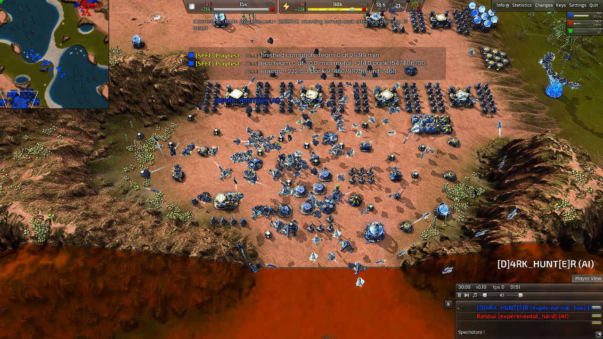
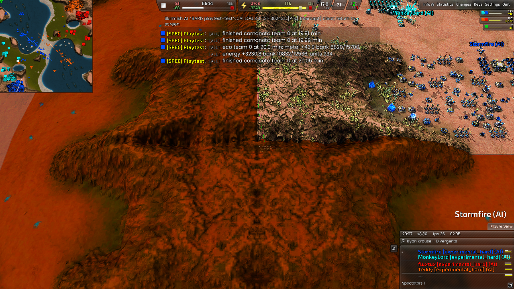
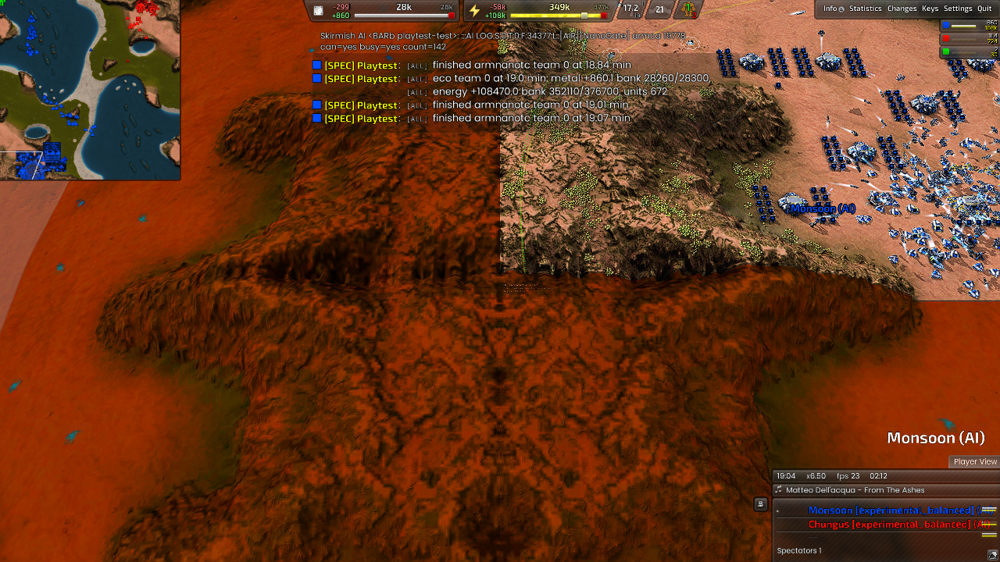
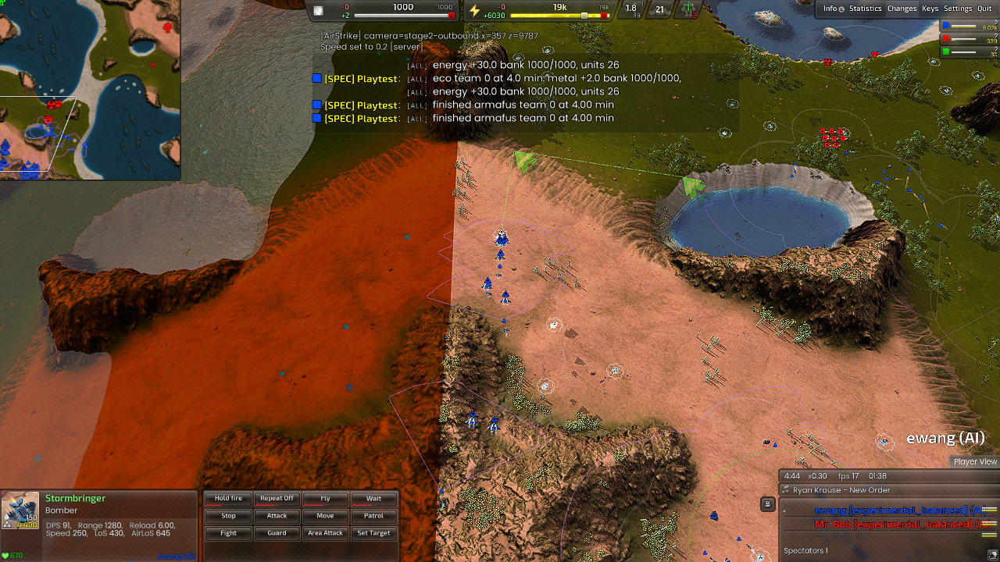
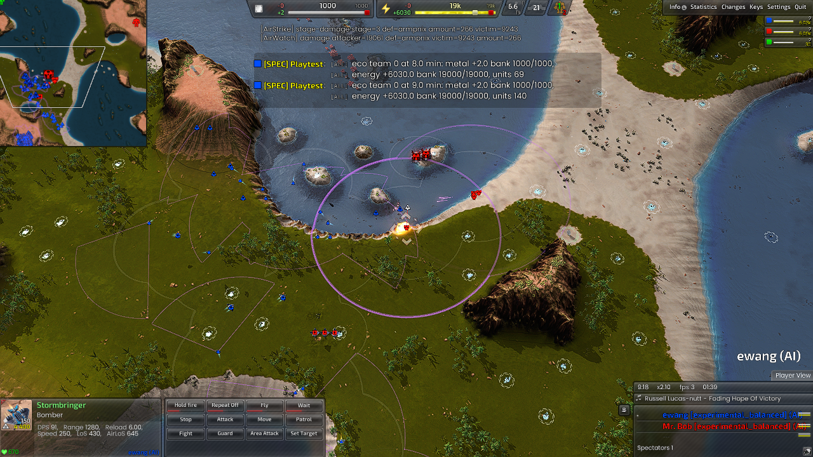

# AIR campus and strike verification (D-163)

2026-10-02. Implements the [reviewed design](air-campus-strike-design.md) on
baseline `d7f55eea`. The owner-selected two-AFUS strategy is implemented; these
tests do not establish optimal PvP play or an unbeatable AI.

## What changed

- Footprint-based dense factory/support blocks, at least six speculative T2
  blocks and one T1, incremental expansion with no default numerical cap.
  Experimental AIR lifts its profile factory caps and restores them on exit.
  Existing labs still need twenty completed, uniquely assigned turrets before
  another T2 lab. An engine-rejected support pin gets a replacement within reach.
- A saved ten-second minimum of +50 metal activates the shared TECH economy
  chooser with AIR inputs and placement. Two completed AFUS unlock mass bomber
  orders. TECH's role/rush/reclaim sequence is unchanged. The AIR growth objective
  persists through income dips; recovery and owned-mex upgrades take priority.
- The first T2 wave is one saved configurable inclusive draw (default 10-20).
  Later sorties use loaded target health/pass damage, padded route risk, local
  AA investment, observed army investment and unknown-threat reserve. Funded
  replacement stock is separate from the number committed to a target.
- Direct and edge ingress routes are executed. Static attacks use nominal
  synchronized impact timing within one AI's cohort. Return navigation latches
  each aircraft's waypoint arrivals instead of requiring simultaneous arrival.
  T1 reusable bombers select mexes and wind clusters.

## Evidence and limits

All directories below are under repository `build-theatres/`. The retained
reports and logs remain authoritative; failed reports have not been edited.
Final native artifact: `d163-build-6/SkirmishAI.dll`, SHA-256
`ace9d657b26093f0e89e82676790e8d39159c68491e5b64f90b19fb917997352`,
7,678,649 bytes, with matching `.dll.dbg`. Build 5 below is
`dbc193f560051ddb06c72a574c91025907cb91c76916137727ec811522be2eaa`.

| Run | Conditions | Observations and verdict |
| --- | --- | --- |
| `d163-natural` / `20261002-010241` | Natural Armada AIR versus AIR, 50 minutes, no gifts | **FAIL**: no T2 access or first fusion. Continuous T1 spending did not reserve a self-funded transition. Recorded as KI-461; this is not a two-AFUS timing benchmark. |
| `d163-growth-v3` / `20261002-012821` | Armada, seed 1633; T2 builders/ordinary reactor income supplied at six minutes, zero AFUS supplied | Self-built AFUS at 13.70 and 16.00 minutes; first saved wave 13 at 18.70. Bounded 34-minute growth checks passed. Fifth lab stopped at nineteen turrets after a failed pin; this motivated support repair. |
| `d163-growth-v5` / `20261002-015231` | Cortex/hard, seed 1633; same zero-AFUS bootstrap | AFUS at 12.96 and 17.69; mass production at 17.70. Six completed T2 labs at 29.61, earlier labs each supported by twenty finished turrets. Stopped at 30.1 of 40 intended minutes. **FAIL**, including an idle-commander observer violation. Its initially Armada-only AFUS check was corrected to accept each faction in subsequent runs. |
| `d163-strike-v5` / `20261002-014342` | Armada/balanced, seed 1631, 20 minutes; supplied units, two own AFUS, global LOS, construction frozen | **PASS** three-stage combat checks, no script/invariant/crash lines. T1 selected wind then mex. Opening T2 draw/release 10, later releases 15/16/34 based on targets and resistance. All logged returns reached home. Details below. |
| `d163-team` / `20261002-013609` | Natural four-AI AIR/TECH, 45 minutes | **FAIL**: first Cortex fusion at 24.72; later growth stalled. Real ferry deliveries occurred. Existing TECH invariants were retained. Diagnosed unbounded fallback guard occupancy and gaps in the reactor search. |
| `d163-team-v6` / `20261002-015344` | Natural Cortex/hard AIR with TECH, seed 1634, 35 minutes | **FAIL** strict 20-minute first-fusion deadline: first reactor started at 18.98 after all owned mex upgrades and finished at 21.21. Subsequent fusions at 25.40/28.89; first AFUS ordered at 28.89, unfinished at stop. Opposing Legion AIR launched a saved opening of 19. TECH invariant failures remain visible. |
| `d163-team-final` / `20261002-021241` | Natural Cortex/hard AIR with TECH, seed 1634, build 5, 40 minutes | First fusion **18.47**, after zero basic/unfinished mexes; AFUS **23.90/26.73**, immediate mass production. Saved opening 13 at 29.20. **FAIL** combined report: T2 lab deadline and TECH invariants. AIR logged no invariants. First two raids were wiped out at the same defended target; this motivated the feedback/exclusion correction. |
| `d163-support-repeat` / `20261002-021308` | Armada/balanced, seed 1636, supplied capacity economy, physical wall blocker, build 5, 20 minutes | **PASS**, no script/invariant/probe failures. Twenty completed support turrets after replacement, original lab retained, six-plus labs built. Earlier `d163-support-final` retained a FAIL because its observer accepted only a dead pin, not the engine's removed pin; the repeated check verifies both replacement and actual blocked ground. |
| `d163-strike-feedback` / `20261002-022342` | Final build 6, Armada/balanced, supplied-force three-stage combat, seed 1631, 20 minutes | **PASS** combat checks and independent feedback audit. Opening 10; later 15/16/48. All logged returns reached home; three later missions respected an active failed-region exclusion. |
| `d163-team-feedback` / `20261002-022726` | Final build 6, natural Cortex/hard AIR with TECH, seed 1634, 42 minutes | **FAIL** strict deadlines and existing TECH/ferry invariants. Cortex fusion 21.48, AFUS 27.62/33.01, immediate mass gate, opening 11 at 35.58. Its first cohort was lost; AIR increased resistance and held subsequent raids rather than repeat that target within the test. Opposing Legion AIR exercised alternate targets during active exclusions. No AIR-owned invariant failures or script errors. |

The Cortex natural repeat showed why full home mobility matters: a reactor can
be outside the old 1,800-elmo assist search while still inside AIR's home area.
Final `AirGrowth::AssistReactor` lets flying workers cross that whole home disc;
the target still must be in the home area, and ground constructors retain their
ordinary travel bound. The following natural run measured the first fusion
at 18:28 and both AFUS at 23:54/26:44. This one seed meets the first-fusion
deadline; it does not establish reliable timing across maps or self-funded T2.

The dense Cortex campus at thirty minutes:

Natural twenty-minute base and the supplied obstruction/capacity repeat:

## Combat outcomes

In the final twenty-minute supplied-force Armada test:

| Package | Outcome |
| --- | --- |
| T1 five-bomber raids | Selected `armwin`, then `armmex`; both logged five survivors reaching home. |
| Opening T2 ten bombers | Edge route to solar economy; nine returned home. |
| Fifteen bombers | Fusion target; nine returned home. |
| Synchronized sixteen bombers | Flak target destroyed at frame 16786; eight returned home. The nominal impact frame was also 16786, but this one event does not prove every bomber arrived simultaneously. |
| Thirty-four bombers | Two AFUS destroyed at frame 20090; eleven returned home. High-value result with heavy losses, not evidence of low attrition. |

Local-AA reserve fixed an earlier underfunded eight-bomber flak attack, and
latched return progress fixed earlier 150-second return timeouts. Corridor
scoring remains a threat-map proxy. Loss/value calibration, dynamic AA movement,
specialist payloads and coordinated attacks across multiple AI owners remain
bounded by KI-457. Global-LOS fixtures prove capability, not fog-of-war win rate.

Build 6 adds loss feedback after the natural run's two complete wipeouts at
the same advanced solar. A repeated Armada fixture exercised the correction:
the sixteen-bomber flak attack killed its target but returned only two aircraft,
so AIR recorded a five-minute 640-elmo exclusion and raised resistance to 1.5.
The next mission selected a different AFUS position with 48 bombers, killed both
AFUS and returned seventeen. A later eight-bomber sortie returned all eight,
relaxing resistance from 2.25 to 2.025. This verifies adaptation and alternate
target selection; the high losses still need cost/egress calibration.
The [retained feedback audit](benchmarks/air-d163-feedback.json) records the
observed multipliers, region expiry, later missions and its focused PASS.
The [natural Legion-side audit](benchmarks/air-d163-natural-feedback.json)
also records exclusion-respecting alternate missions. Those raids still suffered
heavy losses. Learned resistance avoids one repeated-failure pattern; it has not
solved interception, egress or value-based raid economics.

## TECH regression and checks

The natural forty-minute run also exposes remaining late-game resource waste:
in ten-second samples, metal was at least 95% full for 750 of 910 observed
seconds after minute 25, despite completing four additional T2 labs, eighty
turrets and twenty flying constructors during that window. Mean metal income
was 160.41/s. It recorded no energy-stall seconds during that window. Growth is
active, but this is not optimal spending; production/campus critical-path
calibration remains acceptance work. Raw early/mid/late summaries are retained
in [the measurement file](benchmarks/air-d163.json).
This extends the existing KI-442 overflow evidence; nominal income omits allied
transfers, so bank occupancy alone is not a measured production efficiency ratio.

Paired TECH-only games used baseline `d7f55eea` data and DLL `8b78442dc6c269b8`,
versus current data and DLL `dbc193f560051ddb`, both engine/AI seed 1635 and
Armada/balanced on Supreme. Both reached twelve minutes, built a T1 lab then a
T2 lab, and had no script errors. Team 0 logged no invariants; current team 1
logged the existing INV-021 mex-before-fusion failure at frame 21842. First T1 completion was
1.19 versus 1.18 minutes; T2 was 5.94 versus 5.80. These runs are not frame-identical.
Both inherited `smoke.json` reports remain **FAIL** because its historical
`opening.mex` marker was absent and screenshots were disabled for this headless
comparison. This provides bounded behavior evidence, not a full TECH PASS.
Retained reports: `d163-tech-before/runs/20261002-015451` and
`d163-tech-after/runs/20261002-015451`.

The native suite passed: layout ranking, base geometry, lanes, strategic
targeting, terrain routes, air formations/mission budgets, and the AngelScript
policy suites (128 production, 20 placement, 19 amphibious, 48 AIR cases).
Existing unit-helper sonar findings (KI-425) and missing hover-document links
(KI-404) are unrelated pre-existing checks, not waived successes.

## Remaining acceptance work

First fusion by twenty minutes is not consistently achieved in natural games
(KI-461). The shared planner and bomber gates should not be described as an
optimal economy. Preserve TECH's existing invariants while investigating their
separate failures. Aircraft return and target selection now have rendered
evidence, but a supplied scenario cannot establish competitive 8v8 superiority.
