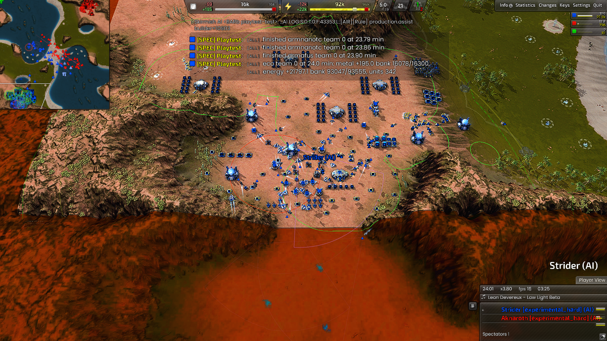
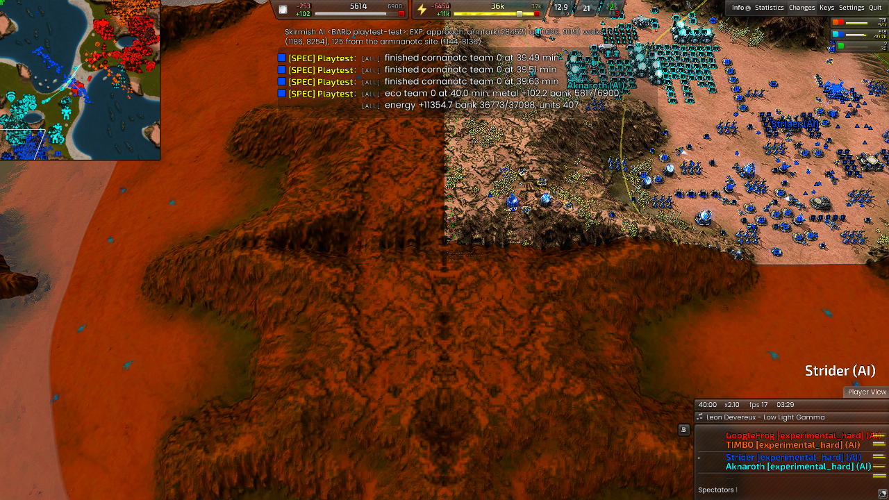

# AIR economic workers and districts: verification (D-164)

2026-10-02, baseline `7be0888c`. Implements the
[design and simulation revisions](air-economy-zone-plan.md).

## Behavior

Advanced aircraft constructors no longer take fallback factory production
guards. A reconciliation pass moves each such worker from an existing builder
guard to a one-second recheck; the guard continues for any remaining workers.
Real construction and useful repair assistance remain valid work. The shared
TECH economic chooser is unchanged. After the two-AFUS milestone, overflowing
metal can fund one additional AFUS after accounting for existing construction
and reserving the production share of projected income. This is an admission
estimate, not a guaranteed split enforced by the engine resource scheduler.
AIR also overrides the shared chooser's generic energy-in-progress flag with
actual owned reactor commitments. Leftover T1 wind/solar orders cannot block
new reactors; queued/unfinished reactors still serialize growth (INV-108).

AIR now reserves its starter, six T2 factory/support modules and four advanced
economy modules during the opening. Each economy module has one AFUS pin and
eight converter pins; capacity is not a required construction ratio. The
district expands one unused module ahead. Its enclosing native zones protect
it from other AIR buildings and allied layouts. District edges can connect;
the 384-elmo reactor/factory separation is not explosion-proofing. Before first
use, physical blockage relocates a whole unused module. Occupied modules stay
fixed. A fine reactor search and a half-pitch factory fallback fit remaining
terrain without moving existing structures or ignoring allied reservations.

New AIR settings: `PlannedEcoModules=4`, `EcoFactorySeparation=384`,
`EcoReactorSpacing=512`, `EcoConverterClearance=128`,
`OverflowGrowthSeconds=180`. `ProductionIncomeShare` remains 0.65. The twenty
completed turrets per existing T2 lab gate, owned-mex reactor prerequisite,
transport priority and TECH's exact rule/reclaim sequence are retained.

## Test evidence

All runs use Recoil `recoil_2026.07.04`, game
`Beyond All Reason test-31479-433a460`, Supreme Isthmus v1.7,
experimental_hard and the unchanged stripped native build:
`ace9d657b26093f0e89e82676790e8d39159c68491e5b64f90b19fb917997352`
(7,678,649 bytes). Script and matching DLL/symbols were published to the
mandatory build output; the live BAR installation was untouched.

| Run | Conditions | Findings |
| --- | --- | --- |
| `d164-economy2` / `20261002-025256` | Armada, seed 1002164; two T2 constructors and ordinary reactor/converter bootstrap at six minutes; **zero AFUS supplied**; 25 minutes | **PASS**, no script/invariant/probe failures. Verified a real injected guard, release in 30 frames, physical first-use relocation, and subsequent advanced converter work by that same constructor. Five self-built AFUS completed at 13.94/16.27/18.78/21.79/24.61, five T2 labs, nine new completed advanced converters plus one ordered, 98 T2 fighters and 62 T2 bombers. Maximum 24 T2 constructors working advanced economy; zero guards in 150 periodic samples. This used the initial two-module spacing, before crowded-team refinements. |
| `d164-natural` / `20261002-025907` | Natural Cortex AIR with Armada TECH, opposing Cortex TECH/Legion AIR; seed 1002164; stopped at 38 minutes | **FAIL**. Four planned T2 bays, two AFUS followed by spatial starvation. Fusion 22.13, AFUS 25.74/28.33. No T2 factory guards; this still left economic workers waiting. Motivated compact spacing, four early economy modules and earlier campus reservation. Existing TECH/ferry invariants retained. |
| `d164-capacity` / `20261002-030131` | Supplied capacity economy, Armada seed 1002165; 20 minutes | **PASS**, no invariant failures. Saved module IDs/zones read back unchanged. T2 guard release retained the T1 peer on the same task. Blocked module relocated and recovered T2 resumed AFUS work. Six completed T2 labs by 15.9 minutes. Initial spacing; followed by a final-configuration repeat. |

| Run | Conditions | Findings |
| --- | --- | --- |
| `d164-capacity-final` / `20261002-030757` | Supplied large economy; seed 1002165; 20 minutes; compact four-module layout, before the immediate-opening and reactor-queue corrections | **PASS**. Guard release in one second preserved the T1 peer; named-state adoption and physical relocation passed. Recovered worker ordered AFUS at 4.82 minutes. Six T2 labs completed by 18.22; five additional AFUS completed after the 36 supplied ones. Produced 187 T2 fighters, 109 T2 bombers and 24 T2 constructors. The deliberately excessive supplied income filled storage in 117/121 samples; this is capacity evidence, not a balanced natural economy. |
| `d164-opening-final` / `20261002-031753` | Natural four-team roster; seed 1002164; 42 minutes; immediate campus reservation, before the reactor-queue correction | **FAIL**. Opening capacity passed, but unfinished T1 energy orders held the generic `energyBuilding` flag true with no reactor underway. First fusion 26.46; no AFUS. Zero T2 guard samples, but AIR commander INV-081 and TECH/ferry failures occurred. Motivated the AIR-only reactor-commitment override. |
| `d164-regression-final` / `20261002-032552` | Final scripts; Armada growth bootstrap; seed 1002164; 25 minutes; zero AFUS supplied | **PASS**, no script/invariant/probe failures. Four economic modules and seven factory bays reserved at 12 seconds. Actual injected T2 guard released in 30 frames; T1 peer retained the shared guard. Native named-state adoption passed. Physical obstruction relocated the unused module at 7.92 minutes and the recovered worker resumed advanced converter work. Five self-built AFUS completed at 14.37/16.63/19.00/21.47/23.90; five T2 labs, four new advanced converters, 96 T2 fighters and 46 T2 bombers completed. Maximum 24 advanced economy workers; zero guards in 151 samples. |
| `d164-reactor-final` / `20261002-033037` | Final scripts; natural Cortex AIR/Armada TECH versus Cortex TECH/Legion AIR; seed 1002164; 42 minutes; observer injects no units, resources or orders | **Overall FAIL** from unsuppressed TECH/ferry invariants. Both AIR teams logged no invariants; no script or observer failures. Opening reservations passed at 12 seconds. Team 0 completed first fusion at 27.89, AFUS at 32.89/37.54, and ordered a third AFUS at 41.15 minutes. Three T2 labs, seven advanced converters, 24 T2 constructors, 27 T2 fighters and 25 T2 bombers completed. Maximum 20 advanced economy workers; zero factory guards in 252 samples. Metal was at least 95% full in 63/103 samples from minute 25 onward. The twenty-minute fusion target and consistent income absorption remain unresolved. |

The earliest diagnostic launch failed on a const mismatch in the test observer,
which was corrected. The first coarse-search capacity attempt also exposed
incomplete relocation and an invalid immediate guard-injection observation;
neither is counted as a passing regression. The corrected test requires the
worker actually to own the injected guard before measuring release.

## Checks and limits

The engine-free AIR suite passes 61 cases, including eight new economic funding
boundaries and five reactor-commitment cases. The complete required
`tools/run_native_tests.sh` also passes: layout, lanes, strategic targeting,
terrain routing, air geometry and all four policy suites (128/20/19/61 cases).
Its pre-existing structured-binding copy warning is in unchanged
`base_layout_geometry_test.cpp`. Actual rendered launches compile the shared AngelScript graph;
API parity passes all 268 used members. Role-document and invariant checks pass.
No TECH role/controller or shared chooser implementation
changes are part of this patch.

Named-state adoption exercises the script reconstruction path, not a complete
engine save/load round trip. Terrain remains finite; reservations and the
configured home boundary can still limit expansion. Metal overflow (KI-442)
and reliable twenty-minute first fusion (KI-461) are separate performance
questions, measured rather than assumed fixed by removing guards. Existing
TECH/ferry failures are not suppressed. The repository's eight missing hover
documentation links (KI-404) and two unreachable sonar helper IDs (KI-425)
remain unrelated validation findings.

The final controlled launch emitted a nonfatal load-thread watchdog/graphics
stack before initialization, then ran the entire regression with no runtime
failure (existing KI-458). The capacity and natural samples are different
workloads; the results do not establish a PvP win-rate or optimal resource
allocation. Completed structures are distinguished from orders and supplied
bootstrap assets throughout. `overflow_reactors` in the audit counts matching
throttled policy log entries, not every completed reactor.

Measurements: [early growth regression](benchmarks/air-d164-regression.json),
[capacity](benchmarks/air-d164-capacity.json),
[reactor queue blocker](benchmarks/air-d164-queue-blocker.json),
[final growth regression](benchmarks/air-d164-final-regression.json),
[final natural game](benchmarks/air-d164-final-natural.json).

## Screenshots

Final controlled growth at 24 minutes: separate factory/turret and advanced
economy modules, with the fifth self-built AFUS just completed. Ordinary
reactors and the initial eight converters were supplied by the fixture.

Final natural game at 40 minutes: the third T2 lab is nearing completion;
two AFUS have completed and the advanced aircraft workforce is scaling the
economic district. The cyan TECH ally remains adjacent.

Earlier iteration evidence: [initial growth at 24 minutes](images/d164/growth-24min.png)
and [capacity fixture at 19 minutes](images/d164/capacity-19min.png).
