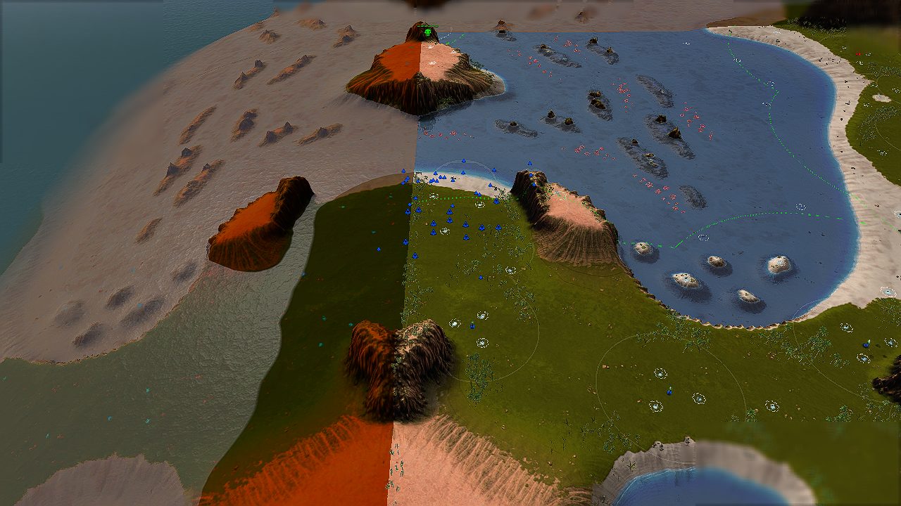
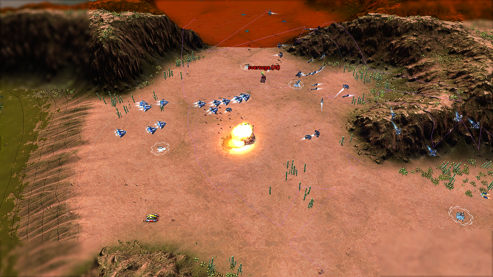
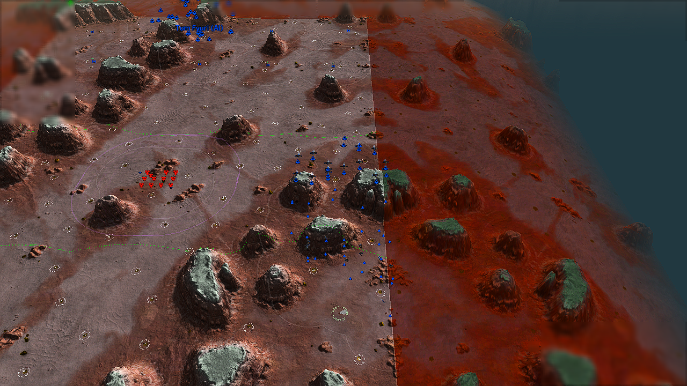
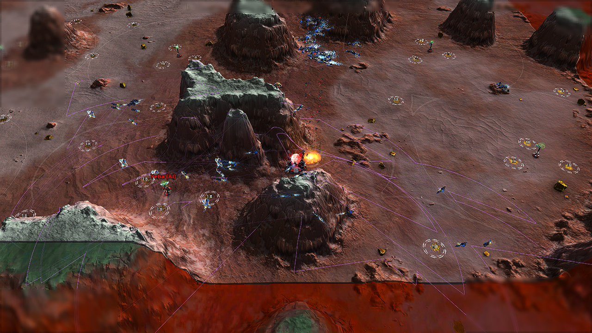
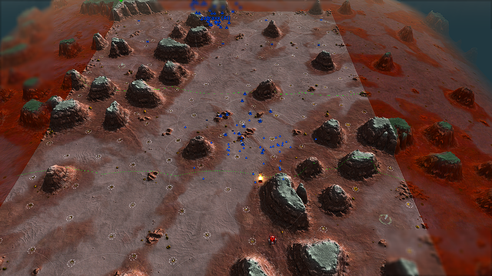

# Edge and flank verification after D-176

Requested verification only: keep deployed gameplay policy unchanged. Use the
published D-176 DLL and its pinned data, excluding concurrent map edits.

## Checks to perform

The experimental operation path still compares direct and four edge routes
in `CAirWaveTask::PlanIngress`, sampling padded AA exposure. `PrepareOperationRoute`
retains intermediate edge waypoints. D-176 replaces only the final travel leg
with ATTACK, or interrupts for an already local, visible priority target.
Legacy random FLANK/PINCER mode names are separate from these risk-selected
experimental flanks; a STRIKE log does not imply a direct flight path.

Run supplied-force rendered combat cases with a dangerous direct corridor and
an open flank. Measure actual bomber positions, crossing points around the AA,
target attack/damage/destruction and escort ownership. A `route=edge` planning
message alone is insufficient. Include a distant visible AFUS to ensure the
new acquisition rule does not prematurely abandon the route. Exercise more
than one map/faction and compare an unobstructed control or the prior binary
where useful. Preserve screenshots during the games and save the evidence.

All changes in this verification are test fixtures, read-only observers or
documentation. Do not retune route weights, threat limits or combat behavior
merely to make a fixture pass. Document any limitations or unexpected results.

## Result: edge attacks still work

Played on 2026-10-03 with the unchanged D-176 production DLL. Armada flew the
western edge on Supreme; Cortex flew the eastern edge on Glitters. Both first
waves reached and destroyed the backline AFUS, then attacked the converter.
The AFUS handoff did not pull either wave through the central AA corridor.
No combat-policy change was needed.

| Rendered case | Visibility / profile | First wave crossing | AFUS destroyed | Strict result |
| --- | --- | --- | --- | --- |
| Supreme: 12 Mercuries across the direct corridor | Global / balanced, Armada | Frame 3960, centre (489, 6117), 14/14 bombers alive; west edge | Frame 5572, 3:05.7 | PASS, 10 minutes |
| Glitters: 12 flak across the direct corridor | Normal LOS/radar / hard, Cortex | Frame 4020, centre (5657, 5321), 17/17 alive; east edge | Frame 4750, 2:38.3 | PASS, 8 minutes |
| Glitters: clear approach and exit | Global / hard, Cortex | Frame 3780, centre (3642, 5380), 14/14 alive; direct | Frame 4101, 2:16.7 | PASS, 8 minutes |

Times are from fixture game start, **not economic production milestones**.
Each case supplies 40 fighters followed by 48 T2 bombers; the production wave
logic chooses how many ready bombers join its first sortie. Builders and
factories are frozen and the income gate is waived by the existing arena.
The fighter-ratio launch gate, route weights, AA padding, assembly and attack
policy remain enabled. The two defended cases subsequently launch a second
wave for surviving targets; the assertions above concern the first sortie.

Both defended cases recorded all living bombers on explicit AFUS ATTACK orders
10 frames (0.33 seconds) after the qualifying local-LOS observation. Supreme's
AFUS was globally known while the wave was still far away, yet the cohort
completed its west-edge crossing before engaging it. This directly exercises
the interaction with [D-176](air-afus-attack-handoff-results.md).

Escort ownership matched every commitment observation, with no INV-115,
INV-116 or INV-121 failures. That verifies assignment and no offensive
return/landing regression; it does not prove every fighter stays ahead of
every bomber (the existing KI-475 limitation). Peak observed team-0 air
commands in the defended cases were 1,804 and 1,824 per game minute. These
small supplied-force tests do not establish a large-match FPS/APM bound.

## Screenshots from the runs

Supreme's western edge, followed by the backline strike:





Glitters' eastern flank bypasses the central flak:





The clear-corridor control flies through the centre:



## Control-fixture correction

Two initial control attempts removed the flak but kept the original backline
targets. Both still flew east and destroyed the AFUS; both **FAIL** the strict
`direct-flown` expectation. Their results remain in the manifest, not relabeled
as passes. Changing normal visibility to global LOS did not change that choice.

Those fixtures still had their bootstrap enemy commander at (3452, 9689),
beside the targets' direct exit corridor. `PlanIngress` scores a padded exit
segment as well as ingress, so removing the flak did not isolate an
unthreatened route. The commander explains the remaining threat geometrically;
these tests did not export per-candidate threat costs to quantify its share.
Moving the control converter/AFUS to (4000, 6500)/(4000, 7400), with global LOS,
separated the approach and exit from that commander. The unchanged planner then
selected **and flew** direct. Only fixture geometry changed.

## Mechanism reviewed

- [Native wave task](../src/circuit/task/fighter/AirWaveTask.cpp): `PlanIngress`
  compares direct and four edges using distance and padded threat exposure;
  `PrepareOperationRoute` retains the selected intermediate legs.
- D-176's `IssueOperationLeg` early ATTACK handoff applies to the final leg.
  `TryImmediateStrike` can interrupt for a local, visible priority target,
  rather than every distant allied AFUS sighting.
- [AIR wave policy](../data/script/src/manager/air_waves.as): experimental
  missions use STRIKE with risk-selected ingress. The historical randomized
  FLANK/PINCER method labels are a separate path, not the required label for
  the edge attacks observed here.

The new opt-in [arena observer](../tools/playtest/widgets/air_arena.lua) samples
the live bomber cohort centre every 60 frames and records its crossing of the
fixture's AA band. It sends no unit orders. This proves the cohort's flight
path, not each aircraft's minimum clearance from every AA range circle.
Screenshots and target damage/death complement the centre-position evidence.

## Reproduction and evidence

[Run manifest](benchmarks/d177-air-routes.json) preserves effective case
settings, build identity, log/report hashes, actual crossing positions, AFUS
handoff timings, escort observations and command counts, including both failed
control designs. Local full logs and replays remain under each named
`build-theatres/d177-*/runs/` directory.

All runs use commit `8fa4bef8734049ccd3383b318cbbcbfe21fe166e`, seed 1651,
Recoil `recoil_2026.07.04`, BAR `test-31479-433a460`, and the pinned
`build-theatres/d176-data` snapshot. The DLL SHA-256 is
`0b8b08be87bbadefebb29b2e921d34df2fe597fe9b4ef6802f7466b3b7c57ea1`,
matching the required published build output. No new DLL build or live-install
deployment is part of this verification.

Run the [Supreme fixture](../tools/playtest/cases/air/combat/edge-supreme.json):

```powershell
python tools/playtest/air_arena.py run --dir build-theatres/d177-supreme --case edge-supreme --map "Supreme Isthmus v1.7" --map-file build-theatres/d176-data/script/src/maps/supreme_isthmus.as --side armada --profile experimental_balanced --dll build-theatres/d176-build-2/SkirmishAI.dll --data build-theatres/d176-data --minutes 10 --speed 4 --wall-minutes 8
```

For [Glitters flak](../tools/playtest/cases/air/combat/edge-glitters.json), use
`--case edge-glitters --map "All That Glitters v2.2.3"`, its
`all_that_glitters.as` map file, `--side cortex --profile experimental_hard`,
`--minutes 8`, and a separate `--dir build-theatres/d177-glitters`.
For the [clear control](../tools/playtest/cases/air/combat/direct-glitters.json), use
the same Glitters command with `--case direct-glitters` and
`--dir build-theatres/d177-direct-clear`. Stop an existing run before reusing
its directory. Preserve logs before rerunning; staging replaces their contents.

[Edge checks](../tools/playtest/checks/air/combat/air_edge.json) require a selected edge,
an actual flank crossing, bomber target damage, AFUS destruction and a
screenshot; [direct checks](../tools/playtest/checks/air/combat/air_direct.json) require
a direct plan and central crossing. Both forbid script errors, runtime
invariants, fixture errors and crashes. The existing
[AFUS audit](../tools/playtest/audit_afus_handoff.py) also passes the two
defended cases and the corrected direct control. No full economy game,
exhaustive map coverage, legacy-mode
FLANK/PINCER runtime test, or performance benchmark is claimed.

The invariant-practice checker and published-DLL script API check pass. The
documentation-link scan reports only the eight existing missing `hover.md`
references tracked in KI-404; all links added here resolve. `git diff --check`
is clean. Concurrent map-registration work is outside this verification and
is excluded from its commit.
