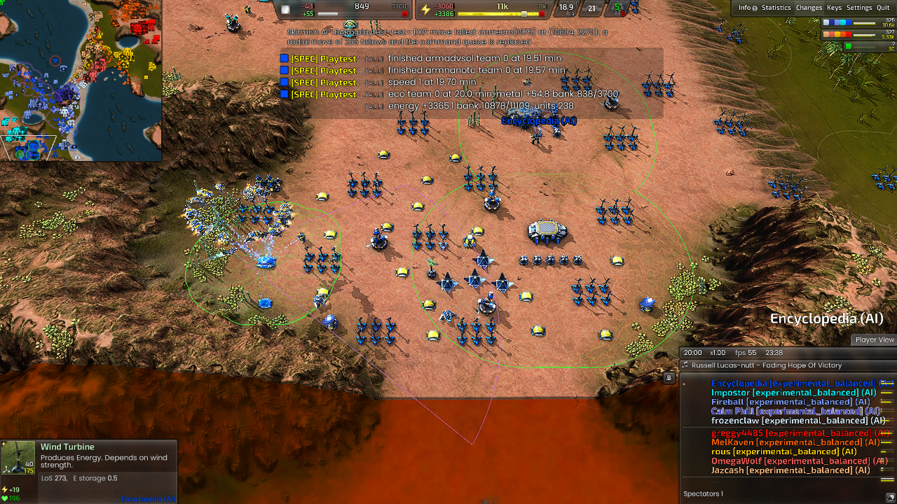
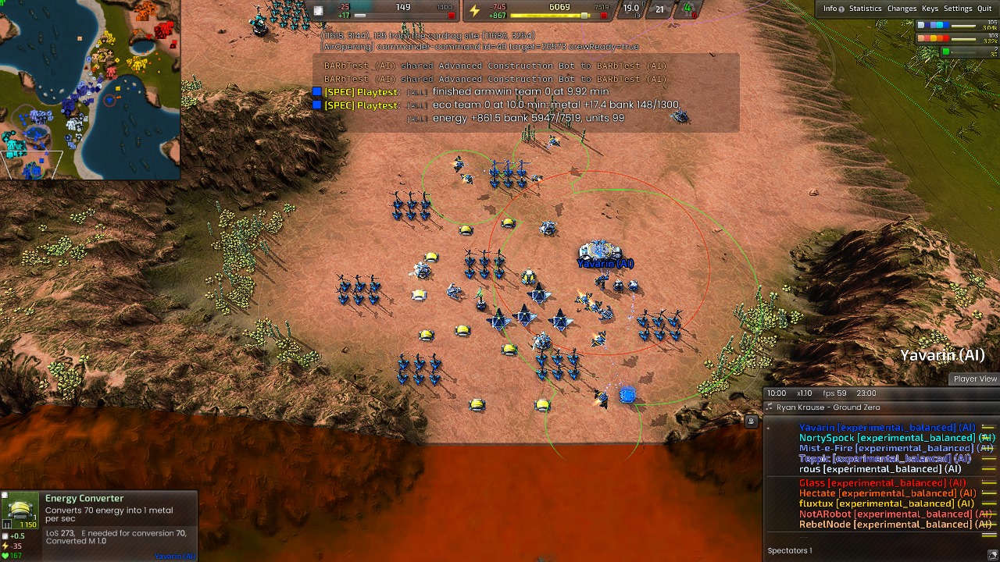
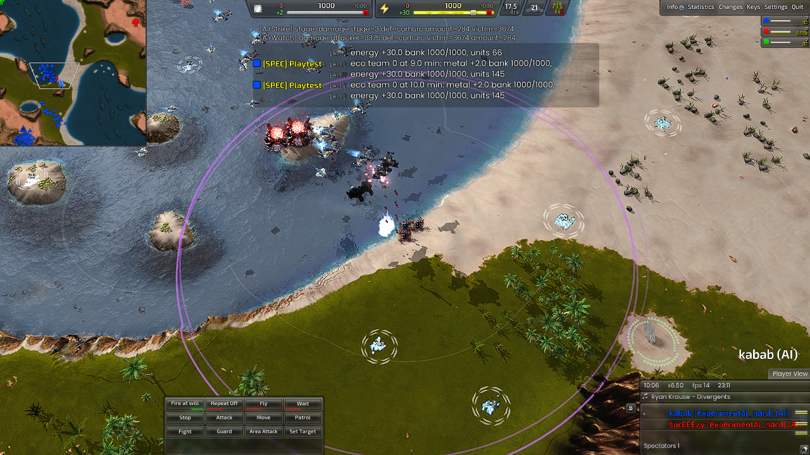
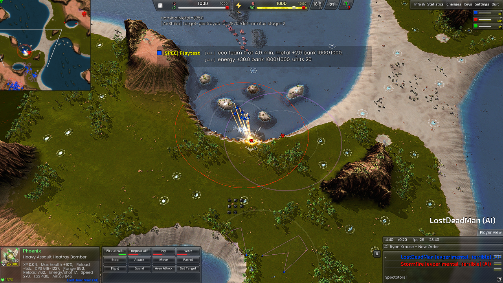
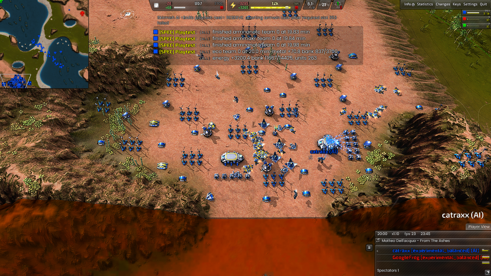
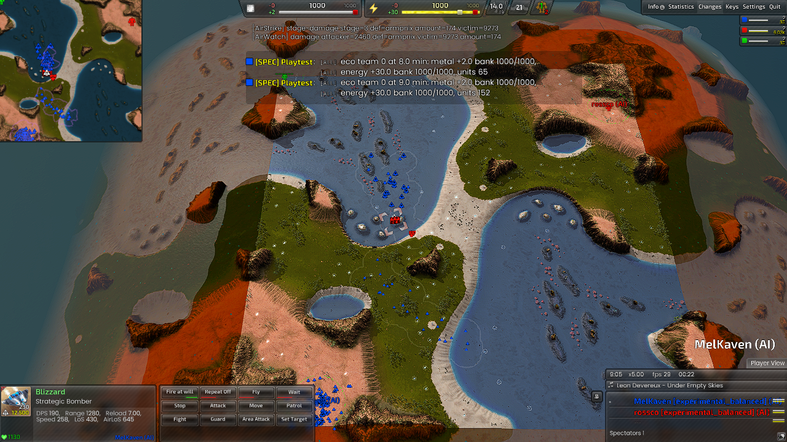
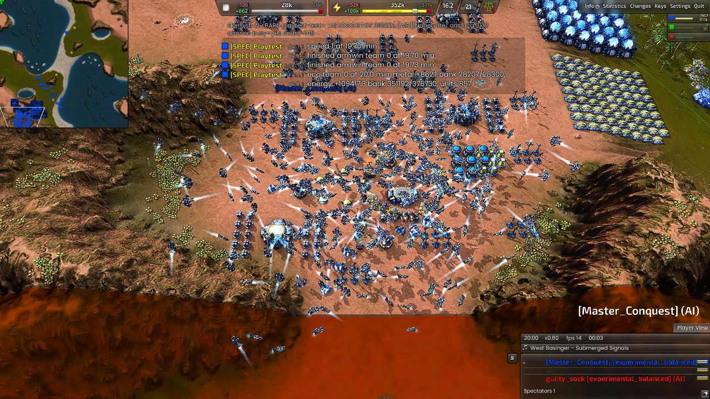
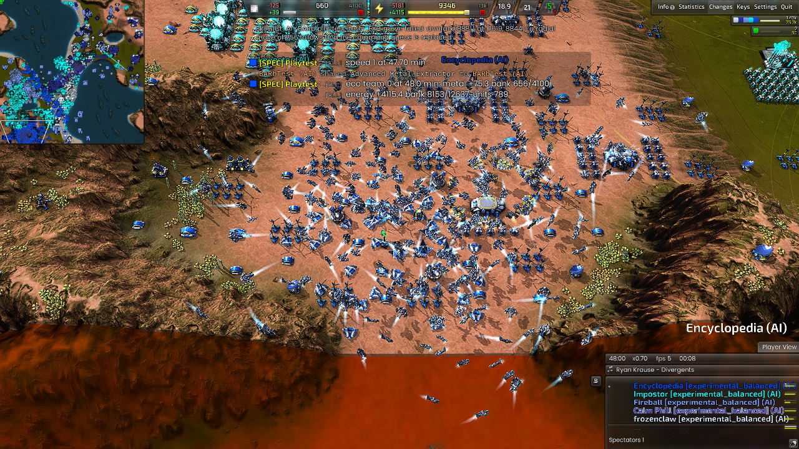
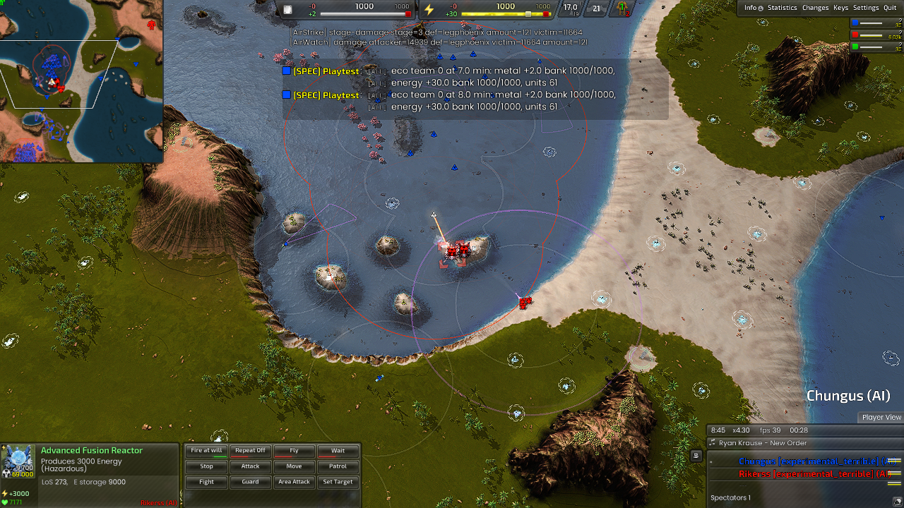

# AIR enhancement review and simulation results (D-162)

This implements the first production, ownership, targeting and flight-control
stages of the [corrected plan](air-enhancement-plan.md). The
[review](air-enhancement-review.md) records the PvP sources, corrected mechanics,
protected behavior and acceptance criteria. Coordinated EMP/Liche packages,
multi-target reservations, radar-plane missions and a dynamic waypoint solver
remain explicit follow-up work. These results do not establish unbeatable play
or an optimal economy against human opponents.

## What changed

- Unique observed armed-air value replaces overlapping role-cost totals and
  unarmed scout vetoes. Emergency interception and initial construction crews
  precede discretionary strikes; requested transports keep their earlier hook.
- Strike production receives interleaved turns: six of ten in clear skies,
  three at parity, zero while losing the measured air-value comparison. These
  are order counts, not equal resource shares. Wave sizing separately considers
  metal, energy and factory throughput.
- Ordinary T1 bombers stage for small raids. Legion Mosquitos use native
  threat-aware raiding instead of waiting for armed groups in DEFEND. Ordinary
  T2 bombers use a funded, capped schedule and launch an escorted subset of
  reserves. Returned aircraft remain survivors in immutable cohort accounting.
- Targets include peaceful economic structures. Loaded lethal weapon mounts,
  current target health, a conservative pass fraction and observed AA determine
  feasibility. Phoenix sweep damage is an upper-bound estimate before that
  fraction, not a promise that every tick hits one structure.
- Assembly has travel time plus settling time, bounded ranks and fixed-wing
  arrival tolerance. Actual firing or attributed lethal damage confirms release;
  aircraft then egress before returning. Loss and assembly failures abort safely.
- AIR retires duplicate construction tasks when their shared frame completes.
  This fixes a diagnosed cause of constructors repeatedly selecting completed
  winds. INV-101 checks that completed construction cannot retain workers.
- First fusion retains mex upgrades, recovery and M/E funding gates. It no
  longer requires an additional 500-metal bank while factories consume income.

TECH's build/reclaim rules, its layout policy, the twenty-completed-turret gate
for each existing T2 air lab, transport priority and static firing defaults are
preserved. New native flight policy is opt-in; the builder cleanup uses AIR's
existing direct-flight opt-in.

## Method and limits

All rendered games use Supreme Isthmus v1.7, BAR
`test-31479-433a460`, and engine `recoil_2026.07.04`. Native/game source research
used BAR `1d267c20d1e2d27586dfb39aaa622698b203c303` and Recoil
`92efda5e60fb6df54a8f17a87e4f4cdb4aa2de31`. The baseline is AI commit
`75e1056b`; simulation directories preserve the staged scripts and pinned DLL.

Natural comparisons use ten AIs (five per side), identical map starts, factions,
role roster, zero handicap and engine seed `1001162`. An audit found that
CircuitAI's separate `random_seed` option was not set in these runs: its RNG
therefore used wall-clock initialization. They are controlled roster comparisons,
not reproducible paired AI-seed experiments. The fixture tools now pin both RNGs for subsequent runs. Both teams' AIR implementations
change, so opponents are not behavior-identical. A single seed is not a
statistically controlled strength comparison. TECH invariants and, in the final natural run, a constructor-locality failure make these
whole-match reports FAIL; they are never filtered out of acceptance checks.
The baseline also logged Legion AIR INV-078 once (a wind order outside a
six-slot cluster); its report was not clean for AIR either.

Combat fixtures supply aircraft, known targets and global LOS, freeze builder
and factory production, and introduce enemy air threats at all three stages.
The observer never issues friendly aircraft orders. Early/mid/late refer to
supplied force composition, not natural production time. Phoenix's scripted
beam bypasses the ordinary per-shot resource deduction in the pinned engine;
its definition's 17-energy value must not be multiplied by emitted ticks as an
actual expense. Aircraft construction energy still matters. These tests establish actual
damage, interception and return capability, not cost-efficient PvP trades.

Economy gift and capacity cases are separate: one T2 constructor at six minutes
without resource gifts, versus a deliberately supplied late-game energy and
conversion economy. Supplied capacity cannot count as a natural growth result.

## Natural comparisons

The first comparative candidate completed eight T2 waves in 50 minutes; the baseline
completed none. That was a real launch-starvation improvement, but 101 late-game
bomber losses exposed poor return behavior. Subsequent egress and assembly
changes were driven by those failures, not merely by higher launch counts.

| Window | Baseline mean M/E income | First candidate mean M/E income | Baseline / candidate T2 bomber completions | Baseline / candidate T2 waves |
| --- | --- | --- | --- | --- |
| 0-10 min | 10.88 / 314.22 | 9.96 / 261.54 | 0 / 0 | 0 / 0 |
| 10-25 min | 48.03 / 2106.83 | 47.03 / 1955.03 | 1 / 10 | 0 / 1 |
| 25-50 min | 61.99 / 3614.07 | 63.83 / 4082.37 | 0 / 139 | 0 / 7 |

The candidate's opening was worse in this pair: seven versus eight air
constructors, and 19.5 versus 11 seconds of observed energy stall. First fusion
was 18:44 versus 18:19. These are not evidence of a universally faster opening.
The candidate fulfilled an actual TECH transport request: requested 9:05,
ordered 9:08, completed 9:18, transferred 9:30.

Build-06's later natural run completed its first fusion at 18:14 and two by
22:25, but exited at 29.5 minutes; it is not a full late-game result. Build-08
then failed fusion timing despite completing owned mex upgrades at 15:06. This
exposed the extra bank gate and prompted a new natural run. The full raw
window data, including losses and stall estimates, is retained in
[the intermediate measurements](benchmarks/air-d162-intermediate.json).

The revised natural run completed Armada's first fusion at **19:03.1** (frame
34293), after the observer recorded reactor start at **16:22.7** with zero basic
or unfinished owned mexes. It had 26 T1 air constructors near minute 18. Duplicate construction cleanup occurred on four completed frames by
that time, with no INV-101 reports. This run completed fifty minutes
(`20261002-001148`, build-09), but its strict report is **FAIL**: existing TECH
invariants and five observer samples with 2-4 constructors beyond 2,400 elmos
at 18:30-19:10. The original observer lacks their coordinates and commands;
travel overshoot versus an out-of-base assignment is unresolved (KI-460).
Do not describe this run as having a wholly local workforce.

Its window means were 10.47/283.51, 46.78/2136.27 and 61.46/3609.53 M/E income.
The first ten minutes completed nine T1 constructors and 22 fighters, with
18.5 seconds of measured energy stall. Mid game added eighteen T1 and eight
T2 constructors, twenty-one turrets, nine T2 bombers and one T2 lab. Late game
added 53 T2 bombers, 329 T2 fighters, 43 turrets and two T2 labs. Four T2 waves
launched at 24:35, 28:52, 32:13 and 35:37; evaluation survivors were 0/8, 1/10,
12/16 and 20/20. Bomber kills included a fusion (3,350 nominal metal), but
22 late T2 bomber losses and continued expensive fighter attrition preclude
an efficiency claim. There were no new launches after 35:37. A known-target
feasibility gate can hold bombers; this is not proof that every target was
strategically unavailable. Build-09 uses the earlier 400-elmo assembly setting
and predates the Phoenix notification fallback. Raw final natural and gift
measurements are in [the final window data](benchmarks/air-d162-final.json).

## Controlled combat

Cortex build-08 passed all strict early/mid/late damage and interception checks.
The first eight-bomber wave destroyed a fusion and returned five survivors;
the next twelve-bomber wave destroyed a flak and returned eleven. The late
sixteen-bomber wave destroyed three flaks and returned eleven. Nominal target
metal is not a net trade calculation, and the fixture supplies both armies.

Legion initially failed every ground-strike stage while its interceptors worked.
Routing Mosquitos to RAID and inspecting Phoenix's lethal mounts restored ground
damage. A second strict failure then exposed missing weapon-fired notifications
for scripted beams. The final repeat checks attributed damage as release evidence
without changing conventional bomber or static firing behavior.

Legion build-10 then **passed all strict checks**: early Mosquito damage at
1:29, Phoenix damage/release at 4:40 and late Phoenix damage at 9:00, with
interception in all three stages. Its first eight-aircraft wave returned five;
the late sixteen-aircraft wave destroyed an AFUS and returned eight. Losses
remain significant, even when a supplied high-value target is destroyed.

## Donated-constructor economy

The final 25-minute gift case **passed** its mex-before-fusion and 20-minute
fusion checks with no invariant violations. A single supplied T2 air constructor
arrived at 6:00; no resources were injected. First advanced mex completed at
7:46.8, reactor construction started at 11:09.2 with no remaining owned basic
or unfinished mexes, and fusion completed at **13:36.4**. The T2 lab completed
at 16:38.7; the second fusion completed at 19:33.9. This still does not satisfy
the older separate `air_transition` check's 14-minute lab target, which is not
the owner's 20-minute fusion requirement. That earlier failure remains recorded.

At 20 minutes the observer reported about 71 metal/s, 3,200 energy/s and a
metal bank of 837/3,700. The workforce stayed local. This is a controlled economy
case against a frozen enemy, not a natural or competitive timing claim.

## Preserved run history

Run IDs are local retained directories under `build-theatres/<case>/runs/<id>`.
Every failed or interrupted run remains available. PASS below means that run's
checks, not the whole plan or the current build in every environment.

| Case / run ID | Build | Result and finding |
| --- | --- | --- |
| air-baseline / 20261001-215459 | pre-change D-161 | 50 min; global TECH invariants; no T2 waves |
| air-candidate / 20261001-225036 | 02 | 50 min; global TECH invariants; eight waves, heavy losses |
| air-final / 20261001-230558 | 06 | interrupted at 29.5 min; global TECH invariants; not a full benchmark |
| gift01 / 20261001-230803 | 06 | FAIL T2 lab by 14 min; lab 17:36, fusion 14:57; no invariants |
| strikes01-armada / 20261001-215800 | 01 | FAIL fixture's unconditional return caused a fatal AS warning |
| strikes02-armada / 20261001-220133 | 01 | weaker checks passed; peaceful-target omission still present |
| strikes03-armada / 20261001-220923 | 02 | PASS ground-strike checks; no enemy interception probes yet |
| strikes04-cortex / 20261001-221919 | 03 | interrupted after startup warning; incomplete |
| strikes05-cortex / 20261001-223249 | 04 | FAIL late strike; whole-reserve escort deadlock |
| strikes06-cortex / 20261001-224422 | 05 | FAIL mid/late; instantaneous assembly readiness |
| strikes07-cortex / 20261001-225406 | 06 | FAIL late; assembly deadline included distant transit |
| strikes08-cortex / 20261001-231209 | 08 | PASS three strike and three interception stages, release and return |
| strikes09-legion / 20261001-231659 | 08 | FAIL ground attacks; Mosquito task / Phoenix zero-damage mount |
| strikes10-legion / 20261001-233140 | 09 | FAIL release evidence; real damage at every stage but scripted beam notification missing |
| strikes11-legion / 20261001-234217 | 10 | PASS three strike and three interception stages, confirmed release and return |
| air-verified / 20261001-233843 | 08 | 50 min; FAIL global TECH invariants; no fusion, prompting bank-gate correction |
| gift02 / 20261001-234706 | 10 | PASS mex-before-fusion and fusion by 20 min; completed 25 min, no invariants |
| strikes12-armada / 20261001-234932 | 10 | FAIL late attack: only 10/18 reached the 400-elmo assembly region; early/mid attacks and all interceptions passed |
| strikes13-armada / 20261001-235935 | 10 | PASS all strict stages with staged radius 600; AI RNG not pinned |
| strikes14-armada-seeded / 20261002-002440 | 10 | PASS all strict stages, both seeds 1621, radius 600; 13.5 min |
| air-fusion-final / 20261002-001148 | 09 | Full 50 min; fusion 19:03; FAIL TECH invariants and brief remote constructors |
| capacity01 / 20261002-002346 | 10 | FAIL observer INV-079; six T2 labs at 14:36; interrupted 33.6 min |
| capacity02-opening / 20261002-002536 | 10 | PASS focused opening regression through 8.7 min, both seeds 1001162 |
| strikes15-cortex-seeded / 20261002-002856 | 10 | PASS all strict stages, both seeds 1622, radius 600 |
| strikes16-legion-seeded / 20261002-002855 | 10 | PASS all strict stages, both seeds 1623, radius 600 |

## Final calibration and capacity evidence

The Armada 400-elmo assembly trial failed late formation (10/18 ready).
Increasing arrival tolerance to 600, while retaining 80% readiness and the
original deadlines, passed the same strict checks in case 13 and the seeded
case 14. Engine and AI seed 1621 were both set for case 14. Production adopts
600; lane spacing remains 180 and rank spacing 240. Arrival tolerance does not
promise a rigid formation or immunity to flak.

Case 14's first restricted watcher falsely reported an engine exit at frame
210 because process enumeration was unavailable. The engine continued through
13.5 minutes. Re-observation with process access passed every unchanged check
and archived the full log as `20261002-002440`. The earlier incomplete report
`20261002-002017` is preserved. Its one-second re-observation wall time is not
the simulation's runtime (the full engine log covers about 282 seconds).

The supplied capacity case reached six T2 labs at **14:36**, and completed
support banks logged twenty turrets before subsequent labs. No INV-090 support
gate violations occurred. It produced a ten-bomber wave at 10:04 and had over
a thousand T2 fighters by minute 33. This exposes crowding and metal overflow
under approximately 862 M/s and 109k E/s of supplied income; six labs are not a
proof of efficient unlimited scaling. Its report is **FAIL**, with an opening
observer error, and the engine exited at **33.6 minutes**, before the intended
45-minute soak. The log says `QuitAction: user exited to system`; the initiator
is not established. Do not present this as a completed 45-minute test.

The observer began tracking commander orders only after the factory frame,
mislabeling an existing opening mex command as newly issued. It now records
that command beforehand. The focused seed-1001162 regression passed through
8.7 minutes: three constructors completed at 1:36.1, and a fighter frame
followed 0.8 seconds later. No invariants fired. This validates the opening
observer and behavior; it does not turn the original capacity report into PASS
or substitute for its missing soak duration. Its early restricted-watch report
is retained separately from the full capture.

The final Cortex/hard and Legion/terrible repeats both passed thirteen minutes
with the same radius and original strict checks. Engine/AI seeds were 1622 and
1623 respectively. These are different faction scenarios, not a three-seed
statistical sample of one matchup.

| Final faction/profile | Seed | First early / mid / late ground damage | Interceptions at all stages | Strict result |
| --- | --- | --- | --- | --- |
| Armada / balanced | 1621 | 1:40 / 4:38 / 9:07 | yes | PASS, 13.5 min |
| Cortex / hard | 1622 | 1:28 / 4:52 / 8:48 | yes | PASS, 13 min |
| Legion / terrible | 1623 | 1:31 / 4:33 / 8:45 | yes | PASS, 13 min |

Armada's first late wave returned 2/21 after target destruction and its next
ended with 16 alive on the return timeout. Cortex's first late wave also hit
the return timeout with twelve alive; a later wave returned nine to the home
region. `reachedHome=0` means task timeout, not arrival. Legion's sixteen-bomber
late wave destroyed both supplied AFUS structures (including blast effects)
and returned ten; its next twenty-bomber wave destroyed the flaks and returned
seventeen. Target destruction and nominal value do not by themselves establish
net advantage, since escorts, repairs, energy, collateral and force timing matter.

No original check deadlines or invariant forbids were weakened.

## Remaining work and release artifact

This is a played core implementation, not completion of every proposed feature.
KI-457 retains expected-loss calibration, multi-target/EMP coordination,
radar-plane missions, dynamic route replanning, save/load mission reconstruction,
T1 remnants below raid size, and crowded home staging. KI-460 retains the
constructor locality failure. A repeat full capacity soak and natural matches
with both seeds fixed, more maps and human-quality opposition are needed before
claiming reliable PvP improvement. The early economy has not been proven optimal.
TECH's previously recorded invariant failures and baseline Legion wind ownership
failure remain recorded separately. The full failed logs are retained.

Final stripped DLL SHA-256:
`8b78442dc6c269b88e34234107bc986078faad5e13c48e28afc4578bfae85202`.
The matching debug file and current data are published together to the required
Recoil build output `build-amd64-windows/install/AI/Skirmish/BARb/stable`.
The live game installation is unchanged. The change is committed locally;
pushing remains withheld per the owner's latest instruction.

## Static and reusable checks

The native suite passed: layout ranking (76 checks), base geometry, eight lane
suites, six strategic-targeting suites, eighteen terrain scenarios and the new
air geometry checks (300 unique bounded slots, transit bounds and loss gates).
AngelScript policy tests passed: 128 production, 20 placement, 19 amphibious and
28 AIR cases, including oversized inputs and fractional escort capacity. The
four final AIR boundary cases also ran directly against the compiled AS harness.

All 268 script API members match the stripped test DLL. Role-document and
invariant-practice checkers pass. Python fixture/measurement tools compile.
`git diff --check` is clean. Existing repository findings remain: eight Markdown
links to the missing hover reference (KI-404), and unreachable `armsonar` /
`corsonar` helpers in TECH (KI-425); the informational `armdfly` roster gap also
remains. No new documentation link failures were introduced.
