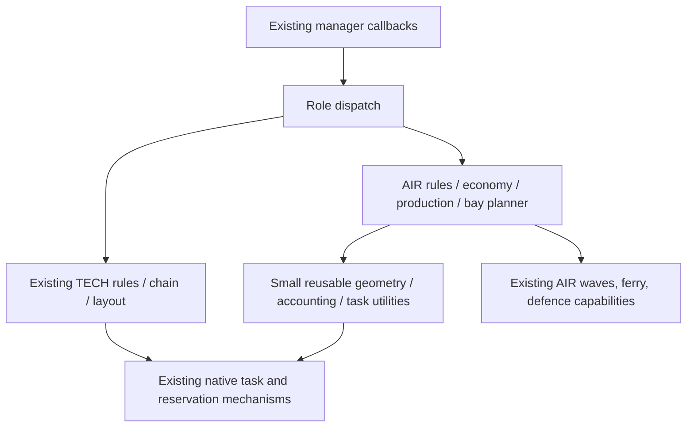

# AIR: PvP economy, production layouts and ordered building policy

Date: 2026-09-30. **Status: proposed design; no implementation changes.**

## 1. Decision and scope

Give AIR its own ordered building policy and modular, reserved layouts using
the native construction mechanisms already used by TECH. Preserve TECH's
current decisions, thresholds, geometry, ordering, random-number consumption,
task ownership and fallbacks. Do not turn AIR into an advanced-fusion rush.

AIR should sustain scouting and air control on a T1 economy, take T2 when the
military situation and a funded transition permit it, then scale production
across six or more aircraft plants when both resources and useful demand
justify them. Approximately 20 ordinary construction turrets per T2 plant is
an initial **soft saturation point**, supplied by the owner, not a proven
engine limit or a mandatory quota. Production mix and measured handoff delays
can justify fewer, more, or a new plant earlier.

This phase delivers analysis and a plan only. New names and APIs below are
proposals unless explicitly identified as existing. Implementation, tests,
builds and playtests described here are future work. No changes to `data/`,
native code, deployed files, tests or `data_sample/` accompany this document.

### Evidence baseline

| Source | Revision / evidence | Interpretation |
| --- | --- | --- |
| CircuitAI | `928c1199f054c1efde671fd47363a27db5404fb1`, branch `smrt-test` | Working tree clean before research; push returned up-to-date and remote SHA was verified |
| BAR content | `1d267c20d1e2d27586dfb39aaa622698b203c303` | Local pinned game source; numbers here are not claims about every live server version |
| Recoil | `92efda5e60fb6df54a8f17a87e4f4cdb4aa2de31` | Local engine source, read only |
| Shared knowledge | `36ccd5a6a3993f193453fb057f3290b99c722cb6`, plus existing local documentation edits | Game knowledge; existing unrelated edits must be accounted for separately |
| Online research | Official guides and first-person coaching/community accounts, accessed 2026-09-30 | Advice and examples, not a statistical sample of current ranked matches |

The game-only research, raw unit values, throughput derivation and source
qualifications live in [the AIR PvP study](../../rjm.bar.docs/knowledge/70-strategy/78-air-pvp-meta.md).
This document owns the CircuitAI design. Neither document claims a replay study
was performed. Threshold calibration and live match validation remain explicit
implementation gates rather than invented evidence.

## 2. PvP analysis translated into requirements

The main context is a dedicated air player in large team games, especially
8v8. Smaller teams need a larger immediate military budget and fewer assumptions
that allies protect the base. An isolated AIR role is not a complete 1v1 policy.

| Situation | Gameplay implication | Required AIR behaviour |
| --- | --- | --- |
| Opening | Information and initial interception matter before a large strike | Establish mexes, inexpensive energy, one plant, a constructor and timely scouting; maintain a fighter response |
| T1 contest | Aircraft need substantial energy; dead air forces do not create a friendly reclaim bank | Reserve ongoing fighter production before spending on discretionary economy; do not interpret every full energy bank as converter demand |
| Quiet T1 growth | Wind can be efficient but fluctuates; flying constructors have limited BP | Build T1 energy fields and reachable nanos progressively; include storage and a reliable low-wind response |
| Enemy rush / lost air battle | An economic milestone cannot protect the team immediately | Emergency recovery and fighters outrank a new plant or reactor; retain essential construction already in progress |
| Exposed enemy economy | Bombers/gunships can punish greed | Permit a bounded strike package using actual intelligence; do not buy a large bomber force simply because an income threshold passed |
| T2 access | A gifted T2 constructor can upgrade mexes without buying an air plant | Treat constructor access, economic tech and aircraft production tech as separate facts |
| T2 transition | The plant, constructor, upgrades and replacement army are one investment | Project the complete transition while preserving a funded T1 screen; avoid the current bank-only force trigger |
| Mature T2 | Extra BP eventually meets pad/command handoff limits | Measure actual throughput, assign nanos per plant, compare a nano with a new bay |
| Late game | More than one production stream and replacement capacity become valuable | Support six, eight and higher configured plant counts, spatially dispersed, with queue-aware quotas |
| Naval flank / water map | Torpedo aircraft, radar/sonar and seaplanes have specific jobs | Preserve available specialist paths; use real build options and map demand rather than assume all plants are interchangeable |
| Base under attack | Dense energy and nano fields are valuable bombing targets | Separate production, energy growth and late reactors; plan coverage, repair and replacement sites |

T1 economy through the middle of the game is the default posture, not a ban on
early T2 or a fixed minute. A purchased/gifted constructor, rich reclaim,
enemy T2 fighters, loss of expansion, or a long quiet window can change it.
Likewise, surviving on T1 is not success if AIR never uses a clear attack window.

The [official air guide](https://www.beyondallreason.info/guide/basics-of-air-warfare)
supports scouting, transport, interception and strike roles. The
[official economy guide](https://www.beyondallreason.info/guide/in-depth-look-at-economy)
supports balancing resources with local build power. These are general guidance;
AIR's exact transition and allocation thresholds must be measured. In particular,
fighters are not assumed to absorb ground AA for bombers: the pinned game's
target-priority gadget takes precedence over that simplification in prose guides.

### Proposed economic states

States change budgets and eligibility; the ordered rules still choose tasks.
Threat response is an overlay, so damage does not reset completed tech progress.

| State | Entry / exit | Economy and production |
| --- | --- | --- |
| `BOOTSTRAP` | No usable plant or initial income | Home mexes, inexpensive energy, first T1 bay, first constructor/scout; reconstruct after a wipe |
| `T1_CONTEST` | T1 plant operating | Fighter floor, map-aware strikes, one home energy lane plus one expansion/reclaim lane |
| `T1_SCALE` | Stable screen and sustained resource headroom | More T1 energy, storage and assigned nanos; efficient mex upgrades if a capable constructor exists |
| `T2_TRANSITION` | Funded package, a capable builder, safe window or compelling enemy T2 pressure | Reserve and build one T2 bay; keep T1 output; first advanced constructor/upgrades where needed |
| `T2_SUSTAIN` | T2 plant producing | Mix-aware energy target, fighter replenishment, bounded bomber waves, fusion when justified |
| `MULTIPLANT` | Existing useful production constrained by capacity with resources to spare | Add independent T2 bays, preserve reserves, scale beyond six when marginal value stays positive |
| `RECOVERY` overlay | Plant/nano/energy losses or acute deficit | Repair, restore missing resource, replace necessary builders; suspend optional expansion |

Use consecutive samples and separate enter/exit thresholds for recovery,
capacity expansion and threat posture. Completed tech remains latched; economy
health may move down without deleting plants or re-running an opening.

## 3. Current AIR: complete source trace

The authority is [air.as](../data/script/src/roles/air.as), 1,258 lines and 42
namespace functions at this baseline. The existing [role reference](roles/air.md)
contains useful history but some prose predates the current source: for example,
staged constructors precede the fighter floor, and `PorcChainHandler` is wired.

Disposition below means **preserve capability**, **replace policy**, or
**retire obsolete implementation**, not delete behaviour accidentally.

| Function(s), baseline line | Current responsibility | Planned destination / disposition |
| --- | --- | --- |
| `Air_IsEconomyHealthy` 22; `Air_IsCombatProductionReady` 27 | Energy-stall and 12 M / 250 E gates | `AirEconomy` snapshot; preserve inputs, replace fixed-only admission with production budget; emergency fighters need explicit handling |
| `Air_GetWindNameForSide` 34 | Hardcoded faction wind lookup | Existing `UnitHelpers` catalog, avoiding another faction table |
| `Air_ShouldPreferWind` 42 | Expected output >7, fewer than six winds, income <300 | T1 energy selector; retain map-aware wind choice, remove six-wind limit as a whole-role growth policy |
| `Air_HasCommanderWindOpportunity` 56 | Commander, bank and wind checks | Commander/opening predicates; keep affordability |
| `Air_TryCommanderWind` 64 | Native scattered wind task and tracked handle | `AirBuild` action into the T1 energy field; preserve commander participation |
| `Air_IsBuildFocusActive` 98 | Latch released after six minutes or healthy 20 M / 300 E | Early focus state, released by progress/budget with configurable timeout |
| `Air_IsConstructionTask` 115 | Recognise construction task types | Reuse existing shared builder classifier |
| `Air_SetStrategicFocus` 122 | Store focus task and leader ID | Common task-lifecycle utilities plus AIR focus ownership |
| `Air_HasTrackedTask` 131 | Read shared builder tracking | Reuse tracking; distinguish queued, framed and active rather than only non-null |
| `Air_GetAssignedT1Leader` 137 | Read primary/secondary guard dictionaries | AIR work lanes, using unit IDs and reacquisition |
| `Air_AssignFocusedFollower` 154 | Guard strategic, expansion or assigned leader; otherwise wait | Ordered assist actions with one owner and explicit timeout |
| `Air_GetArmyMetalCostEstimate` 208 | Sum T1/T2 combat aircraft cost, reject NaN | Preserve metric for compatibility; add separate fighter/interception and bomber budgets |
| `Air_UpdateDynamicMilitaryQuotas` 246 | Compare our air cost with enemy air cost per player; set attack/raid quotas | Preserve existing quota path initially; later use confidence/role-aware air balance, with hysteresis, not all-enemy-player dilution |
| `Air_Init` 311 | Reset state, porc settings, quotas, start caps, waves; optional dynamic production | Initialise AIR-only controller and layout gate after complete replacement paths exist |
| `Air_ApplyStartLimits` 360 | Suppress ground factories, gantries, nukes and T1 land defence | Preserve default AIR identity; central catalog/cap resolver; explicit option-gated specialist exceptions only |
| `Air_MainUpdate` 398 | Delayed quotas and `AirWaves::Update` | Keep both; add bounded budget/bay reconciliation ticks |
| `Air_EconomyUpdate` 414 | Registered empty hook | Populate cached economic snapshot rather than repeated per-builder scans |
| `GetT1StrikeAircraftNameForSide` 424 | `armkam`, `corbw`, `legkam` | Capability-aware role catalog, retain faction differences |
| `Air_TryT1StrikeOpener` 432 | Three queued strike units, count based on successful enqueue | Preserve bounded attack option; make interruption, cancellation and threat gating explicit |
| `Air_FactoryAiMakeTask` 470 | T1/T2 recruit policy and native fallback | `AirProduction`, with a shared pending-demand ledger and per-plant service role |
| `Air_SelectFactoryHandler` 683 | Start factory from map role or fallback | Reuse factory helper; preserve selection, AIR bay supplies the site |
| `Air_AiIsSwitchTime` 697 | 30-second test | New controller owns AIR plant expansion; keep legacy route when switch is off |
| `Air_AiIsSwitchAllowed` 701 | Army-cost or bank gate; writes assistRequired | Replace for enabled AIR with capacity/budget decision; never change shared/TECH gate |
| `Air_MakeSwitchInterval` 706 | Random configured 20–60 seconds | Keep for legacy mode; deterministic AIR planner cooldown for new mode |
| `Air_MilitaryAiMakeTask` 720 | Waves first for T2 bombers/fighters, native for others | Preserve waves; introduce explicit home-defence versus escort assignment before handing fighters to waves |
| `Air_MilitaryAiUnitRemoved` 727; `Air_MilitaryAiTaskRemoved` 732 | Wave cleanup | Preserve; notify AIR allocation ledger too |
| `Air_BuilderAiMakeTask` 743 | Commander route; T2 floating ladder; primary T1 policy; secondary native expansion; focused followers; default | Total `AirRules` dispatcher for every constructor class, including gifts and naval/hover builders |
| `Air_Commander_AiMakeTask` 788 | Help first constructor, winds, focused guard, default | Opening/home work rules; retain first-constructor acceleration and commander safety |
| `Air_BuilderAiUnitAdded` 839 | Remove BASE attribute from non-primary T1 and T2 air builders | Preserve useful mobility; claim work lane and reconcile capabilities |
| `Air_BuilderAiTaskAdded` 861 | Log only | Own pending task/budget claims; existing shared callback bookkeeping still executes |
| `Air_BuilderAiTaskRemoved` 865 | Clear wind/focus handles | Also release reservation, project budget and assistant allocation, idempotently |
| `Air_BuilderAiUnitRemoved` 875 | Clear commander/focus state | Reassign surviving work and clear IDs; do not retain borrowed unit handles |
| `Air_IsFloating` 903 | Income >=35 and full metal or >=2500 bank | Replace with trend, forecast and committed-spending snapshot |
| `Air_ClampToMap` 910; `Air_RingAnchor` 925 | Six anchors at radius 1400, clamped to map | Retire ring-specific geometry; shared geometry/bounds helpers and AIR bay candidates |
| `Air_LateExpansion_AiMakeTask` 943 | Four nanos/plant, up to three T2 plants, fusion/AFUS, gantry while metal floats | Replace with capacity allocator and separate reactor precinct; preserve sustainable expansion objective |
| `Air_T1Constructor_AiMakeTask` 1014 | Floating ladder, first T2 plant, >1300 bank override, mex helper, converters, solar, nano, advanced solar, default | Split into named AIR rules and actions; remove bank-only T2 override in enabled mode |
| `Air_RoleMatch` 1159 | Match map-preferred AIR | Preserve |
| `Air_PorcChain` 1203 | Faction AA-led chain, optional extra/scav tiers, default water chain | Preserve capability; explicit defence adapter/budget required under exclusive building control |
| `Register` 1226 | 18 populated RoleConfig callbacks including main and porc; no layout handler | Add AIR layout and lifecycle hooks as needed, preserve remaining callbacks |

### Factory production order that must be accounted for

T1 today: first constructor; early scout before five minutes; staged constructors
(1 → 2 → 3 at the configured economy gates); two-fighter floor; three-unit
strike opener; optional dynamic production; native default. T2: staged advanced
constructors; Cortex/Legion bounded heavy-air package at >250 M/s; bomber-wave
fill; optional dynamic production; native default. Dynamic production is off.
The fallback means the explicit combat gates are not a universal prohibition on
native combat production.

Before the role sees a factory request, [factory.as](../data/script/src/manager/factory.as)
checks TECH flank production, spam, ferry requests, then constructor donations.
Retain this ordering and the existing role guards. An AIR transport owed to a
teammate must still be produced and delivered under the established protocol.
With multiple factories, pending quotas must be reserved once at enqueue time;
counting only completed or held units invites simultaneous excess orders.

### Behaviour outside air.as

| Component | Preserve / integrate |
| --- | --- |
| [builder.as](../data/script/src/manager/builder.as) | Current-frame retention, grace tracking, worker groups, mex bookkeeping, role dispatch and native fallback; new AIR dispatcher must not fight the outer retention guards |
| [factory.as](../data/script/src/manager/factory.as) | Factory roster, primary handles, queued flags, nano helpers, pre-role ferry/donation handling; a single primary handle cannot represent six bay budgets |
| [economy.as](../data/script/src/manager/economy.as) | Ten-second minimum incomes, bank/stall flags, `MexTracker`, anchors |
| [economy_helpers.as](../data/script/src/helpers/economy_helpers.as) | Existing admission helpers and mex-upgrade query; use capability checks for gifted constructors |
| [air_waves.as](../data/script/src/manager/air_waves.as) | Hold/launch/escort/release/mop-up cleanup, income and survival sizing, six attack methods; preserve options, add pending production accounting and distinguish home fighters |
| [air-wave-attacks.md](air-wave-attacks.md), native wave/bomb/guard tasks | Existing target and flight execution; changing all bomber micro is outside building migration |
| [porc_policy.as](../data/script/src/manager/porc_policy.as) | AIR AA cadence and allied-cluster AA; explicit budgeted dispatch must replace any disabled native chooser responsibilities |
| [ferry.as](../data/script/src/manager/ferry.as), [donation.as](../data/script/src/manager/donation.as), roster/team | Requests, incoming gifted builders, outgoing transports, orphan rescue; no protocol changes for TECH |
| [setup.as](../data/script/src/setup.as), [layout_helpers.as](../data/script/src/helpers/layout_helpers.as), [role_config.as](../data/script/src/types/role_config.as) | Setup order and existing `LayoutPlanHandler` extension point |
| [commands.as](../data/script/src/manager/commands.as) | Runtime role switching, native-state snapshot/restore, layout teardown and overlay routing |
| [global.as](../data/script/src/global.as) | AIR settings only; do not reuse mutable TECH thresholds |
| Maps / profiles / JSON | Merge order of map limits, role limits and behaviour max counts; Supreme has T1-air caps; all three experimental profiles and enabled content options need coverage |

No automatic activation of the dynamic-production subsystem: KI-201 and the
Legion configuration gap KI-308 are prerequisites to that separate choice.

## 4. Gaps found during the trace

1. **Factory nano accounting is order accounting, not live capacity.**
   `EnqueueNanoForFactory` increments a count after enqueue; the dictionary is
   deleted on factory removal but has no nano-death or failed-order decrement.
   Existing 5/T1 and 20/T2 caps therefore cannot be the new live BP ledger.
   Recorded as KI-217; replace only AIR's consumer initially.
2. **AIR's explicit mex-first helper cannot fire on its current normal caller.**
   It is inside the primary T1-air constructor ladder; the helper rejects tier
   <2. The T2 AIR branch runs late expansion then native default. Native may
   still upgrade mexes, but the documented AIR priority is not enforced there.
   Recorded as KI-218, qualifying the older KI-213 implementation claim.
3. Three T2 plants is the late ladder's explicit ceiling, not a tested optimum.
   A full bank alone says nothing about whether the fourth plant is sustainable.
4. Wave production reads held units; additional plants need pending quota
   accounting. Treat this as a required concurrency contract, not evidence that
   a six-plant overshoot was observed in a game.
5. All T2 wave-class fighters currently enter wave management. Preserving a
   team interception screen requires explicit assignment before allocating
   escorts; merely building more fighters does not establish that screen.
6. Existing save/load gaps (KI-209), quota inconsistency (KI-208), and broader
   TECH invariant failures (KI-427) are existing constraints. Do not silently
   fix or conceal them in a layout refactor.
7. The gantry-to-experimental-air comments are not a verified base-roster path.
   Keep such progression disabled unless the effective build graph for the
   selected content options proves every edge. A file on disk is insufficient.

## 5. AIR layout family

Use `air.*` named groups, stable bay IDs, layout schema version and native
reservation identities. The drawings describe topology, **not fixed coordinates**.
Native geometry uses actual rotated footprints and the existing half-cell grid;
never interpret raw Lua dimensions as native engine square counts without conversion.

### A. T1 starter and growth field

```text
                 flight departure / rally area
                 [ T1 aircraft plant ]
                    [N][N]  + optional reachable nano slots
              repair / access gap
       [wind patch]  [solar patch]   [future T2 bay envelope]
       [wind patch]  [storage]       (only the next bay is held)
                   home mexes: exact resource spots
```

Start with a minimal plant footprint and access clearance close to the commander.
Reserve two nano slots first, then grow to the budgeted T1 allowance (initial
compatibility ceiling five), without constructing them just because they exist.
Do not reserve a large four-row TECH block before an AIR opening can function.

Energy fields are small repeated patches of actual wind/solar footprints,
separated by access/repair gaps; build one affordable patch at a time. Group
size/spacing is tunable against bombing risk, BP reach, map slope and wind.
Storage sits where it is reachable but not surrounded by fragile nanos.
Home energy workers may travel between patches; AIR does not impose TECH's
single turret-box reach rule on its entire T1 wind economy.

Keep the T1 plant after T2 by default for scouts, transports, specialist units
and recovery. Recycling it needs an explicit funded replacement decision and
must not interrupt the only fighter/transport source.

### B. T2 production bay: factory plus two assistant banks

```text
                 clear launch area / emergency landing separation
                           [ T2 plant ]
                   [N N N N N] [N N N N N]
                   [N N N N N] [N N N N N]
                         access / repair path
                      local AA / repair service
```

The two 2x5 banks provide up to 20 ordinary nanos; grow in affordable tranches
(for example 2, 5, 10, 15, 20), ordered nearest usable positions first. Rotate,
split or shrink the banks when terrain requires it. Every slot must be able to
assist the **actual factory build point and aircraft frame**, not merely lie
within a circle around the factory centre. Height, facing, collision/model
radius and different aircraft must be tested by the native reach predicate.

Assign each nano to one primary production bay. Nearby bays may borrow idle
capacity, but each nano supplies at most one job in the forecast. Pending and
unfinished nanos are future capacity, not current capacity. Count 200-BP nano
equivalents when advanced nanos or gifted mobile assistants participate.

A paired-bay variant places the second plant where some existing nanos can reach
either build point, helping seed new production. Overlap is an allocation
opportunity, not a licence to credit the same BP to both factories. A remote bay
must include the cost of its own seed assistance; it cannot assume old nanos move.

### C. Distributed air campus

```text
         [bay 1: fighters]       [bay 2: fighters]
         [bay 3: flexible]       [bay 4: bombers]
         [bay 5: fighters]       [bay 6: flexible]   ... further bays

          T1 energy patches and service space, outside launch areas
                    separate late reactor precinct(s)
```

Plant service roles are budget preferences, rebalanced with cooldowns, not
permanent hardcoded unit lists. Reserve/build one next bay; keep later candidates
as advisory plans so six empty reservations do not evict allies or block mexes.
Search safe side/rear space, then another defended local cluster; do not blindly
put the next plant on the forward point of a fixed-radius ring.

AA covers approaches and retreat areas. Aircraft fly, so land-factory exit
corridors are not copied wholesale; preserve the actual build-pad clearance,
ground constructor access and engine egress needs. Validate all facings and the
real sortie path. Put rally/hold points away from crowded launch pads.

### D. Late energy precinct

Fusion/AFUS/converters use separate, defended economy groups with their own
builders and assist slots. Production assistance has a minimum reserved share;
an AFUS must not silently take every factory nano.

Do not copy TECH's dense AFUS/converter sets. Determine setback from pinned
death-explosion and target-health data, terrain and damaged-unit safety margin.
A nano assisting an AFUS cannot simultaneously be guaranteed outside that
AFUS's blast radius: accept and budget local economic assist risk, while keeping
critical production bays beyond the chosen damage threshold. Never describe a
cosmetic gap as chain-explosion immunity.

### E. Terrain and recovery variants

Cramped: reserve one valid factory first, fit partial banks, add satellite energy
patches and another reachable bay later. Shore/island: use valid land plants or
explicit option-gated floating/seaplane facilities and naval energy builders.
Do not route AIR through TECH's harbour policy. Occupied or dead slots: release
the failed project claim, blacklist/retry with bounded backoff, retain built
structures and their actual ownership. No unbounded search on every builder ask.

## 6. Production capacity, delays and six-plus plants

Use the derivation and example table in the game-only study. For one product:

```text
B = factory BP + allocated, alive, in-range assistant BP
t_build = buildTime / B
t_cycle = t_build + measured warm handoff delay
q = 1 / t_cycle
metal demand = q * unit metal cost
energy demand = q * unit energy cost
```

Include a distinct initial opening delay in time-to-first-unit. Do not charge a
factory's cold opening animation to every aircraft. Warm handoff comprises pad
clearance and unavoidable command/update latency; measure queue starvation and
resource stalls separately so they are not mistaken for inherent saturation.
Use a distribution/rolling estimate per factory and unit class, with a guarded
configured estimate until enough uncontaminated samples exist.

For a count-weighted product mix, compute `sum(count * cycle)` and resource sums
over the same batch. Do not average units/second arithmetically across products.
Calculate high-demand bursts and long-run average separately; reserve energy for
upkeep, mexes, AA stockpiles and concurrent economy construction too.

Example, **illustrative 0.5-second warm gap, not a measurement**: pinned Armada
Highwind costs 150 M / 6100 E, buildTime 11,500. A T2 plant (600 BP) plus twenty
200-BP nanos yields 2.5 seconds building + 0.5 seconds handoff: 20/minute,
50 M/s and about 2,033 E/s. Six such fighter bays need about **300 M/s and
12,200 E/s for aircraft alone**, before growth, upkeep or reserve. Bomber mixes
have different requirements. Six plants is therefore a supported capacity,
never a goal to satisfy on inadequate income.

### Marginal expansion algorithm

1. Determine funded useful demand: defence deficit, replacements, chosen strike
   and requested utility units. Exclude deliberately idle or retiring factories.
2. Forecast existing plants with actual BP allocation and warm-gap estimates.
3. Subtract committed resource consumption once; reject expansions that breach
   a conservative metal or low-wind energy floor over the planning horizon.
4. Compare: another nano on an under-assisted plant; reallocating idle in-range
   assistants; a new plant with affordable seed assistance; energy/mex investment;
   repairing an existing damaged production bay; doing nothing.
5. Score useful marginal throughput against **full** capital costs (M, E, BP
   occupation, build delay, ground, defence and opportunity cost). Use current
   bottleneck weights, not a permanent energy-to-metal conversion rate.
6. At roughly twenty ordinary nanos per T2 plant, prefer considering another
   bay before more assistance. A slow heavy product can justify more nanos;
   a fast product can justify a second bay earlier. Require an explicit logged
   reason for crossing the configured soft point.
7. Commit one bay, including budget and slot claims. Re-evaluate after it
   becomes productive. Cooldowns and deadbands prevent build/cancel oscillation.

Suggested initial AIR settings (all tuning candidates): T2 soft nano-equivalent
cap 20; preferred supported campus size 6; configurable hard safety ceiling 12,
never hardwired into algorithms; one new plant under construction at once;
20-second sustained capacity pressure; 60-second projection; 10-second scan
backoff when no site exists. Actual low-wind floor and production shares are
profile inputs calibrated from the evidence phase, not copied TECH ratios.

## 7. Ordered building rules and resource priority

Rows use a once-per-ask snapshot plus live validation at commit. Masks distinguish
commander, T1/T2 air, gifted land/hover/naval constructors and static assistants.
All actions verify `CanBuild`, availability/caps and reach. A row can return
null to continue; the final action is a bounded wait. Already-started work stays
unless explicit emergency/retirement policy permits interruption.

| Order | Proposed key | Eligibility and action |
| ---: | --- | --- |
| 1 | `air.lifecycle` | Reject retired/dead objects; preserve transport/cargo holds and authoritative assignment |
| 2 | `air.emergency.repair` | Save critical production or income where repair is feasible; bounded emergency preemption |
| 3 | `air.keep.current` | Keep useful work, especially frames; do not churn between assist and build every ask |
| 4 | `air.nano.service` | Static assistants: assigned factory/critical repair, otherwise authorised local construction or reclaim; never steal all military BP |
| 5 | `air.recover.energy` | A real deficit: finish imminent energy first or choose quickly payable energy; suspend optional converter/expansion spending |
| 6 | `air.recover.factory` | No viable production after loss: rebuild the appropriate funded bay |
| 7 | `air.opening` | Exact home mexes, initial energy and first T1 bay; no implicit native start job |
| 8 | `air.intel.defence` | Budgeted radar, essential local AA and strategic repair service |
| 9 | `air.mex.upgrade` | Capable owned/gifted constructor, safe owned spot, no duplicate claim, upkeep budget |
| 10 | `air.expand.resource` | Safe mex/geo/reclaim opportunity assigned to the expansion lane; respect allies |
| 11 | `air.energy.production` | T1 wind/solar/tidal/storage as appropriate, then fusion-era sources, to fund selected aircraft mix |
| 12 | `air.factory.assist` | Nano addition or assistance reallocation with useful funded throughput gain |
| 13 | `air.tech.transition` | Fully evaluated first T2 package; keep interception budget and existing T1 plant |
| 14 | `air.factory.expand` | Next bay wins marginal comparison; queue-aware count and one project claim |
| 15 | `air.energy.growth` | Extra T1 field or separate reactor project with affordable growth budget |
| 16 | `air.convert.surplus` | Persistent surplus after aircraft/upkeep/committed energy demand; no converter while metal cannot be spent |
| 17 | `air.storage` | Cover forecast fluctuations or overflow; queued-aware, not arbitrary storage spam |
| 18 | `air.defence.team` | Existing AA-led porc capability, especially allies, within its explicit budget |
| 19 | `air.recycle` | Obsolete structure only with safe replacement, bank room and no unique utility role |
| 20 | `air.assist` / `air.wait` | Useful authorised local work, otherwise retry after a short wait |

Opening state masks make rows 8–19 ineligible until their prerequisites exist.
The emergency energy row also covers an opening stall. Storage necessary to
survive a predicted wind trough is part of row 11; optional surplus storage is
row 17. Broad high-priority rules must return null once their bounded target is
met, preventing starvation of all lower rows.

**Rule order and game resource priority are different mechanisms.** Native
builder tasks and recruit tasks issue BAR-priority commands, and can rewrite
them during updates. Inspect `BuilderTask.cpp` and `RecruitTask.cpp`; an AIR
HIGH task alone does not prove a military budget is enforced. Add an optional
per-task resource-priority override for AIR-managed tasks if required, defaulting
to existing behaviour for every old task. It must govern assistants as well as
the project leader and be persisted/reset. Gate admissions and assistant BP even
when engine priority controls are unavailable; report an unsupported contract
rather than pretending labels ration resources.

### AIR production priority and military preservation

Keep the existing ferry pre-hook. Within AIR: critical constructor recovery;
scout refresh when information is stale; home fighter deficit; funded additional
constructors; bounded tactical strike; wave bomber/escort deficit; suitable
specialist/heavy aircraft; default funded combat. Utility and economic quotas
must be finite so they cannot occupy six factories indefinitely.

Maintain one ledger for finished/held units, active frames and pending recruits.
Claim demand before enqueue, roll it back on failure, convert rather than add
again at birth, release on cancellation/death/transfer. Wave reserve membership
and home fighter assignment are exclusive. Retain the wave attack methods and
native bomber implementation; do not let a bomber-wave launch take the minimum
home interception reserve. Keep anti-air versus anti-surface demand separate.

## 8. Reuse with a strict TECH compatibility boundary

### Architecture



Do not rename `Layout` and globally substitute AIR settings. It contains TECH
state, sets, forward boxes and lab lifecycle assumptions. Keep that namespace
and `TechRules`, `TechBuild`, `TechChain`, `TechPlan`, `TechFactories`, weapons,
flanks and harbour on their current path.

Proposed new modules, all under active `data/script/src/`: `roles/air_rules.as`,
`roles/air_build.as`, `manager/air_layout.as`, `manager/air_economy.as`, and
`manager/air_production.as`. `air.as` remains the thin registration/integration
layer and owns legacy dispatch when the new feature is off.

### Reuse and extraction decisions

| Concern | Reuse / narrow refactor | TECH protection |
| --- | --- | --- |
| Grid, rotation, rectangle intersection | Existing `BaseLayoutGeometry.h`; add a separate AIR geometry function family | Existing functions and constants untouched; exact output fixtures |
| Native reservations, claims, required pins, dead slots | Existing terrain/task engine; expose a named atomic compound plan for AIR if existing APIs cannot commit a bay safely | Default legacy mode unchanged; no TECH slot renumbering or ordering changes |
| Packing/ranking | Reuse predicates and collision checks; AIR-specific candidate rank | Do not change `LayoutRanking.h` TECH comparator or tie-breaks |
| Rule execution | Small role-neutral traversal over ordered predicates/actions; AIR supplies all decisions | Keep TECH evaluator initially. Extract its traversal only if differential fixtures prove order, live predicate reads, side effects and tracing identical |
| Build actions | Shared null checks, pinned enqueue rollback, nearby-assist lookup, waits, exact resource task helpers | Do not call `TechBuild` as AIR; extract only genuinely parameter-only functions with compatibility wrappers |
| Counts and lifecycle | Reuse native structure lifecycle plus AIR bay/project ledger; helper functions for transitions and count projection | `Lifecycle::RetiringNear` currently reads a TECH setting: parameterise through an overload with old default only if AIR needs it |
| Resource snapshot / maths | Existing economy readings; pure projection and throughput helpers | All thresholds supplied explicitly; no new side effects in TECH snapshot paths |
| Faction/content | Existing `UnitHelpers`, effective definitions and `CanBuild` | Avoid mirrored faction arrays or edits to shared roster meaning |
| Factory nano assignment | New reconciliation from live IDs, pending task IDs and reach | Initially AIR-only consumer; repairing global bookkeeping for all roles is a separate behaviour change |

AngelScript does not support arbitrary user-defined templates or captured
lambdas here. If a common rule runner is extracted, use registered `funcdef`s
and a narrow `IRuleFacts` interface with typed role adapters, or retain short
role-local evaluators while sharing actions. Do not introduce a giant context
containing every TECH and AIR policy field. Snapshot creation has no enqueue
side effects; validate mutable claims again in the action.

### Native integration traps and proposed contracts

1. `aiBuilderMgr.experimentalBuild=true` disables `DefaultMakeTask`, native
   economy/energy/storage/pylon planning and `StartFactoryJob`, changes ordinary
   placement and queued-order adoption, and changes builder waiting/travel.
   Enable it for AIR only after all required replacement paths exist. Test the
   first factory, mexes, storage, repair and defence explicitly.
2. `AcquireFactoryReservation` scans names beginning `tech.factory.`;
   `CBFactoryTask` may acquire or pack a factory automatically. Add an explicit
   **AIR required-pin mode** that honours the supplied bay reservation and
   rejects unplanned AIR factories. Keep the old path/default for TECH. Do not
   merely broaden that string prefix or put AIR sites into TECH groups.
3. `PackFactoryFlush` uses registered factory zones. AIR uses explicitly chosen
   bays; it must not silently move a plant to a different nano group. Keep
   pinned tasks on their sites through activation and retries.
4. The current script API exposes `costM`, `costE`, footprints and `CanBuild`,
   plus aggregate nearby BP. Individual build time, build speed and build reach
   are native data not currently registered as equivalent `CCircuitDef` getters.
   Add read-only bindings or an immutable production snapshot for the planner.
   Do not hardcode this document's unit values into policy.
5. Needed new observations: productive frames, completed units, pending recruit
   owner, resource-stalled duration, idle-with-demand duration, and factory-to-next
   frame gap. Prefer native event counters/snapshots over per-frame script scans.
   They must use owned/fairly observed information; enemy economy is not available.
6. All control/state is per AI instance. No static C++ mutable AIR state, shared
   cross-team dictionaries, or changes to TECH settings during AIR setup.

`Air.ExperimentalBuild` defaults false during development. The three
experimental JSON fragments already permit layout; AIR still needs its own
opt-in and a complete `LayoutPlanHandler`. Legacy profiles remain untouched.
The new AIR controller must have one owner for every factory/energy order;
native switching cannot independently add plants behind its budget.

## 9. Lifecycle, save/load and role switches

Use two distinct ledgers without duplicating truth: native slots/tasks own
reservation/claim/frame identity; the role ledger owns intended bay, budget and
assistant assignment. A project progresses planned → reserved → ordered →
framed → active; retirement uses existing `Lifecycle`; destruction releases or
recycles the actual reservation through normal task/unit callbacks.

Every reader must agree: builder rule, factory production, nano assistance,
reclaimer, guard, overlay, budget and save/load reconstruction. Never repair or
recruit from a retiring structure. Claim conversion on a callback is idempotent;
callbacks in different orders must not double-count BP or expenditure.

On load: restore native state first; adopt AIR named groups and reconcile live
units, active tasks and unfinished frames; reconstruct assignments by stable
IDs; discard stale IDs and revalidate project budgets. Preserve completed tech
and finite opener progress in supported native metadata. Do not claim existing
empty script save hooks already solve it (KI-209). Layout adoption can be added
without fixing all wave/save state in the repository; disclose that remaining
limitation and test an explicit safe wave reset if persistence is still absent.

Role change: dispatch old-role leave before restoring native/definition state;
abort only old layout-owned tasks; clear AIR claims and resource-priority
overrides; restore snapshots; initialise incoming role; adopt standing buildings
without moving/reclaiming them automatically. Test AIR→TECH, TECH→AIR and
AIR→FRONT. Preserve the existing TECH teardown order exactly on its branch.
Overlay/query dispatch must select the active layout, not always `Layout::`.

Bounded work: cache economic/factory snapshots once per second; layout search
only on demand, topology/occupancy change or backoff expiry; no repeated global
unit scans inside each predicate. Cache invalidation covers deaths, gifts,
captured plants, changed reservations and completed frames. Keep deterministic
candidate ordering, stable ties and explicit random-stream use.

## 10. Tests and acceptance criteria

### Pure reusable functions

Extend the standalone [tests CMake project](../tests/CMakeLists.txt), which already
tests base geometry and layout ranking without a running engine. Test production
math where it will execute: a minimal AngelScript harness using the vendored
runtime for script helpers; C++ tests for native geometry/observation helpers.
Do not write a separate Python reimplementation and call it a policy unit test.

| Test family | Required cases / expected properties |
| --- | --- |
| Throughput | Zero BP, zero/invalid build time, no gap, positive gap, finite results, monotonic output, diminishing marginal BP with gap, separate cold/warm delays |
| Product mix | Single-unit equivalence; weighted batches; resource bottleneck; no arithmetic averaging of rates; different factions/build times |
| Capacity choice | Nano versus new bay versus energy; equal demand; saturated demand; no income; bank windfall without sustainable income; 19/20/21 equivalents; six/eight/twelve plants |
| Allocation | Each assistant counted once despite overlap; out-of-range/busy/dead assistants excluded; pending nanos counted only as future capacity |
| Budget | No double subtraction of committed spend; burst and steady demand; low wind; mex upkeep; storage bounds; stall recovery; gifts not treated as recurring income |
| Geometry | All facings, odd/even footprints, slope/water/bounds rejection, access and pad clearance, exact build-point reach, six-plus bays, partial banks, ally exclusion |
| Reservations | All-or-nothing bay commit and rollback; competing claims; retries; dead slots; killed factory/nano; recycled sites; no hidden TECH prefix |
| Rule traversal | Mask/predicate order; first non-null result; null fallthrough; bounded wait; live revalidation; retained frame; emergency exception |
| Lifecycle | Failure/death/gift/cancel/load callback permutations; no duplicate active/pending count; retire forbids production, guard and repair |
| TECH differential | Same snapshots yield same row/task/def/site/facing/priority/count/call order/random draws before and after any extraction |

Do not allocate new `INV-nnn` IDs until implementation. Planned promises are:
AIR claims are exclusive; retirement is authoritative; each assistant has one
budget owner; every enabled AIR economy task has an allowed site/spot; factory
expansion respects funded demand; TECH decisions remain identical for identical
inputs. Add these to the invariant register and actor matrix when code lands.

### In-engine measurement and play matrix

First measure sustained factory throughput for all three factions, T1/T2,
fighters/bombers/heavy aircraft, 0/5/10/15/20/25/30/40 nanos; compare one plant
against two and several plants using both equal assistant BP and equal total
investment. Include high-income calibration and realistic income-limited runs,
empty-to-active versus continuously queued plants, blocked pads, mixed queues,
damage, stuns and idle restarts. Record actual seconds, completed units and
resource spend, not only issued commands. Warm-gap measurements exclude stalls.

Then play AIR on high wind, poor wind, cramped terrain, mixed shore, and ordinary
land; Armada/Cortex/Legion, balanced/hard/terrible profiles, relevant content
options. Include enemy early air rush, no enemy air, escalating fighter war,
heavy AA, lost plant, nano deaths, failed orders, donor T2 constructor, transport
request, six-plus bays and a mixed AIR+TECH allied team. Verify runtime role from
startup logs, not just the harness request (KI-428).

TECH comparison uses pinned baseline DLL/data, map, start, faction, settings,
seed and income. Keep unchanged-script hashes in manifests. Unit tests require
exact equality for identical inputs; games also compare ordered traces and
milestones, but timing/AI interactions can diverge, so a matching finish time
alone is insufficient. Run isolated TECH control plus mixed AIR/TECH tests:
the latter necessarily changes allied resources and enemies, and cannot prove
identical emergent matches. It must prove no cross-role state/placement leakage.

KI-427 already records failing TECH invariants. Preserve all forbid checks;
report baseline and candidate failures separately. A relative non-regression
result is not an overall clean-game PASS. Do not adjust TECH to make AIR's
acceptance suite green; fix baseline TECH issues under separate scope if needed.

Acceptance: runtime startup/API compilation passes; first plant and essential
economy always have a path; aircraft production remains funded through the T2
transition; observed output improves where handoff/capacity limited it; six-plus
bays can operate when supplied and are not ordered when energy is inadequate;
no new invariant violations; AIR-off and TECH differential fixtures unchanged.
Use metrics for factory utilisation, energy/metal stall seconds, excess,
fighter reserve, first scout/fighter/T2 timing, losses and useful damage, bay
completion time, layout-search cost and assistant idle time. Win rate requires
matched repeated games; one showcase is not evidence of a stronger meta policy.

Before each launch: script API check against the exact staged DLL. Use the
separate playtest write directory and repository harness; never deploy into
the live game install. Unit, static and game checks are distinct evidence.

## 11. Implementation sequence and stop gates

| Phase | Deliverables | Gate before proceeding |
| --- | --- | --- |
| 0: evidence | Pin TECH baseline, throughput observer, replay coding sheet for representative PvP air games; verify effective unit data | Measured startup/handoff distributions; documented T1/T2 transition and income ranges; no claim that twenty is universally optimal |
| 1: mechanism | AIR geometry functions, atomic named reservations, explicit pin mode, read-only production stats; unit tests | Existing geometry/ranking tests and TECH differential fixtures unchanged |
| 2: accounting | AIR snapshot, budget/pending ledger, bay lifecycle, assistant assignment and cleanup | Failure/death/transfer/load tests; no state shared with TECH |
| 3: T1 replacement | Minimal starter layout, energy patches, mex/repair/storage/defence coverage, total AIR rule dispatcher | First-factory and poor-wind recovery games; native planner only disabled now |
| 4: transition | Funded T2 package, gifted-builder mex upgrades, retaining T1 utility | Continued fighter output and successful T2 transition under natural economy |
| 5: scaling | Mix-aware capacity chooser, six-plus bays, reactor precinct and production budgets | Multi-plant pending quotas, real throughput, income-limited rejection and spatial tests |
| 6: military integration | Home fighter versus escort assignment, wave/pending accounting, legacy utility/heavy/specialist paths | No broken ferry; no screen stripped by wave launch; no unbounded utility recruitment |
| 7: rollout | Opt-in playtests across profiles/factions, role switch/load checks, docs and review | Complete acceptance report; enable AIR flag only after review of failures and baseline differences |

Phases may contain a small behaviour-preserving extraction, but not a general
rewrite of TECH. Existing common mechanisms are reused first. An extraction
that cannot demonstrate parity is deferred; avoiding a few lines of duplication
does not justify moving TECH onto a new decision path.

### Planned file impact

New AIR modules above; AIR settings in `global.as`; AIR registration/dispatch in
`air.as`; small role-gated manager/lifecycle/overlay entry changes; additive
native layout/observation/priority APIs and bindings; AIR geometry and script
math tests; dedicated playtest fixtures/checks; role docs, actor matrix,
invariants and decision records. Shared configuration is changed only for an
explicit AIR setting or proven content requirement. TECH scripts/configurations,
legacy profiles, vendored libraries, sample data and the live game install are
protected from incidental edits.

Rollback is the AIR feature flag plus compatible persisted layout ownership;
on disable, finish/abort owned tasks through normal teardown before returning
to legacy AIR. Never toggle the flag underneath pinned tasks or restore stale
reservations. Keep the legacy AIR path until migration acceptance is complete.

## 12. Design decisions and unresolved measurements

Chosen: T1-first state model; independent production bays; twenty-nano soft
point; marginal expansion; separate late reactor areas; existing native
mechanisms with AIR-owned policy; capability-aware handling of gifted builders.

Rejected: clone TECH's turret box/AFUS chain; raise `LateMaxT2AircraftPlants`
alone; fixed six-plant order; fixed energy-per-plant heuristic independent of
product; use raw nano enqueue counts; treat HIGH priority as guaranteed resource
allocation; switch on experimental mode before replacing native economy;
generalise both roles in one broad refactor.

Open measurements: actual warm-gap distributions by faction/product; safe
spacing and full reach on real maps; minimum successful T1 army budget; tech
transition pressure thresholds; sufficient plant utilisation for expansion;
unknown-enemy threat reserve; sustainable wave versus defence shares. These
are tuning/calibration work with specified tests, not unmade architectural
choices. No live meta win-rate or gameplay improvement is claimed in this plan.

See [D-146](decisions.md#d-146--plan-air-production-bays-without-changing-tech)
and [known issues](known-issues.md) for the proposal's decision and open defects.

## 13. Verification of this planning deliverable

| Check, 2026-09-30 | Result |
| --- | --- |
| Source inventory against plan | All 42 namespace functions in `air.as` named; no missing functions |
| `check_role_docs.py` | 0 findings |
| `check_invariants.py` | 0 findings |
| CircuitAI `check_doc_links.py` | 2,571 relative links checked; eight pre-existing broken links to missing `doc/roles/hover.md` (KI-404); none from this work |
| Shared knowledge `tools/knowledge/check.py` | 753 files; 0 broken links, 0 missing images, 0 unknown unit IDs |
| `git diff --check` | Passed for tracked CircuitAI documentation changes |
| Implementation / gameplay verification | Not run: this phase contains documentation only; all tests and experiments in sections 10–11 remain future work |

Existing shared-knowledge edits were present before this analysis and are not
evidence of AIR implementation. No conclusion about current installed gameplay
is drawn from these static checks.
