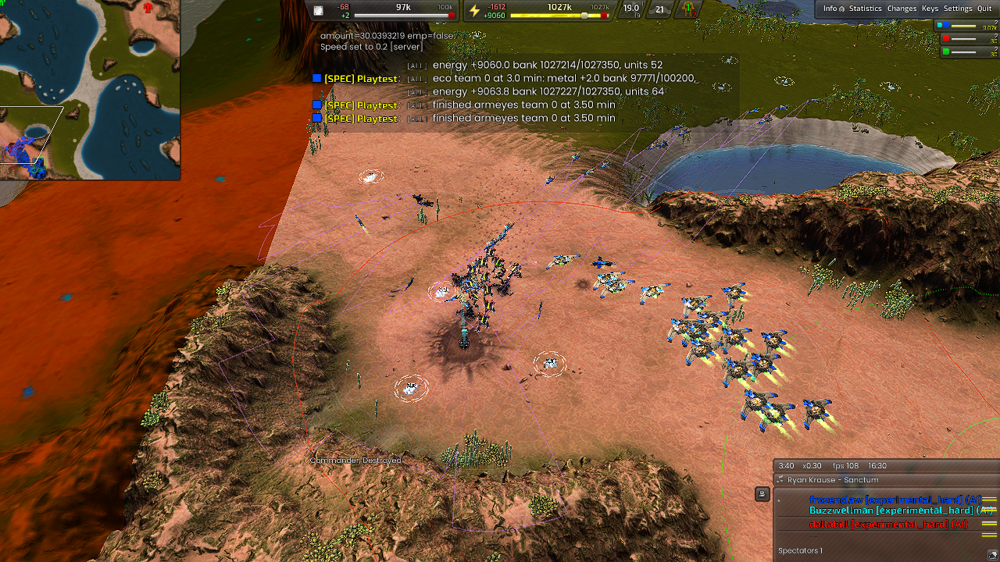
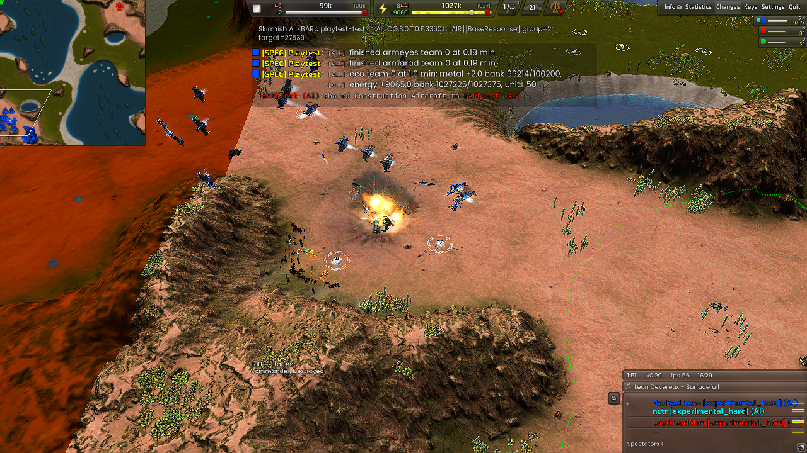

# AIR reconnaissance and base-defense results (D-193)

2026-10-04. The focused response tests pass. The natural Glacial comparison
finishes twenty minutes but retains TECH invariant failures in both builds.
This is a behavior fix, not a win-rate or optimal-force benchmark.

## Implemented behavior

- Existing radar wave size/ten-minute production cadence are retained. An
  eligible waiting cohort launches after `RadarMaxWaitSeconds=90`, including
  incomplete or unassembled cohorts. Full assembled waves launch earlier.
  Surviving opening T1 scouts now loop over their route.
- Current observed land enemies inside `BaseResponseRadius=1800` of an allied
  or human start trigger a once-per-second defense scan. Free suitable aircraft
  join shared attack tasks immediately; held bombers bypass offensive admission.
- Factories replenish one configurable twenty-unit lethal reserve across the
  AIR owner, counting live units, frames and unframed orders once. They select
  faction/tier-compatible gunships; Cortex T1 adds a small EMP group alongside
  damaging bombers. Production uses the next available factory turn, preserving
  transports, recovery and bounded workforce turns rather than cancelling
  valuable existing products.
- Uncommitted fighters cover the ground response or intercept simultaneous
  aircraft. The owner's prior commitment rule is preserved: offensive waves
  and their escorts are not recalled. PLAYER, retreat, ferry and carrier-owned
  units are excluded. T2 bombers retain the heavy-mobile/structure target rule.
- When contact is lost, recruitment stops; a twenty-second last-seen search
  ends in normal reassignment. Shared stable targets use native order
  deduplication; no APM rate limiter was introduced.

The [plan](air-recon-base-defense-plan.md), [decision](decisions.md#d-193---timed-air-reconnaissance-and-immediate-allied-base-defense)
and [role reference](roles/air.md) describe scope and settings.

## Build and fixture controls

Candidate DLL SHA256:
`df4b5dd21490b7687a75dded76989a03341f9b16aafff5a5d6127066b44611e1`.
Matching debug SHA256:
`56bf9f84ead13f3fd52f04ecdc1b3212b0afee380a3bdf6409653b990856f5f4`.
The stripped candidate is 7,805,625 bytes. The saved pre-D193 baseline DLL is
`a293daae515d9f77945a095c2e84950177429b6b0da2b32366372bf347c1e28b`;
its data snapshot predates this fix but includes the earlier uncommitted work.
Both sides are staged with their own scripts. New API parity is 287 members,
baseline 285; both have zero registration findings.

Rendered fixtures use Supreme Isthmus v1.7, BAR test-31479-433a460 and
Recoil 2026.07.04. They supply resources/factories, freeze economic builders,
and script only the enemy approach. Defender production/targeting are real.
They use ordinary radar/LOS, never global vision. Two pushes start at frames
2700 and 6300 (90 and 210 seconds), northwest of a nearby allied start. The
small case uses one Marauder per push; the faction cases use twelve each.
Raw logs, replay/configuration, exact staged file hashes and screenshots stay
in isolated game archives. Compact immutable bundles are linked below.

## Reconnaissance and small reserves

| Case | Measured result |
| --- | --- |
| Three radar planes | Released at frame 4560 (152 seconds), after the 90-second waiting deadline; all three physically reached surveying state by frame 5580 (186 seconds). |
| Twenty radar planes | Released at frame 2820 (94 seconds), fully assembled, before the deadline. |
| Two parked Phoenixes, old build | No bomber damage or Marauder kill throughout seven minutes. |
| Two parked Phoenixes, candidate | Both dispatched at frame 2730; first damage at 3185 (16.17 seconds after the first push). Both separate Marauders killed. |

The timeout test preserves the normal formation/scouting controller. It does
not pretend that the partial cohort has twenty-plane coverage. The old
18-Phoenix fixture did eventually attack through the offensive planner, so the
baseline evidence does **not** establish that every large reserve always stalls.

## T2 base defense

All three faction fixtures passed strict script, invariant and crash checks.
Aircraft dispatch occurred at frame 2730, the first recorded contact, one
second after the fixture's push event. The next factory orders and actual hits
include existing product completion and flight time.

| Faction | First defensive production after push | First bomber damage after push | New gunship observed firing | Marauders killed | Peak AIR commands/minute |
| --- | ---: | ---: | --- | ---: | ---: |
| Armada | 5.10s | 14.20s | `armbrawl` | 24/24 | 671 |
| Cortex | 1.63s | 14.93s | `corape` | 24/24 | 694 |
| Legion | 1.90s | 8.73s | `legstronghold` | 24/24 | 943 |

The Legion Stronghold's recorded hit is on the second push; its Phoenixes
handled the first before the gunship reached a firing opportunity. These are
supplied force-response tests, not proof of surviving a late-game AA escort.

## T1, ownership and performance controls

T1 Armada/hard, Cortex/balanced and Legion/terrible all compile and pass their
production/damage checks. Banshee, Shadow and Mosquito damage is recorded;
Cortex Shuriken damage is separately marked EMP. **None of these T1 fixtures
kills a Marauder during seven minutes.** They prove an active fallback response,
not that a T1 air force beats two twelve-Marauder attacks.

The outside-radius control sees ordinary attacks but no base emergency or
emergency recruitment. The committed-home-air-raid control retains all 24
escorts. The combined ground/air control also dispatches 14 free bombers while
retaining 24 committed escorts. Both pass strict ownership invariants.

The T2 fixtures peak at 671/694/943 AIR command callbacks per minute; all-unit
peaks are 1327/1296/1675. T1 peaks are 284/332/509 AIR commands per minute.
These are independent one-minute engine observations, including commands from
other game systems. They are not network packet counts or CPU/FPS benchmarks,
and do not certify huge-army scaling. The controller scans contacts against a
bounded allied-start list plus owned units once per second; targets are stable
until invalidated rather than reissued every tick.

## Natural Glacial comparison and preserved failures

The candidate and pinned baseline run the same ordinary four-player
AIR/TECH Glacial Gap v1.1 scenario for twenty minutes, with no supplied assets
or economic policy override. Candidate AIR reaches one T1 and one T2 plant,
+58 metal/s and +1735.5 energy/s at the final sample. No candidate AIR invariant
or script error is reported. The strict **overall verdict is FAIL** for TECH
INV-008/010. The baseline also fails, with INV-008/010/019/021/090. This confirms
existing categories, not the root cause of every instance or unchanged
performance. [KI-427 follow-up](known-issues.md) retains these observations.

Earlier fixture failures are preserved rather than relabelled:

- A deliberately frozen allied start was re-derived as TECH and correctly
  emitted INV-050. The fixture now explicitly gives that frozen ally FRONT.
- An interim production order refilled the fighter floor before making gunships.
  The final order fixes that starvation; the failed observation remains.
- The first combined-attack fixture rejected Marauders placed in its aircraft
  list. Moving them to the generic target list fixed the fixture.
- Its next run demonstrated the ground response, but the check wrongly expected
  a raw team prefix after the parser had removed it. The final independent
  rerun uses the selected-team scope and passes.
- A baseline natural preparation initially checked the current repository
  against the old DLL. The natural and arena runners now honor pinned data.
  It was stopped before engine launch; the matched baseline then ran normally.

## Verification and limits

Full native/policy suite passes, including fourteen new AIR predicate tests
(127 AIR math tests total). Native integration build and runtime script loading
pass. All three experimental profiles were played. INV-139 checks timed scout
transfer, INV-140 checks defensive ownership, and every fixture retains all
invariant forbids. The role document and registered script API are checked.
Invariant practice, role-document freshness, Python compilation and whitespace
checks pass. The doc-link checker retains eight existing links to missing
`roles/hover.md`; the unit-helper checker retains 167 existing roster findings.
There are no new findings in either check. The required build output at
`C:/bardev/bar-RecoilEngine/build-amd64-windows/install/AI/Skirmish/BARb/stable`
has matching DLL/debug hashes and all 322 current data files (zero mismatches).

Multi-AIR incident election, expanded live-campus geography, abandonment
filtering and AA-aware incident routes remain [KI-482](known-issues.md#ki-482---air-base-response-still-lacks-multi-air-election-and-live-campus-routing).
Save/load, manual takeover and ferry/cargo transitions have not been replayed
in these fixtures. Twenty is configurable, not a measured optimum. No claim
is made to reconstruct the user's original match without its replay.

## Screenshots

## Immutable evidence inventory

PASS is the acceptance-check verdict, not a game victory. Failed originals
remain intact. Bundles include response observations and raw-evidence hashes.

| Scenario | Verdict | Observation |
| --- | --- | --- |
| base-response-commitment | FAIL | [20261004T193957Z-9190a57f](benchmarks/records/air/combat/base-response-commitment/2026-10-04/20261004T193957Z-9190a57f/README.md) |
| base-response-commitment | FAIL | [20261004T194253Z-80308aef](benchmarks/records/air/combat/base-response-commitment/2026-10-04/20261004T194253Z-80308aef/README.md) |
| base-response-commitment | PASS | [20261004T194718Z-ef9ddb7b](benchmarks/records/air/combat/base-response-commitment/2026-10-04/20261004T194718Z-ef9ddb7b/README.md) |
| committed-home-incursion | PASS | [20261004T193816Z-81fc6673](benchmarks/records/air/combat/committed-home-incursion/2026-10-04/20261004T193816Z-81fc6673/README.md) |
| old-resp-defense-armada | FAIL | [20261004T192120Z-a5ceedae](benchmarks/records/air/combat/old-resp-defense-armada/2026-10-04/20261004T192120Z-a5ceedae/README.md) |
| old-resp-small-armada | FAIL | [20261004T192903Z-cad36ee5](benchmarks/records/air/combat/old-resp-small-armada/2026-10-04/20261004T192903Z-cad36ee5/README.md) |
| resp-defense-armada | FAIL | [20261004T192412Z-2c43e105](benchmarks/records/air/combat/resp-defense-armada/2026-10-04/20261004T192412Z-2c43e105/README.md) |
| resp-defense-armada | PASS | [20261004T193028Z-5dc7a251](benchmarks/records/air/combat/resp-defense-armada/2026-10-04/20261004T193028Z-5dc7a251/README.md) |
| resp-defense-cortex | FAIL | [20261004T192413Z-52046375](benchmarks/records/air/combat/resp-defense-cortex/2026-10-04/20261004T192413Z-52046375/README.md) |
| resp-defense-cortex | PASS | [20261004T193029Z-c0f9a127](benchmarks/records/air/combat/resp-defense-cortex/2026-10-04/20261004T193029Z-c0f9a127/README.md) |
| resp-defense-legion | FAIL | [20261004T192412Z-fc20a7a4](benchmarks/records/air/combat/resp-defense-legion/2026-10-04/20261004T192412Z-fc20a7a4/README.md) |
| resp-defense-legion | PASS | [20261004T193027Z-e79c5014](benchmarks/records/air/combat/resp-defense-legion/2026-10-04/20261004T193027Z-e79c5014/README.md) |
| resp-full-armada | PASS | [20261004T192706Z-f8d325dc](benchmarks/records/air/combat/resp-full-armada/2026-10-04/20261004T192706Z-f8d325dc/README.md) |
| resp-outside-armada | PASS | [20261004T193807Z-784aa162](benchmarks/records/air/combat/resp-outside-armada/2026-10-04/20261004T193807Z-784aa162/README.md) |
| resp-partial-armada | PASS | [20261004T192705Z-4d36f1c2](benchmarks/records/air/combat/resp-partial-armada/2026-10-04/20261004T192705Z-4d36f1c2/README.md) |
| resp-small-armada | PASS | [20261004T192705Z-4a9159f4](benchmarks/records/air/combat/resp-small-armada/2026-10-04/20261004T192705Z-4a9159f4/README.md) |
| resp-t1-armada | PASS | [20261004T193548Z-945e62ce](benchmarks/records/air/combat/resp-t1-armada/2026-10-04/20261004T193548Z-945e62ce/README.md) |
| resp-t1-cortex | PASS | [20261004T193547Z-bbce6a7f](benchmarks/records/air/combat/resp-t1-cortex/2026-10-04/20261004T193547Z-bbce6a7f/README.md) |
| resp-t1-legion | PASS | [20261004T193550Z-757186c3](benchmarks/records/air/combat/resp-t1-legion/2026-10-04/20261004T193550Z-757186c3/README.md) |
| response-defense-armada | FAIL | [20261004T192031Z-f4d3ade9](benchmarks/records/air/combat/response-defense-armada/2026-10-04/20261004T192031Z-f4d3ade9/README.md) |
| response-partial-armada | FAIL | [20261004T191909Z-125e51f5](benchmarks/records/air/combat/response-partial-armada/2026-10-04/20261004T191909Z-125e51f5/README.md) |
| old-resp-natural | FAIL | [20261004T194205Z-9a60c772](benchmarks/records/air/economy/old-resp-natural/2026-10-04/20261004T194205Z-9a60c772/README.md) |
| resp-natural | FAIL | [20261004T193845Z-d6b24020](benchmarks/records/air/economy/resp-natural/2026-10-04/20261004T193845Z-d6b24020/README.md) |
