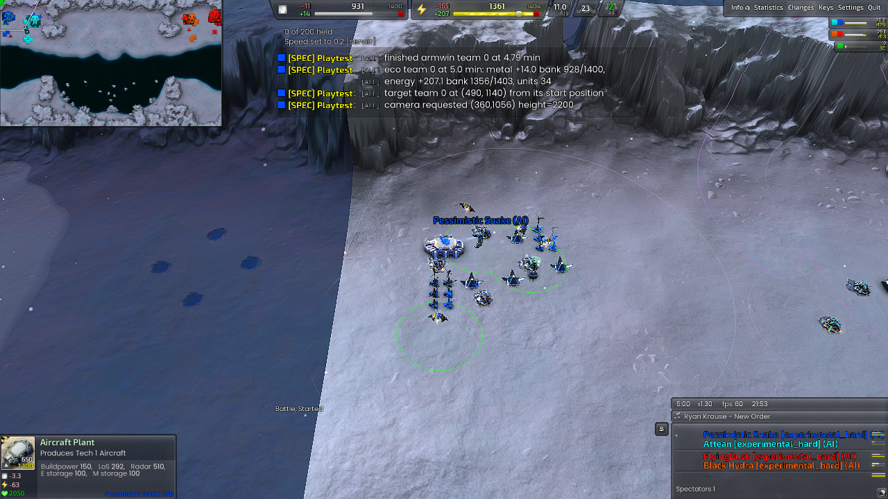
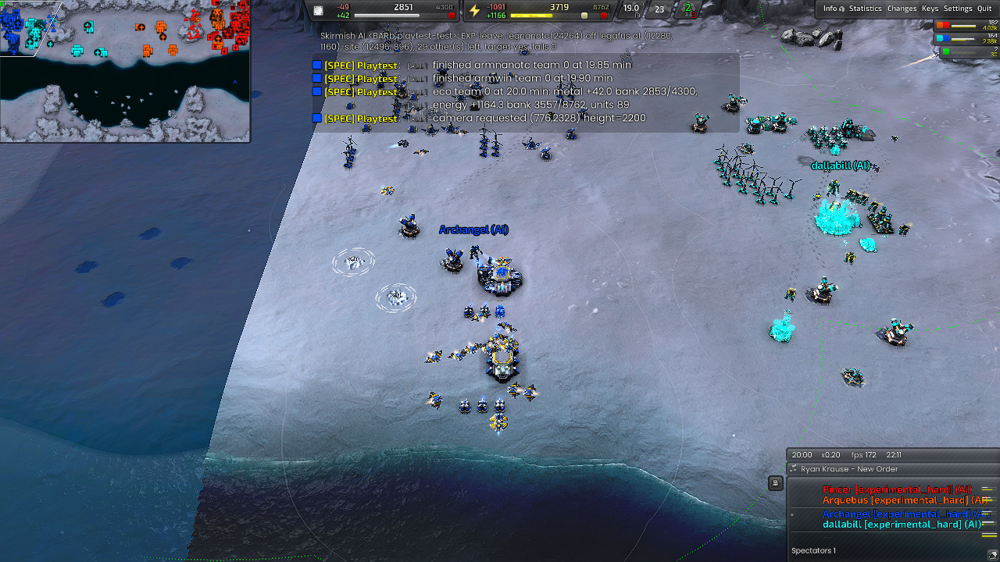
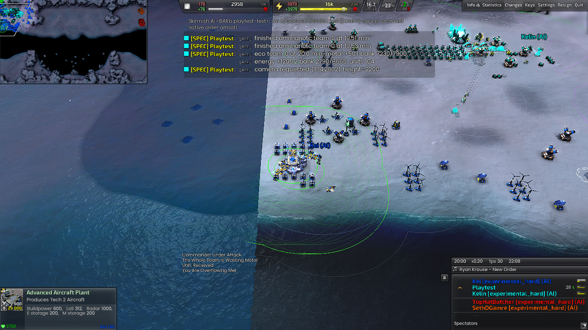

# AIR workforce and transition verification

Implemented the [repair plan](air-workforce-repair-plan.md) in experimental
AIR only. Native task semantics, TECH's sequence, metal-map opening rules and
the shared layout engine are unchanged. No files were written to the live BAR
install. Build output contains the matched build-8 DLL/debug symbols and the
committed data baseline plus these AIR changes.

## Changes

- Both T1 and T2 air constructors now leave builder guards individually and
  clear the old engine guard order. Their fallback is concrete economy work
  or a short wait. Ground assistants require an actively working factory.
- After the initial scout/three-constructor/fighter opening, funded missing
  workers precede ordinary fighter replacement. During a real incursion,
  `CombatOrdersPerEconomyConstructor=2` bounds combat production precedence.
  Transport requests still precede AIR recruitment. No command rate cap was added.
- First T2 lab admission precedes shared reactor growth and its assists.
  A first-lab budget starts after eight minutes, the opening screen, +12 metal
  and +450 energy, outside recovery. It pauses optional spending to bank the
  loaded lab cost. This is a saving condition: lab admission still requires
  sustained +50 metal/+1200 energy or the full lab cost banked.
- Later T2 labs still require twenty completed construction turrets per
  existing advanced lab. Current construction, mex upgrades and energy
  recovery retain precedence. The existing bank-aware workforce target is
  retained; recruitment can now reach it instead of repeatedly losing its turn.

## Final policy games

Times are team-0 completed units, not orders or frames. Supplied resources
are excluded from natural timings. Full paths, starts, hashes, per-team checks,
workforce samples, receipts and guard traces are in the
[evidence JSON](benchmarks/d172-air-workforce.json).

| Case | Duration | First T2 lab | First fusion | First T2 bomber | Result |
| --- | ---: | ---: | ---: | ---: | --- |
| Natural Glacial, final | 30 min | 12:56 | 13:26 | 16:24 | AIR checks clean; overall FAIL on TECH invariants |
| Natural Serene Caldera, final, no TECH donor | 30 min | 15:31 | 19:18 | 20:15 | PASS, all enabled checks |
| Glacial coastal starts, final, supplied allied metal and forced guards | 18 min | 9:23 | 16:52 | 17:31 | AIR checks clean; overall FAIL on TECH invariants |

Final Glacial also completed AFUS at 18:14/23:16 and its second T2 lab at
20:05. Its peak aircraft APM was 2396; total AI APM reached 3833, so this is
not a universal sub-3000-APM result. KI-477 remains open.

The final guard fixture assigned a non-interruptible native guard to a T1
aircraft at frame 16200 and a T2 aircraft at 21600. AIR released them at
16230/21630: one second each. No INV-106/119/120 or constructor guard observer
failure occurred. The fixture confirmed positive engine RECEIVED observations,
including 1000 metal transfers. Donation amounts are requests; actual receipts
can be smaller when the recipient's store is full.

## Earlier diagnostic games and limits

The original Glacial seed did build T2 at 14:22. The reported complete failure
was therefore not reproduced as a universal map failure. Code review established
the admission-order and workforce-starvation paths; controlled games exercised
the guard release and donations. These are individual games, not statistical
proof of optimal PvP timing.

An earlier natural Supreme game ran 35 minutes: T2 at 20:39, fusion 23:27,
T2 bomber 24:35, no AIR policy/guard failures. It used the initial 1200-energy
saving floor. A 30-minute Caldera test with that floor completed T2 only at
26:24. The final budget uses the existing 450-energy access floor; the normal
income admission gate is unchanged. Three normal maps were exercised, with
Armada, Cortex and Legion AIR instances represented.

A rendered coastal donation test reached 13 T1 constructors, 9 T2 constructors
and 27 turrets by 25 minutes. Banked metal remained high while energy was short;
spending accelerated after fusion. That test used the initial saving floor.
An earlier donation fixture attempted to switch teams before cheats became
active; its results are excluded. The corrected fixture separates those commands
and records actual receipts. An initial INV-120 audit also saw a just-completed
lab before the one-second economy snapshot refreshed; the final check reads the
fresh planned count before declaring a missing first lab.

An earlier 35-minute rendered Glacial repeat flagged INV-080 for fighter patrol
coordinates after 30:18. This did not recur in the final 30-minute run. It is
recorded as KI-480, without attributing it to constructor or economy behavior.
Consistent timing under attack, save/load guard recovery and universal APM/FPS
bounds remain unproven. Existing TECH invariant failures remain KI-472.

## Screenshots

These inspected images are from the rendered diagnostic runs. The final
capital-budget and forced-guard repeats were headless.

Baseline opening at five minutes:

Natural Glacial at twenty minutes, with the advanced factory and local economy:

Coastal donation test at twenty minutes, showing advanced-lab turret support:

## Checks and reproduction

- 98 AIR math tests and 133 shared production math tests passed.
- All three experimental profile graphs compiled; actual engine games loaded
  the scripts successfully. API parity: 276 members, zero findings.
- Role documentation and invariant checks passed. Documentation links retain
  eight missing-hover-document findings (KI-404). Tracked unit validation
  retains two sonar findings (KI-473); concurrent, excluded map work added
  unknown hover-factory identifiers to the whole-workspace scan (KI-481).
- No C++ rebuild was needed. DLL SHA-256:
  `223a5789a2821e534c485428d1888c8bf5b2bbe9e5e40ab1100dac6338230b43`.

Use `run_air_natural.py --data <pinned-data> --maps glacial,caldera` for the
natural matrix. `prepare_air_workforce.py --data <pinned-data> --output
build-theatres/<new-data>` creates the two-tier guard fixture at coastal Glacial
starts `(430,2300)` and `(13890,2246)`. Run that snapshot with
`--extra-widget tools/playtest/widgets/air_donation_fixture.lua`. The standard
Glacial natural fixture explicitly overrides TECH starts `(490,1140)` and
`(14000,1100)` to AIR because the committed map has no AIR start.
