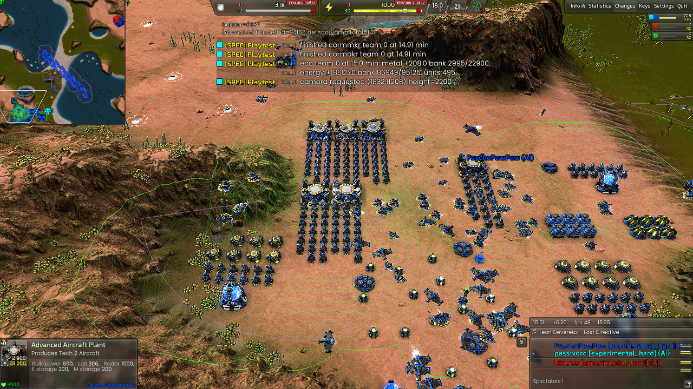

# AIR funded workforce (D-181)

Implementation of the [review and acceptance map](reviews/2026-10-03-air-build-power-review.md).
This document separates verified workforce behavior, natural economy timing,
whole-game failures and remaining performance limits.

## Policy and scope

`AirWorkforce` samples the engine's own income, actual usage, current storage,
receipts, sharing and excess once per simulation second. It forecasts no future
gifts. The minimum own-income sample over the last ten observed seconds and
stored capital fund a sixty-second runway after protecting the first-lab bank,
existing workforce commitments and a 100M/200E reserve. A new investment pays
its construction cost before adding its expected workload; early completion
and end-of-horizon balances must both remain above reserve. New admissions
debit capital and incremental spending immediately within the same sample.

Live project demand, idle capacity, arriving aircraft, queued support and
observed progress replace independent constructor ratios. The ordinary 40 T1
and 24 T2 counts are safety guards, lifted to 128 per type only under sustained
rising/full/refilling bank pressure. They are not workforce targets. Production
turrets still use the cold-start throughput model and twenty completed turrets
per existing advanced lab before expansion. Economy support cannot satisfy
that gate.

The old `NanoParallel`, `OpeningNanoMinEnergy`, `EconomyBuildPowerPerMetal`,
`BuildPowerFloatFactor` and `BuildPowerBankDrainSeconds` fields remain declared
for compatibility, but no longer control this AIR path. Their comments say so.
Tune the `Workforce*` budget/batch settings instead. The five-map and timing
snapshots predate these explanatory comments and two final lifecycle fixes:
PLAYER/RETREAT tasks no longer count as idle workers merely because they do not
cast to builder tasks, and entry reconciliation removes reachable unassigned
legacy nano orders. These fixes have subsequent lifecycle verification;
the earlier snapshots are retained with their original hashes.

Desired project power is delivered power plus affordable extra throughput,
bounded by remaining work. Existing assignments, including travellers and
temporarily energy-limited workers, and queued support subtract from that total
once. A factory turret cannot debit an economic shortage within the same sample.

Twelve additional economy support pins occupy their own array in each AFUS
module. The reactor/converter array preserves its original indices and old-save
loader. Support is built only for an unfinished, reachable, funded reactor;
reserving future land is not a spending instruction. Factory and economy turret
dispatch have separate ownership. Flying constructors can shorten the former
120/12-second assistance horizons when resources support useful extra work.

TECH's rule table, builder actions, layout, shared chooser, rush chain and
sharing policy remain unchanged in Git. AIR submits its support request before
the shared chooser and disables the chooser's second, independent turret
decision in its own snapshot. The existing metal-map AIR path already calls
the updated `Nano` and `Assist`; its dedicated mex/energy workers still take
precedence. No native code, bindings, profiles, combat routing or sample data
changed.

## Evidence interpretation

All games use Recoil `recoil_2026.07.04`, BAR
`Beyond All Reason test-31479-433a460` and pinned DLL SHA-256 prefix
`7be8085c281c3a0f`. Each immutable archive records full source/DLL/widget hashes,
start settings, original checks and screenshots. Supplied fixtures are not
natural economy scores. Whole-game invariant failures remain failures even
when AIR-specific checks pass.

The independent observer's `workingBP` is nominal BP on an active engine build
target, not a measurement of delivered work. Actual resource use comes from
engine usage fields. The controller separately measures project progress.
Thirty-second point samples do not establish total overflow or total transfers;
missing fields remain unavailable, and repeated frames are deduplicated.
Comparisons stop at the earlier AIR removal/observation frame. A spectator clock
continuing after defeat is not live economy evidence. The version-2 cohort
analysis below supersedes uncensored comparisons from initial per-run analyses;
their raw observations and immutable publications remain intact.

## Controlled tests

The first support-bank run revealed overlapping reservations caused by treating
the native half-footprint as a full footprint. The corrected test requires all
twelve pins and verifies named-state re-adoption. The first role-handoff run
failed INV-076; AIR now observes existing builder tasks on entry, retains framed
construction and reconciles unframed foreign orders before ownership checks.
Failed runs remain retained.

Strict supplied-fixture observations:

- Armada donation fixture: twenty-four physical economy turrets (4,800 BP),
  an AFUS and advanced converters; donors stop at ten minutes.
- Final Cortex six-lab fixture: all six supplied factories observed producing
  concurrently, 167 turrets and 62 T2 constructors physically completed by AIR,
  and economy support observed separately. The independent observer measured
  mean metal usage of 184.6/s, peaking at 471.6/s, with 18 full-bank samples
  spending above own income. These are point-sample statistics from a supplied
  stress test, not a sustainable natural economy score. All nine recruits seen
  at native priority zero subsequently completed.
- Legion energy-starved fixture: compiles under `experimental_terrible` and
  grows ordinary energy without a supplied reactor economy. This alone does
  not prove every resource-admission boundary; pure funding tests cover those.
- Lifecycle fixture: old nine-slot adoption, blocked support relocation,
  cancellation, both constructor tiers leaving injected guards, and AIR exit/
  reentry. The final strict audit requires actual observed events.

The native priority opt-in is deliberately not implemented. Several observed
priority-zero recruits progressed and completed. A matched causal low/high-pull
starvation experiment remains a stronger test than these observations; KI-491
stays open rather than becoming an unsupported native behavior change.

The final ownership review found that a non-builder task was being interpreted
as an idle worker. `IdleWorker` now admits null/NIL/IDLE/WAIT or inactive builder
jobs explicitly; PLAYER and RETREAT ownership remain unavailable. This changes
capacity accounting only and issues no command to those units. A staged probe
uses the existing native `UnitControl` API to hold and release one constructor.
The first strengthened run passed that assertion but failed INV-076 at role
re-entry: inherited unassigned nano orders were absent from the unit-task walk.
Entry reconciliation now uses the existing native queued-task lookup before
enabling its layout-only filter, cancels reachable unframed orders and preserves
frames. The final sixteen-minute lifecycle run passes all required assertions
and has no invariant or script failures. Both runs remain retained.

## Natural comparison

The initial frozen candidate and baseline each ran five maps with three paired
seed/faction combinations: Armada 1811001, Cortex 1811002 and Legion 1811003.
These are fifteen pairs, not fifteen independent repeats per faction. The
[portable comparison](benchmarks/air-workforce-cohort-2026-10-03.json) links
all thirty immutable reports and records matching inputs and common live
observation windows. Seeded inputs do not guarantee identical battles.

The median paired changes were -1.69 percentage points in full-bank sampled
occupancy, -27.0 nominal idle BP and **-5.96 metal/s actual usage**. Results are
mixed; reduced overflow or fewer idle workers alone does not establish better
gameplay. Several transitions and first fusions were later. One candidate
Caldera AIR stayed at 1,300 metal capacity without T2 through thirty minutes.
A diagnostic repeat could build storage, and the subsequent final-source
five-map repeat reached T2 everywhere. That does not establish the original
stall's root cause or close KI-461.

The final accounting correction received another five-map Armada run requesting
forty-five minutes, using seed 1811001. Times below are simulation minutes;
"alive" stops at AIR removal. A dash means not observed while AIR remained alive.

| Map | Clock / AIR alive | First T2 lab | First fusion | First T2 bomber | First / second AFUS | Whole game |
| --- | ---: | ---: | ---: | ---: | ---: | --- |
| [Supreme](benchmarks/records/air/economy/workforce-verified/2026-10-03/20261003T183738Z-c161d1a4/README.md) | 45.20 / 43.22 | 16.74 | 19.81 | 21.16 | 26.41 / 29.57 | FAIL |
| [Glacial](benchmarks/records/air/economy/workforce-verified/2026-10-03/20261003T183449Z-5e3c6d45/README.md) | 45.03 / 33.50 | 16.35 | 19.57 | 21.87 | 28.92 / 31.81 | FAIL |
| [Glitters](benchmarks/records/air/economy/workforce-verified/2026-10-03/20261003T184124Z-3c4dc7ca/README.md) | 45.10 / 43.01 | 17.63 | 22.64 | 25.58 | 25.58 / 30.08 | FAIL |
| [Tundra](benchmarks/records/air/economy/workforce-verified/2026-10-03/20261003T185343Z-bc951b46/README.md) | 45.02 / 45.02 | 14.01 | 22.26 | 30.08 | — / — | FAIL |
| [Caldera](benchmarks/records/air/economy/workforce-verified/2026-10-03/20261003T184529Z-4950273e/README.md) | 45.17 / 45.17 | 17.48 | 23.97 | 24.26 | — / — | PASS |

All five have zero AIR-specific invariant findings. Supreme and Glacial meet
the twenty-minute first-fusion goal; the other three do not. None establishes
an effective T2 raid by twenty minutes. Tundra records no T2 wave launch through
forty-five minutes. First bomber completion is not a wave launch or target kill.

The [final comparison](benchmarks/air-workforce-final-2026-10-03.json) links all
five reports and compares their common live windows with the Armada baseline.
Its median deltas are -3.28 percentage points full-bank sampled occupancy,
-332.6 nominal idle BP and **-19.49 metal/s usage**. These diverging battles do
not isolate a cause for lower spending, and are not an optimization victory.
KI-461 remains open for inconsistent natural transitions and timing.

## Metal and TECH controls

The three metal-map controls independently observe zero converters and dense
mex growth. They are four-player TECH/AIR controls, with teams 0/1 allied and
2/3 opponents. Their maximum observed mex counts were:

| Map | TECH 0 | AIR 1 | TECH 2 | AIR 3 | Focused / whole-game verdict |
| --- | ---: | ---: | ---: | ---: | --- |
| [Full Metal Plate 1.7](benchmarks/records/shared/economy/workforce-control/2026-10-03/20261003T173622Z-98c6ee06/README.md) | 40 | 34 | 48 | 73 | PASS / FAIL |
| [SpeedMetal BAR V2](benchmarks/records/shared/economy/workforce-control/2026-10-03/20261003T174256Z-9ebecc64/README.md) | 9 | 40 | 30 | 24 | PASS / FAIL |
| [Nine Metal Islands V1](benchmarks/records/shared/economy/workforce-control/2026-10-03/20261003T174757Z-5867a381/README.md) | 46 | 92 | 51 | 51 | PASS / FAIL |

Zero converters is verified; forty mexes for every player is not. Combat and
available buildable area affect those totals. Full Metal ended before the
requested thirty minutes. The whole-game failures include TECH production,
retirement, floating-metal and layout invariants; none is hidden by the focused
metal audit. Existing KI-472 remains open.

TECH's seven protected controller/chooser/sharing sources compare unchanged
against HEAD. The pinned baseline opening and T2-rush checks passed. The later
TECH-only repeats still performed their opening/rush but failed strict checks
with INV-028, INV-015 and INV-004. This is not a clean runtime regression gate,
and source isolation is not evidence that all existing TECH problems are fixed.

## Performance and command traffic

The performance observer measures Recoil's aggregate `AI` timer across **all**
AI callbacks per simulation frame. It cannot attribute a percentile to an
individual AIR instance or its census in the pinned non-profiling DLL. Report
that limitation explicitly; aggregate timing must not be relabeled per-AI CPU
time. Concurrent economy games are not wall-time performance benchmarks.

Four serial thirty-minute Supreme 8v8 games used seed 1814001: baseline/revised
with two AIR players, then baseline/revised with six AIR players. The
[portable timing evidence](benchmarks/air-workforce-performance-2026-10-03.json)
contains cumulative p50/p95/max, minute speed and synchronized orders.

| AIR players | Cumulative window | Baseline / revised p95, ms | Change | Population caveat |
| ---: | ---: | ---: | ---: | --- |
| 2 | 10 min | 2.377 / 2.516 | +5.83% | Full roster; different battles |
| 2 | 20 min | 2.967 / 2.980 | +0.46% | Full roster; different battles |
| 2 | 30 min | 3.482 / 4.066 | +16.77% | Baseline lost eight AIs at 27.50 min; not a full-roster comparison |
| 6 | 10 min | 2.736 / 2.736 | 0.00% | Full roster; different battles |
| 6 | 20 min | 3.465 / 3.488 | +0.68% | Full roster; different battles |
| 6 | 30 min | 5.750 / 4.789 | -16.71% | Full roster; different battles |

The early +5.83% observation is retained. The later +16.77% observation prompted
investigation: baseline AIR team 0 had zero units at thirty minutes versus 159
in the revised game, and eight AI instances had stopped after elimination. This
confounds attribution; it does not prove every millisecond came from population.
The full-roster observations do not show a repeatable regression above 5%.
They also do not isolate AIR census time or prove an FPS guarantee.
Median observed simulation speeds were 4.485x/4.501x for the two-AIR pair and
4.749x/4.553x for the six-AIR pair at a requested 30x. These include the engine
and rendering workload, and are not isolated AI timings.

All four timing observers succeeded, with zero AIR-specific invariants; all
four whole-game checks failed TECH invariants. Peak AIR-role orders/minute were
1,112/1,179 for the two-AIR pair and 2,006/1,777 for the six-AIR pair. These
thirty-minute controls do not erase the later Supreme APM failure below.

The [fixed-population comparison](benchmarks/air-workforce-scaling-2026-10-03.json)
uses two frozen AIs with supplied factories and 100/500/1,000 idle constructors,
with no active construction projects. Both final games pass every check. The
table uses settled minute windows after each spawn; times cover all callbacks.

| Constructors | Baseline / revised mean, ms | Baseline / revised p95, ms | Baseline / revised p99, ms |
| ---: | ---: | ---: | ---: |
| 100 | 0.129 / 0.140 | 0.375 / 0.379 | 2.130 / 1.986 |
| 500 | 0.260 / 0.297 | 0.396 / 0.403 | 5.309 / 6.409 |
| 1,000 | 0.440 / 0.520 | 0.499 / 0.514 | 10.405 / 12.854 |

The highest population adds 0.081 ms mean callback time per frame and 2.449 ms
at p99. This is measurable cost, even though p95 grows only 2.94%. A once-second
census can affect too few frames for p95 alone to capture its tail. No claim of
zero overhead is made. These idle fixtures cannot measure savings from removing
project-by-unit rescans in an active economy. Isolated census timing at increasing
project counts remains a profiling gap.

The [first population trials](benchmarks/air-workforce-scaling-initial-2026-10-03.json)
and [intermediate control](benchmarks/air-workforce-scaling-partial-control-2026-10-03.json)
remain retained as whole-game failures: production was frozen without providing
a factory to every AI, so INV-050 fired. Their observed counts/timings are
available, but the final fixture satisfies that invariant by supplying factories.

The workforce census traverses owned units and active projects once per second.
It skips combat aircraft before progress/lifecycle/name queries, and indexes
assignments by worker/target ID. Assistance no longer scans every owned unit
for every candidate project. Support ownership uses indexed positions. Layout
reservation searches remain separate, bounded placement operations; the entire
planner is not claimed to be linear-time.

Supreme's final 45-minute run reached 6,323 total synchronized unit orders/min
at minute 41 (4,508 aircraft orders). The breakdown was 3,068 fighter, 1,570
turret, 862 bomber, 279 T2-constructor and 124 T1-constructor orders, plus other
units. Minute 43 also had substantial constructor traffic. These measurements
exceed the owner's threshold and keep KI-477 open. They are unit-order counts,
not packet counts or network bandwidth. No blanket rate limiter was added.

## Verification scope

Nineteen standalone funding/capacity tests pass, including a full bank with
negative own balance, donor loss/runway, protected lab capital, queued capacity,
faster construction's early cash requirement, energy-limited assignees, and an
affordable constructor while the opening turret is unaffordable. Existing native
geometry/placement and AngelScript policy suites passed. The playtest tooling
suite passes all 81 tests, including elimination censoring and the engine-timer
argument/profiling contract.
Script/DLL parity checks 276 used members with no findings. Role-document and
invariant checks pass. Documentation links retain the eight existing missing
hover-reference failures (KI-404).

The final report distinguishes these limits:

- R1-R5 are implemented in active AIR scripts. TECH defaults, samples and native
  recruitment behavior are unchanged.
- Supplied donation, six-lab, energy-starved and lifecycle checks pass; old
  module adoption is not an engine save/load round trip.
- Natural timing and whole-game invariant checks remain mixed. KI-461 and
  KI-472 are not closed by passing capability fixtures.
- Isolated per-AIR/census p95 and a causal low/high-pull recruitment experiment
  remain unverified. Native priority is deliberately unchanged; KI-491 stays
  open. Global sub-3,000 APM and no-FPS-impact guarantees are not established.

## Selected immutable evidence

- [Donation control](benchmarks/records/air/economy/workforce-donations/2026-10-03/20261003T171308Z-520f3adf/README.md)
- [Six-lab control](benchmarks/records/air/economy/workforce-six-labs/2026-10-03/20261003T182546Z-5f1781f1/README.md)
- [Energy-starved Legion](benchmarks/records/air/economy/workforce-energy-starved/2026-10-03/20261003T173107Z-fbfc435c/README.md)
- [Initial lifecycle failure](benchmarks/records/air/economy/workforce-lifecycle/2026-10-03/20261003T173720Z-6f976a48/README.md)
- [Initial corrected lifecycle](benchmarks/records/air/economy/workforce-lifecycle/2026-10-03/20261003T174844Z-889a51fd/README.md)
- [Strengthened lifecycle failure](benchmarks/records/air/economy/workforce-lifecycle/2026-10-03/20261003T193734Z-2cad4a2b/README.md)
- [Final ownership and handoff PASS](benchmarks/records/air/economy/workforce-lifecycle/2026-10-03/20261003T194437Z-545a16b5/README.md)
- [Baseline TECH opening](benchmarks/records/tech/economy/workforce-control/2026-10-03/20261003T175502Z-47b1f9a7/README.md)
- [Revised TECH opening](benchmarks/records/tech/economy/workforce-control/2026-10-03/20261003T180314Z-9d7ea167/README.md)
- [Revised TECH rush](benchmarks/records/tech/economy/workforce-control/2026-10-03/20261003T180527Z-248e4c28/README.md)

Supplied six-lab fixture: economic support is separate from the factory banks.
This demonstrates capacity, not a natural economy timing target.

