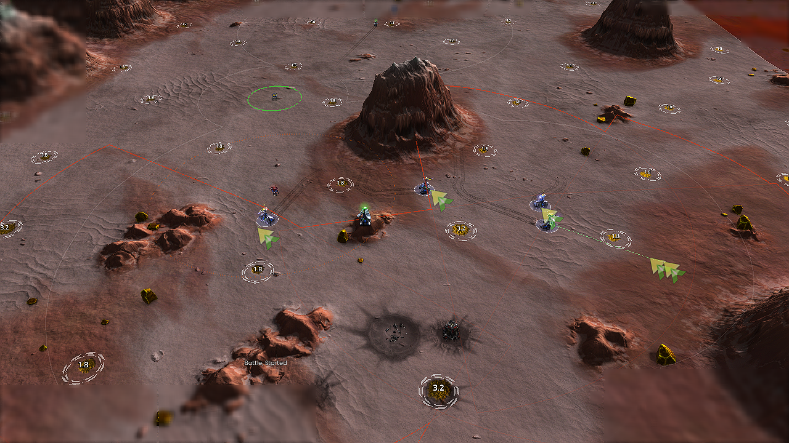
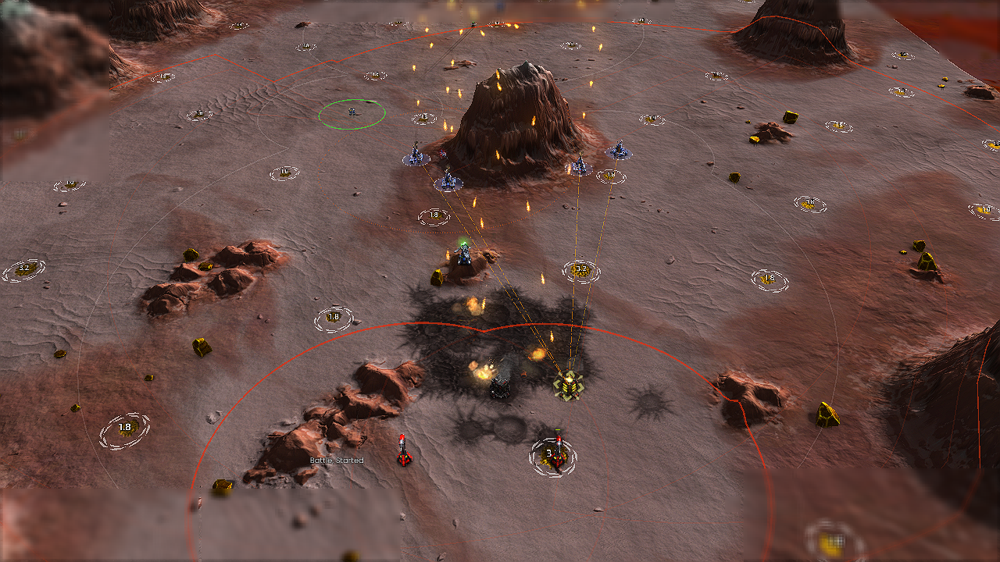
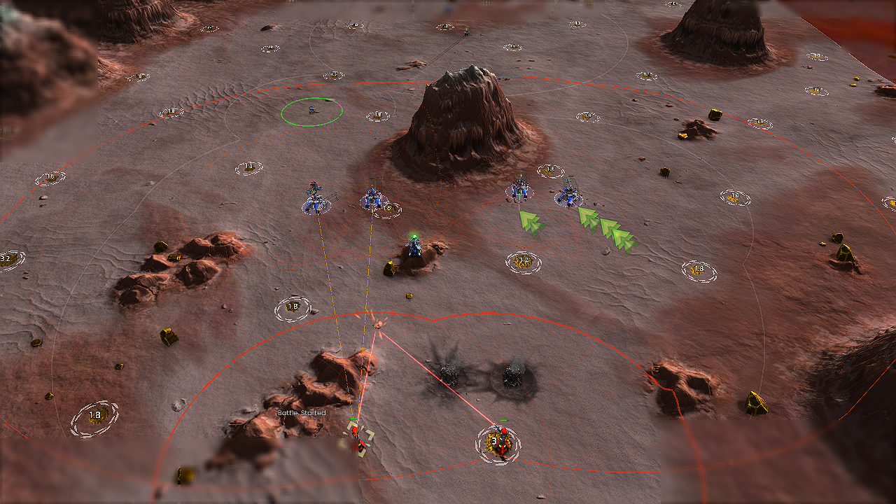
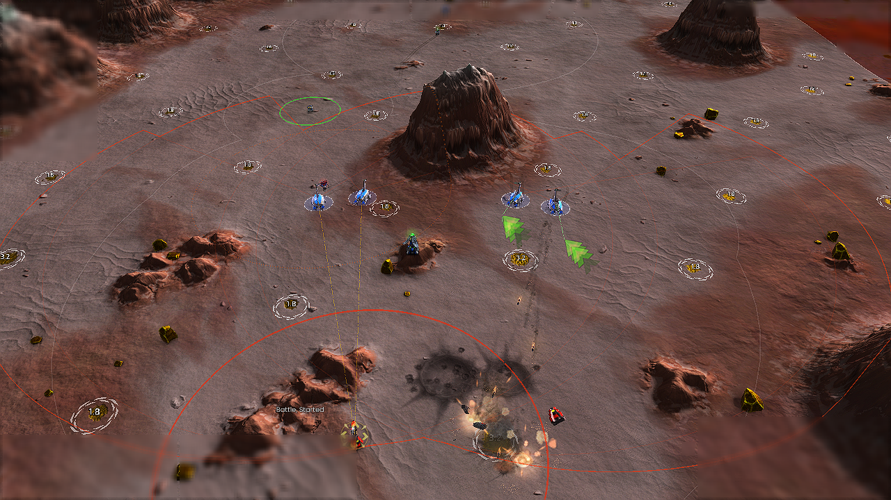
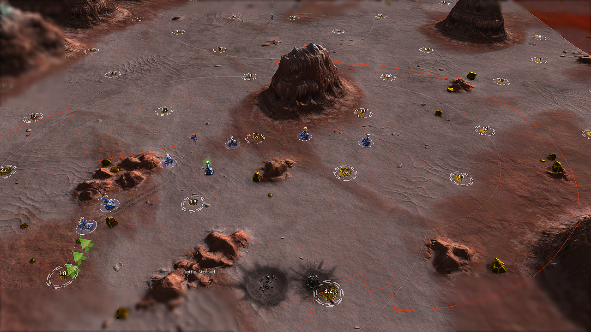
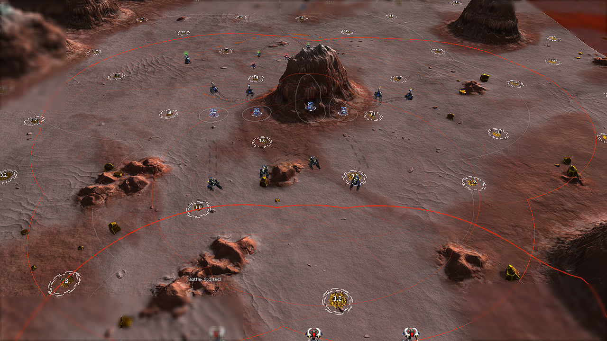
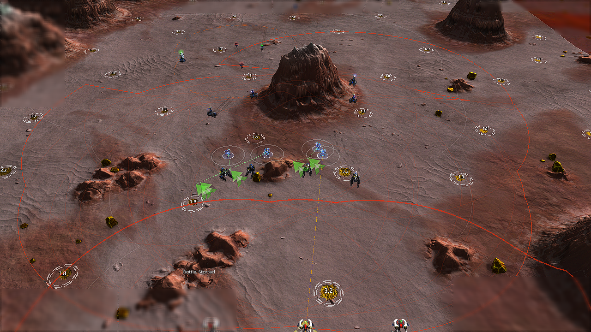
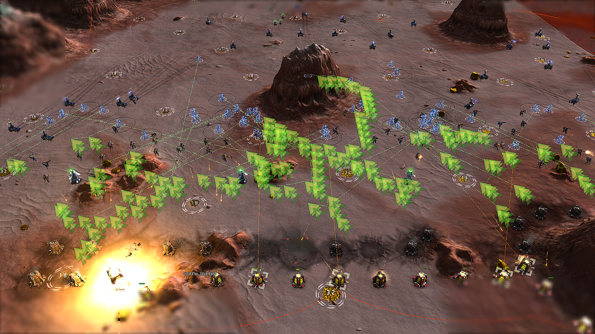

# Ranged combat rework: verification and performance

2026-10-05. Source checkpoint: `24e0c4d7`; feature branch:
`codex/ranged-combat-rework`. This is a supplied-force combat study, not a
natural economy or multiplayer win-rate benchmark. The
[implementation reference](../ranged-combat.md) links the unit-by-unit PvP
research, controls, source owners and scope. The
[original balanced inventory](../reviews/2026-10-05-balanced-siege-attributes.md)
covers the existing siege roster, including units deliberately not migrated.

**Merge readiness: draft.** The mechanisms and all ten unit migrations are
implemented, built and played. Starlight survival in the unscreened closing
fixture still trails the old build, and zero FPS impact has not been
established. KI-509 and KI-510 record those limits. Original failed trials and
overly broad watch passes are preserved below rather than counted as a clean
regression suite.

## What changed

1. Added one opt-in `ranged` attribute and JSON presets for precision,
   skirmishing, bombardment and carrier positioning. All ten proposed units
   retain their original role lists, prior attributes and production settings.
2. Separated safe MOVE routing from BAR priority firing. Loaded real weapons,
   target categories, firing geometry and local friendly hulls constrain shots.
   In-range useful targets take precedence over pursuing valuable bait.
3. Added planned firing-slot separation, observed threat coverage, salvo claims,
   visible repair-progress penalties and closing-speed withdrawal. Sharpshooters
   retain turret fire during tactical withdrawal and use affordable cloak;
   Starlights reserve more space and account for turning before escape.
4. Added advancing radar/jammer escorts with safe routes and coverage leases.
   Existing non-enrolled combat owners, naval/air policies and carrier-child
   gadget ownership remain in place.
5. Fixed runtime bugs found in the matrix: unrelated death clearing a live
   artillery controller, Medusa rockets hitting friendly radar, lost sensor
   classification/handover, unsafe escort anchors and energy-stall order churn.
6. Removed repeated ally-wrapper reconstruction, cached immutable armor data,
   and borrowed objective lists. These are performance changes; death-explosion
   avoidance is separately identified as an intentional behavior change.

## Reproduction and provenance

- Game: `Beyond All Reason test-31479-433a460`; engine: `recoil_2026.07.04`.
- Maps: All That Glitters v2.2.3 and Comet Catcher Remake 1.8.
- Seed: 2071; standard combat window: four game minutes; speed: 8x;
  rendered resolution: 1280 x 720. Profile admission smokes use one minute.
- Host reported by the engine: Intel Core i9-12900KF, 16 physical / 24 logical
  cores, approximately 64 GB RAM. Timings are observations on this host.
- Baseline DLL SHA-256:
  `9af405acf9a6180b3d060f9431f8531f1259a61247532b621e7b96cba29cc997`.
  This is a pinned pre-work development binary with checkpoint data, not a
  claim that the binary was rebuilt reproducibly from `24e0c4d7`.
- Every published run includes actual DLL/data/observer hashes, fixture JSON,
  original watch checks/verdict and versioned combat measurements. Raw logs,
  replays and matching symbols remain at their recorded local archive paths.
- Combat orders for team 0 are AI-owned. The fixture supplies units/resources
  and controls enemy movement. Experimental economy is frozen only in staged
  scripts. Legacy profile smokes retain their native economy.

Use [ranged_benchmark.py](../../tools/playtest/ranged_benchmark.py) and the
[case index](../../tools/playtest/cases/shared/combat/README.md). Measurement v5
discards shutdown-grace events beyond the fixed deadline, rejects partial log
events, carries forward failed watch verdicts and refuses conflicting rewrites.
Earlier analyses and failures remain intact. Watch PASS and combat acceptance
are separate results; neither means a game victory.

The `shots` field counts sampled mounted-weapon reload changes; Medusa's
zero-damage marker can contribute events. It is not a projectile or damaging
shot count. Actual damage and target deaths are separate evidence. Carrier
child damage is attributed to its parent without counting fake parent shots.

## Initial serial performance comparison

Performance games were serial, without concurrent builds or simulations.
Detailed tracing and the snapshot differential oracle were disabled. Functional
matrix runs may overlap and are **excluded** from CPU/FPS comparisons.
The user's existing BAR menu process remained open and untouched. These are
same-host comparisons, not measurements on an otherwise empty machine.

| 120-unit, four-minute trial | Enemy targets killed | Ranged losses | AI commands / game minute | Mean aggregate AI ms / sim frame | Mean of four window p95 values, ms | Median sampled render FPS |
| --- | ---: | ---: | ---: | ---: | ---: | ---: |
| Old build | 150 | 0 | 5,780.25 | 0.118450 | 0.426910 | 112 |
| Optimized candidate A | 140 | 0 | 3,154.25 | 0.182334 | 0.485931 | 107 |
| Optimized candidate B | 143 | 0 | 2,885.50 | 0.180633 | 0.484680 | 105 |

At this stage the controller issued **45-50% fewer AI orders**, with **0.062-0.064 ms/frame
more average aggregate AI work** than the old behavior. The p95 column is a
mean of window percentiles, not a percentile reconstructed from all frames.
The engine counter includes both AIs. Orders are non-Lua unit orders, not
network packets; no internet-peer saving is claimed.

These trials precede the final guided-corridor, half-turn and precision vision
refinements. Release-build timing is recorded separately below. Intervening
timing attempts overlapping a rebuild or functional run are excluded; their
raw directories are retained.

The repeated rendered samples are lower than the baseline. This does **not**
establish FPS parity, and the rework is not presented as a zero-cost change.
The 8x test magnifies simulation cost per wall second. Camera/screenshot work,
different movement and surviving targets also affect rendering. There is no
verified guarantee against late-game or multiplayer FPS drops from these runs.
The measured increase is small in absolute simulation-frame time; larger
natural 8v8 games and network traces remain a separate acceptance dimension.

The final normal-speed cohort also includes `perf-realtime-clean-control`:
the new DLL with pinned old policy data. This distinguishes the enabled
controller from unrelated pre-work binary differences. `clean-baseline` uses
the pinned old DLL/data; `clean-candidate` uses the new DLL/data. Both old-policy
variants are labeled `baseline` by the runner, so use the trial label and DLL
hash together. These are equivalent fixtures, not identical evolving armies.

The final 1x comparison against that same-DLL control reduced orders from
4680.5 to 3884 per game minute (**17.0%**), while mean aggregate AI time rose
from 0.129329 to 0.198573 ms per simulation frame (**+0.069245 ms, 53.5%**).
Median sampled render FPS fell from 341 to 282 (**17.3%**). The final 8x run
issued 37.3% fewer orders than the earlier old-build 8x trial, with zero ranged
losses in both. Clearance was 147 versus 150 targets over four minutes.

The measured native AI increment alone does not explain the entire render-FPS
difference: armies, effects and visible command paths evolve differently.
These short samples do not isolate a rendering cause or provide confidence
intervals. They do establish that the requested no-FPS-drop acceptance has
**not passed**; the PR remains a draft. Do not turn fewer orders or faster
shared snapshots into a claim of faster overall gameplay.

The explosive-storage load case intentionally tests safety under targets
appearing near advancing units. The pre-safety candidate killed 159-160 targets
but lost 1-6 ranged units in two trials. The final candidate lost none, with
lower clearance. This is a safety/throughput tradeoff, not proof of universally
better combat strength. Do not compare unequal surviving armies as an exact
CPU microbenchmark.

Separate diagnostic phase runs measured shared snapshot exclusive time falling
from **489.741 ms to 323.959 ms** over four game minutes, approximately **34%**.
Decision time changed from 205.567 to 258.457 ms, including the added blast
checks and different battle trajectories. These totals establish where time
was spent; they do not isolate an exact same-input kernel speedup.

### Before/after allocation path

The earlier candidate forced the general ally cache to rebuild:

```cpp
circuit->UpdateFriendlyUnits(); // deletes/recreates ally objects and wrappers
for (const auto& [id, unit] : circuit->GetFriendlyUnits()) {
    // Copy legal definition and position into this frame's snapshot.
}
```

The final reader retains an ID buffer and reads the same legal engine fields:

```cpp
const int count = api->GetFriendlyUnitIds(friendlyIds);
std::sort(friendlyIds.begin(), friendlyIds.begin() + count);
for (int i = 0; i < count; ++i) {
    const int id = friendlyIds[i];
    // Read authority definition and position; apply the same terrain correction.
}
```

Sorting preserves the former map iteration/tie order. Complexity is
O(F log F), with retained ID storage, instead of repeated wrapper/map-node
allocation. `CIRCUIT_VERIFY_RANGED_SNAPSHOT=1` compared IDs, positions, counts
and radii against the former view in load, unrelated-death and mixed-sensor
games: all passed. No engine callbacks moved to worker threads. See the
[maintenance contract](../performance/engineering-guide.md).

## Validation boundaries

The final repaired-bait Starlight run cleared nine targets without losses.
A rear-only idle-formation experiment reduced that to two without fixing
closing-assault losses; it was reverted. The final Sharpshooter approach
retains unknown-radar movement, after disabling it reduced bait clearance
from nine to four and introduced a closing-assault loss. Restored-policy
closing trials cleared 14 targets with zero Sharpshooter losses.

The original single-line mixed-sensor run cleared all three defenses by game
frame 1894 (63.1 seconds), but failed its fixed 600-elmo escort travel
threshold. That FAIL remains visible. A separate `ranged-sensor-advance`
fixture added a second defensive line at 90 seconds: the final build cleared
all six defenses without ranged losses, with radar advance of 1692 elmos and
jammer advance of 975 elmos. This demonstrates continued escort progress when
the front advances; it does not retroactively pass the original travel
assertion or establish optimal coverage in every formation.

The integration build uses C++20 and `-Wall`. The native suite passed all 13
executables, including 1,000 mutation queries compared against a brute-force
spatial oracle. Embedded AngelScript policy suites also passed. Profile checks
verified 77 migrated entries in 15 active files while preserving unrelated
configuration content and classifications (the outside-object comparison
normalizes Git CRLF/LF conversion). All seven supported profiles loaded
and admitted all ten types in actual engine runs. Script/DLL parity checked
303 API members with zero findings.

Python checks cover profile parsing/migration, immutable measurements,
truncated events, fixed windows and storage preservation. Existing repository
diagnostics remain: 165 unknown floating-hover IDs (KI-481), two unreachable
sonar IDs (KI-473), and eight missing hover-document links (KI-404). They are
outside this migration and are not reported as passing checks. The one-time
storage migration audit still reports the documented KI-492/D-182 hash
mismatch for the subsequently revised `air_build_power` definition; that
definition is unchanged by this branch. All 130 historical benchmark/image
hashes still match. The 66 newly published observations verified 932 artifact
hashes, with no pending publication directories left behind.

Save/load, mixed human command handover, long-running 8v8/network sessions,
and universal PvP superiority are not established by these fixtures. Formation
spacing is a destination contract; moving units can pass closer in transit.
Radar-only shots retain uncertainty. Sampled shots and damage confirm actual
combat, but do not prove every possible cloak, aim, reload and collision state.

<!-- GENERATED_RUN_EVIDENCE -->

## Published observations

### Release performance runs

| Trial | Speed / minutes | Kills / losses | Orders / game min | Mean AI ms | Mean window p95 ms | Median FPS |
| --- | --- | --- | ---: | ---: | ---: | ---: |
| perf-release | 8x / 4 | 147 / 0 | 3623.75 | 0.192824 | 0.504699 | 106.0 |
| perf-realtime-clean-baseline | 1x / 2 | 87 / 0 | 4547.00 | 0.136557 | 0.465027 | 323.0 |
| perf-realtime-clean-control | 1x / 2 | 84 / 0 | 4680.50 | 0.129329 | 0.450927 | 341.0 |
| perf-realtime-clean-candidate | 1x / 2 | 81 / 0 | 3884.00 | 0.198573 | 0.505310 | 282.0 |

Each row links its immutable record. Acceptance is from measurement v5, separately from the original watch verdict. Older failed candidates remain visible.

| Cohort | Case | Acceptance | Kills / ranged losses | Evidence |
| --- | --- | --- | --- | --- |
| final-oracle | ranged-population-120 | PASS | 136 / 0 | [20261005T205708Z-446cabe3](records/shared/combat/ranged-population-120/2026-10-05/20261005T205708Z-446cabe3/README.md) |
| final-oracle | ranged-foreign-death | PASS | 4 / 0 | [20261005T205821Z-2baca3d5](records/shared/combat/ranged-foreign-death/2026-10-05/20261005T205821Z-2baca3d5/README.md) |
| final-oracle | ranged-mixed-sensors | PASS | 3 / 0 | [20261005T205936Z-2e25e456](records/shared/combat/ranged-mixed-sensors/2026-10-05/20261005T205936Z-2e25e456/README.md) |
| final-units-armada | ranged-armfboy | PASS | 4 / 0 | [20261005T210651Z-4b9a58ad](records/shared/combat/ranged-armfboy/2026-10-05/20261005T210651Z-4b9a58ad/README.md) |
| final-units-armada | ranged-armfido | PASS | 4 / 0 | [20261005T210810Z-de475e79](records/shared/combat/ranged-armfido/2026-10-05/20261005T210810Z-de475e79/README.md) |
| final-units-armada | ranged-armsnipe | PASS | 4 / 0 | [20261005T210933Z-ca1b79ac](records/shared/combat/ranged-armsnipe/2026-10-05/20261005T210933Z-ca1b79ac/README.md) |
| final-units-armada | ranged-armmanni | PASS | 4 / 0 | [20261005T211052Z-81a9ac9c](records/shared/combat/ranged-armmanni/2026-10-05/20261005T211052Z-81a9ac9c/README.md) |
| final-units-armada | ranged-cormort | PASS | 4 / 0 | [20261005T211212Z-e4fd34ad](records/shared/combat/ranged-cormort/2026-10-05/20261005T211212Z-e4fd34ad/README.md) |
| final-units-armada | ranged-sniper-bait | PASS | 9 / 0 | [20261005T211331Z-a0daf75d](records/shared/combat/ranged-sniper-bait/2026-10-05/20261005T211331Z-a0daf75d/README.md) |
| final-units-armada | ranged-starlight-bait | PASS | 9 / 0 | [20261005T211447Z-2413a7ab](records/shared/combat/ranged-starlight-bait/2026-10-05/20261005T211447Z-2413a7ab/README.md) |
| final-units-others | ranged-corban | PASS | 4 / 0 | [20261005T210707Z-00ad7f88](records/shared/combat/ranged-corban/2026-10-05/20261005T210707Z-00ad7f88/README.md) |
| final-units-others | ranged-cortrem | PASS | 4 / 0 | [20261005T210824Z-328b2701](records/shared/combat/ranged-cortrem/2026-10-05/20261005T210824Z-328b2701/README.md) |
| final-units-others | ranged-legamcluster | PASS | 4 / 0 | [20261005T210947Z-37c5b471](records/shared/combat/ranged-legamcluster/2026-10-05/20261005T210947Z-37c5b471/README.md) |
| final-units-others | ranged-legmed | FAIL: insufficient target kills | 2 / 0 | [20261005T211107Z-3218c959](records/shared/combat/ranged-legmed/2026-10-05/20261005T211107Z-3218c959/README.md) |
| final-units-others | ranged-legvcarry | PASS | 4 / 0 | [20261005T211229Z-a5c65a16](records/shared/combat/ranged-legvcarry/2026-10-05/20261005T211229Z-a5c65a16/README.md) |
| final-units-others | ranged-corban-air | PASS | 6 / 1 | [20261005T211346Z-a49c6108](records/shared/combat/ranged-corban-air/2026-10-05/20261005T211346Z-a49c6108/README.md) |
| final-units-others | ranged-splash-screen | PASS | 8 / 0 | [20261005T211501Z-7cb32870](records/shared/combat/ranged-splash-screen/2026-10-05/20261005T211501Z-7cb32870/README.md) |
| final-units-others | ranged-mixed-flat | PASS | 3 / 0 | [20261005T211614Z-9d50eedd](records/shared/combat/ranged-mixed-flat/2026-10-05/20261005T211614Z-9d50eedd/README.md) |
| final-guided | ranged-legmed | PASS | 4 / 0 | [20261005T211925Z-7ebff709](records/shared/combat/ranged-legmed/2026-10-05/20261005T211925Z-7ebff709/README.md) |
| final-guided | ranged-legmed | PASS | 4 / 0 | [20261005T212047Z-cf8dc23e](records/shared/combat/ranged-legmed/2026-10-05/20261005T212047Z-cf8dc23e/README.md) |
| final-guided | ranged-corban | PASS | 4 / 0 | [20261005T212209Z-fbc08648](records/shared/combat/ranged-corban/2026-10-05/20261005T212209Z-fbc08648/README.md) |
| final-guided | ranged-corban-air | PASS | 6 / 0 | [20261005T212327Z-a3008761](records/shared/combat/ranged-corban-air/2026-10-05/20261005T212327Z-a3008761/README.md) |
| final-withdrawal | ranged-sniper-low-energy | PASS | 0 / 0 | [20261005T211943Z-d9660e43](records/shared/combat/ranged-sniper-low-energy/2026-10-05/20261005T211943Z-d9660e43/README.md) |
| final-withdrawal | ranged-sniper-closing | PASS | 14 / 0 | [20261005T212105Z-08757fbd](records/shared/combat/ranged-sniper-closing/2026-10-05/20261005T212105Z-08757fbd/README.md) |
| final-withdrawal | ranged-starlight-closing | PASS | 14 / 1 | [20261005T212227Z-b8b7cf87](records/shared/combat/ranged-starlight-closing/2026-10-05/20261005T212227Z-b8b7cf87/README.md) |
| final-half-turn | ranged-starlight-closing | PASS | 14 / 1 | [20261005T213146Z-5c9a0fe4](records/shared/combat/ranged-starlight-closing/2026-10-05/20261005T213146Z-5c9a0fe4/README.md) |
| final-precision | ranged-starlight-closing | PASS | 14 / 1 | [20261005T214514Z-60c2cd3d](records/shared/combat/ranged-starlight-closing/2026-10-05/20261005T214514Z-60c2cd3d/README.md) |
| final-precision | ranged-sniper-closing | PASS | 14 / 1 | [20261005T214637Z-cda1b70f](records/shared/combat/ranged-sniper-closing/2026-10-05/20261005T214637Z-cda1b70f/README.md) |
| final-precision | ranged-starlight-bait | PASS | 9 / 0 | [20261005T214800Z-4a71c4e8](records/shared/combat/ranged-starlight-bait/2026-10-05/20261005T214800Z-4a71c4e8/README.md) |
| final-precision | ranged-sniper-bait | PASS | 4 / 0 | [20261005T214923Z-3e7477f4](records/shared/combat/ranged-sniper-bait/2026-10-05/20261005T214923Z-3e7477f4/README.md) |
| final-precision | ranged-mixed-sensors | PASS | 3 / 0 | [20261005T215046Z-652978c1](records/shared/combat/ranged-mixed-sensors/2026-10-05/20261005T215046Z-652978c1/README.md) |
| final-sniper-refinement | ranged-sniper-bait | PASS | 9 / 0 | [20261005T215222Z-0beb492b](records/shared/combat/ranged-sniper-bait/2026-10-05/20261005T215222Z-0beb492b/README.md) |
| final-sniper-refinement | ranged-sniper-closing | PASS | 14 / 0 | [20261005T215340Z-60e9b03c](records/shared/combat/ranged-sniper-closing/2026-10-05/20261005T215340Z-60e9b03c/README.md) |
| rejected-rear-dispersal | ranged-starlight-closing | PASS | 14 / 1 | [20261005T220054Z-d8d8217e](records/shared/combat/ranged-starlight-closing/2026-10-05/20261005T220054Z-d8d8217e/README.md) |
| rejected-rear-dispersal | ranged-sniper-closing | PASS | 14 / 0 | [20261005T220214Z-bb9500f0](records/shared/combat/ranged-sniper-closing/2026-10-05/20261005T220214Z-bb9500f0/README.md) |
| rejected-rear-dispersal | ranged-starlight-bait | PASS | 2 / 0 | [20261005T220333Z-e6b6f102](records/shared/combat/ranged-starlight-bait/2026-10-05/20261005T220333Z-e6b6f102/README.md) |
| rejected-rear-dispersal | ranged-sniper-bait | PASS | 9 / 0 | [20261005T220451Z-80b3de51](records/shared/combat/ranged-sniper-bait/2026-10-05/20261005T220451Z-80b3de51/README.md) |
| rejected-rear-dispersal | ranged-mixed-sensors | FAIL: sensor did not advance: armseer, sensor did not advance: armaser | 2 / 0 | [20261005T220610Z-cfe7154f](records/shared/combat/ranged-mixed-sensors/2026-10-05/20261005T220610Z-cfe7154f/README.md) |
| final-release-bait | ranged-starlight-bait | PASS | 9 / 0 | [20261005T220907Z-c73b34f5](records/shared/combat/ranged-starlight-bait/2026-10-05/20261005T220907Z-c73b34f5/README.md) |
| final-release-bait | ranged-mixed-sensors | FAIL: sensor did not advance: armseer, sensor did not advance: armaser | 3 / 0 | [20261005T221022Z-137a7920](records/shared/combat/ranged-mixed-sensors/2026-10-05/20261005T221022Z-137a7920/README.md) |
| final-sensor-advance | ranged-sensor-advance | PASS | 6 / 0 | [20261005T221328Z-5d9bcda8](records/shared/combat/ranged-sensor-advance/2026-10-05/20261005T221328Z-5d9bcda8/README.md) |
| perf-final-a | ranged-population-120 | PASS | 140 / 0 | [20261005T210111Z-68ad1f7f](records/shared/combat/ranged-population-120/2026-10-05/20261005T210111Z-68ad1f7f/README.md) |
| perf-final-baseline | ranged-population-120 | PASS | 150 / 0 | [20261005T210227Z-c364cade](records/shared/combat/ranged-population-120/2026-10-05/20261005T210227Z-c364cade/README.md) |
| perf-final-b | ranged-population-120 | PASS | 143 / 0 | [20261005T210342Z-01881dd9](records/shared/combat/ranged-population-120/2026-10-05/20261005T210342Z-01881dd9/README.md) |
| perf-phase-before | ranged-population-120 | FAIL: ranged casualties | 151 / 2 | [20261005T204349Z-8c55b737](records/shared/combat/ranged-population-120/2026-10-05/20261005T204349Z-8c55b737/README.md) |
| perf-phase-after | ranged-population-120 | PASS | 146 / 0 | [20261005T210457Z-d3016476](records/shared/combat/ranged-population-120/2026-10-05/20261005T210457Z-d3016476/README.md) |
| perf-valid-candidate | ranged-population-120 | FAIL: ranged casualties | 157 / 1 | [20261005T203519Z-b8271ebd](records/shared/combat/ranged-population-120/2026-10-05/20261005T203519Z-b8271ebd/README.md) |
| perf-valid-candidate-repeat | ranged-population-120 | FAIL: ranged casualties | 153 / 5 | [20261005T203750Z-379a7ba0](records/shared/combat/ranged-population-120/2026-10-05/20261005T203750Z-379a7ba0/README.md) |
| perf-release | ranged-population-120 | PASS | 147 / 0 | [20261005T221525Z-74738e19](records/shared/combat/ranged-population-120/2026-10-05/20261005T221525Z-74738e19/README.md) |
| perf-realtime-clean-baseline | ranged-population-120 | PASS | 87 / 0 | [20261005T221808Z-ed9e79dc](records/shared/combat/ranged-population-120/2026-10-05/20261005T221808Z-ed9e79dc/README.md) |
| perf-realtime-clean-control | ranged-population-120 | PASS | 84 / 0 | [20261005T222050Z-a5a8cfb5](records/shared/combat/ranged-population-120/2026-10-05/20261005T222050Z-a5a8cfb5/README.md) |
| perf-realtime-clean-candidate | ranged-population-120 | PASS | 81 / 0 | [20261005T222330Z-b6b5bda4](records/shared/combat/ranged-population-120/2026-10-05/20261005T222330Z-b6b5bda4/README.md) |
| bait-baseline | ranged-sniper-bait | PASS | 9 / 0 | [20261005T202207Z-3bca819c](records/shared/combat/ranged-sniper-bait/2026-10-05/20261005T202207Z-3bca819c/README.md) |
| bait-baseline | ranged-starlight-bait | PASS | 9 / 0 | [20261005T202323Z-24fed6ac](records/shared/combat/ranged-starlight-bait/2026-10-05/20261005T202323Z-24fed6ac/README.md) |
| bait-siege | ranged-sniper-bait | PASS | 1 / 0 | [20261005T202440Z-e3f7c226](records/shared/combat/ranged-sniper-bait/2026-10-05/20261005T202440Z-e3f7c226/README.md) |
| bait-siege-starlight | ranged-starlight-bait | PASS | 1 / 0 | [20261005T202939Z-57517966](records/shared/combat/ranged-starlight-bait/2026-10-05/20261005T202939Z-57517966/README.md) |
| closing-baseline | ranged-sniper-closing | PASS | 14 / 0 | [20261005T212521Z-84e4eb14](records/shared/combat/ranged-sniper-closing/2026-10-05/20261005T212521Z-84e4eb14/README.md) |
| closing-baseline | ranged-starlight-closing | PASS | 14 / 0 | [20261005T212640Z-ed3b3318](records/shared/combat/ranged-starlight-closing/2026-10-05/20261005T212640Z-ed3b3318/README.md) |
| profile-release-experimental_balanced | ranged-profile-load | PASS | 4 / 0 | [20261005T214504Z-c2d11b4e](records/shared/combat/ranged-profile-load/2026-10-05/20261005T214504Z-c2d11b4e/README.md) |
| profile-release-experimental_hard | ranged-profile-load | PASS | 4 / 0 | [20261005T214559Z-aecbab94](records/shared/combat/ranged-profile-load/2026-10-05/20261005T214559Z-aecbab94/README.md) |
| profile-release-experimental_terrible | ranged-profile-load | PASS | 4 / 0 | [20261005T214655Z-b2a24c98](records/shared/combat/ranged-profile-load/2026-10-05/20261005T214655Z-b2a24c98/README.md) |
| profile-release-easy | ranged-profile-load | PASS | 4 / 0 | [20261005T214749Z-834996c4](records/shared/combat/ranged-profile-load/2026-10-05/20261005T214749Z-834996c4/README.md) |
| profile-release-medium | ranged-profile-load | PASS | 4 / 0 | [20261005T214844Z-96228887](records/shared/combat/ranged-profile-load/2026-10-05/20261005T214844Z-96228887/README.md) |
| profile-release-hard | ranged-profile-load | PASS | 4 / 0 | [20261005T214939Z-d61fc86a](records/shared/combat/ranged-profile-load/2026-10-05/20261005T214939Z-d61fc86a/README.md) |
| profile-release-hard_aggressive | ranged-profile-load | PASS | 4 / 0 | [20261005T215033Z-8a4e0ca7](records/shared/combat/ranged-profile-load/2026-10-05/20261005T215033Z-8a4e0ca7/README.md) |
| development-medusa-crash | ranged-legmed | FAIL: insufficient target kills, incomplete observation window, original watch verdict: FAIL | 0 / 0 | [20261005T193854Z-7a2fd14d](records/shared/combat/ranged-legmed/2026-10-05/20261005T193854Z-7a2fd14d/README.md) |

The [machine-readable comparison](ranged-combat.json) includes timings, commands, build hashes and direct record locations.

## Selected rendered observations

### ranged-armmanni



### ranged-cortrem



### ranged-legvcarry



### ranged-legmed



### ranged-starlight-closing



### ranged-mixed-sensors



### ranged-sensor-advance



### ranged-population-120


