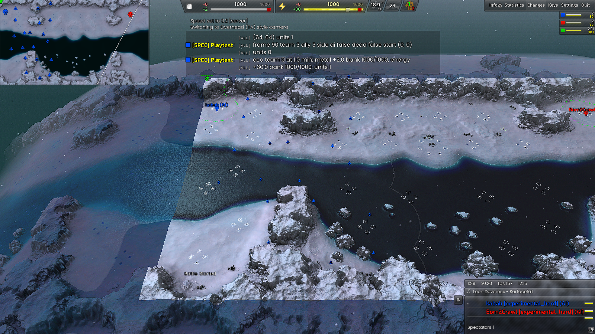
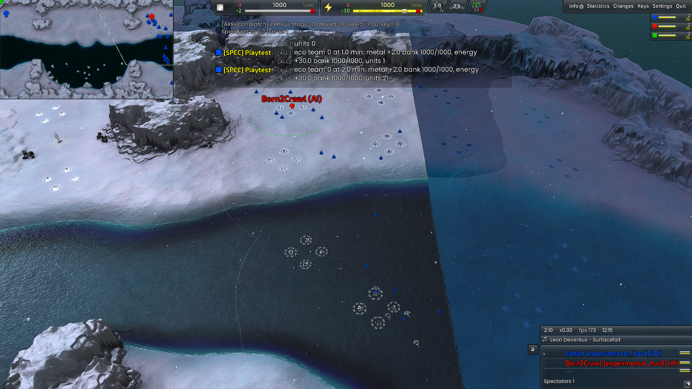

# AIR / combat / recon-d179-centered

Observation: **PASS** (reached 8 min); frame 15301.

Experiment kind: `supplied`. Map: Glacial Gap v1.1. Game: Beyond All Reason test-31479-433a460.

[Original report](report.md) | [Result and raw-evidence hashes](result.json) | [Acceptance checks](checks.json)

PASS is the check verdict, not a confirmed game victory. Raw logs/replays remain in the recorded local archive.

