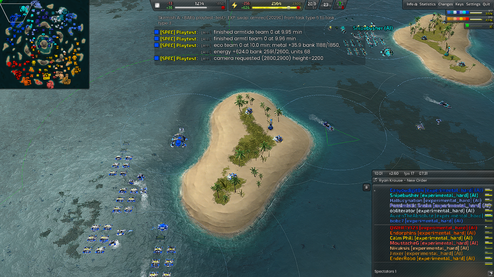

# SEA / economy / cohort-candidate

Observation: **PASS** (reached 30 min); frame 54115.

Experiment kind: `benchmark`. Map: Serene Caldera v1.3. Game: Beyond All Reason test-31479-433a460.

[Original report](report.md) | [Result and raw-evidence hashes](result.json) | [Acceptance checks](checks.json)

PASS is the check verdict, not a confirmed game victory. Raw logs/replays remain in the recorded local archive.

