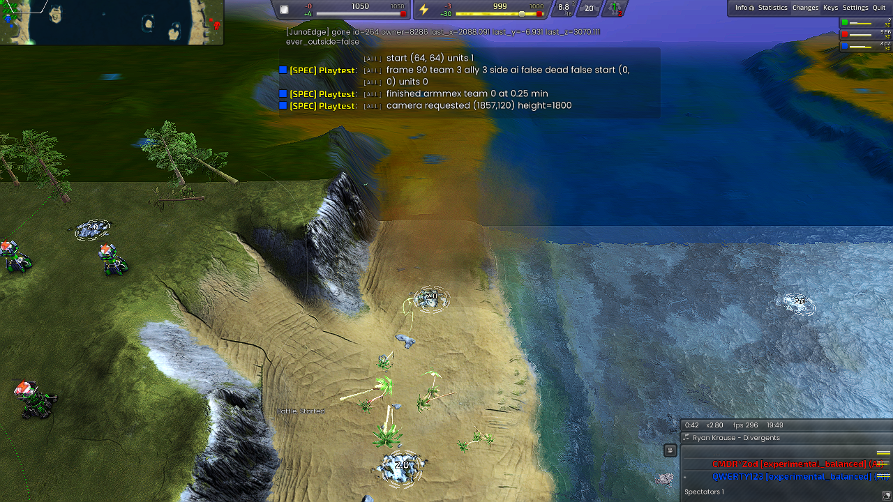
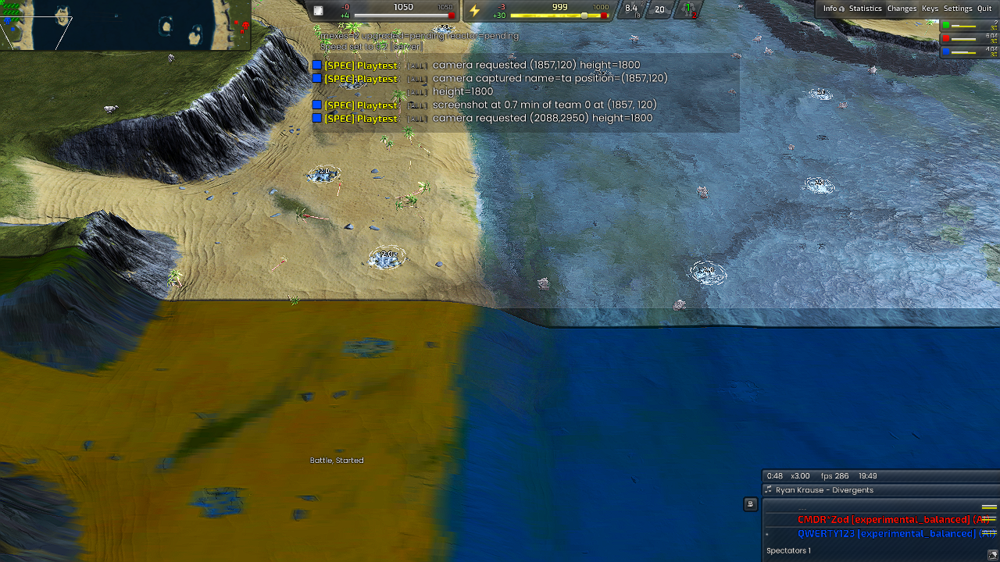
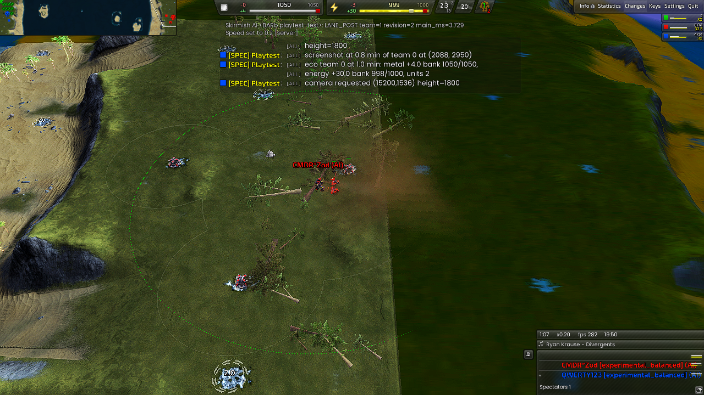

# SHARED / combat / juno-edge-impacts

Observation: **PASS** (reached 2 min); frame 4046.

Experiment kind: `supplied`. Map: Shore_to_Shore_V3. Game: Beyond All Reason test-31479-433a460.

[Original report](report.md) | [Result and raw-evidence hashes](result.json) | [Acceptance checks](checks.json)

PASS is the check verdict, not a confirmed game victory. Raw logs/replays remain in the recorded local archive.

