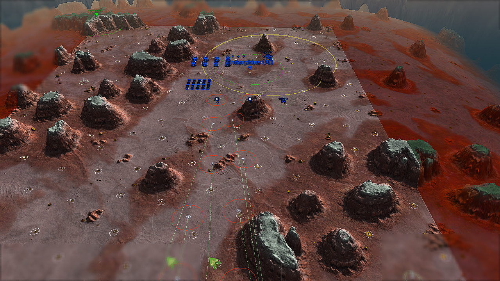

# SHARED / combat / spam-repeat-tactical

Observation: **PASS** (reached 3 min); frame 5490.

Experiment kind: `supplied`. Map: All That Glitters v2.2.3. Game: Beyond All Reason test-31479-433a460.

[Original report](report.md) | [Result and raw-evidence hashes](result.json) | [Acceptance checks](checks.json)

PASS is the check verdict, not a confirmed game victory. Raw logs/replays remain in the recorded local archive.

