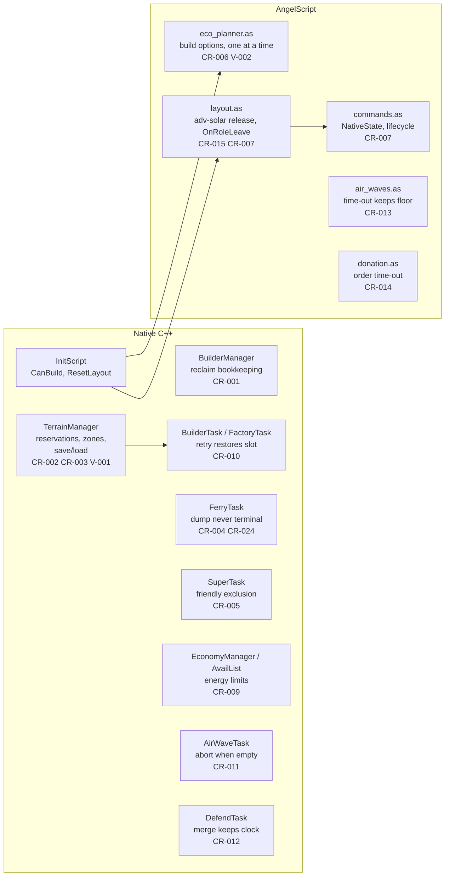
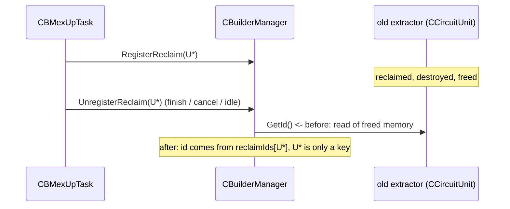
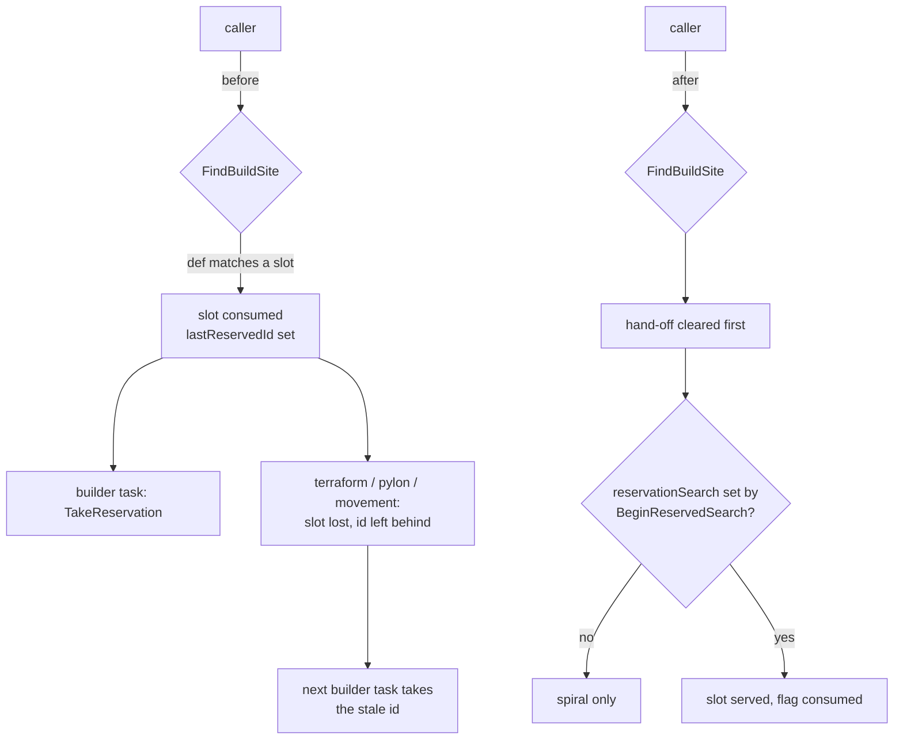
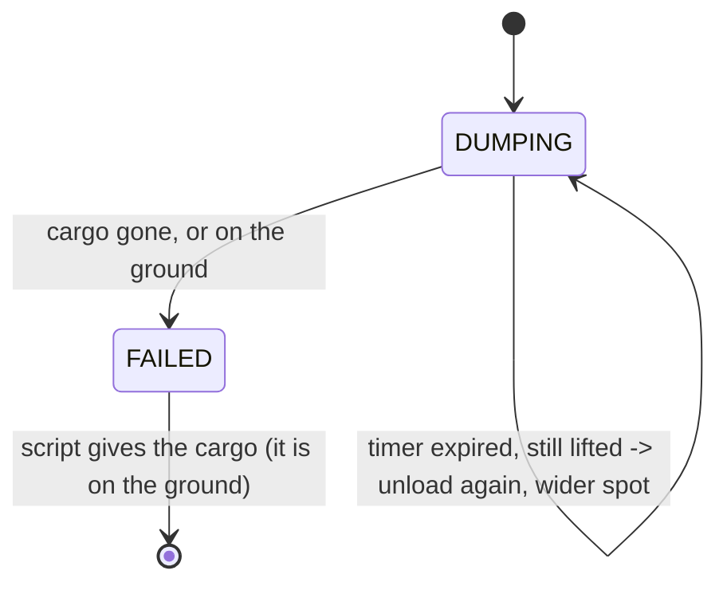
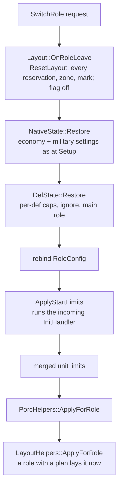

# Code review fixes - 2026-09-20

**Applies:** [`2026-09-20-uncommitted-code-review.md`](2026-09-20-uncommitted-code-review.md)
(CR-001 to CR-025) plus three findings made while verifying it (V-001 to V-003).
**Decision:** [D-059](../decisions.md#d-059--the-2026-09-20-code-review-is-applied-in-full).
**Status:** Built, deployed, not Played. Every section says what was wrong,
what changed, and what to look for in a game. Screenshot placeholders mark
the places where a played game should add evidence.

Verification of the review itself: all 25 findings reproduced against the
working tree. Two priorities were re-rated (CR-003 down to P3: BAR games
with skirmish AIs are rarely saved; CR-013 up to the top of P2: it defeated
the wave-size rule). CR-025 turned out to be a gate configuration, not
whitespace (see its section).

## Contents

| Group | Findings |
| --- | --- |
| [Crash and lifecycle](#crash-and-lifecycle) | CR-001, CR-011, CR-012, CR-014 |
| [Reservations](#reservations) | CR-002, CR-010, CR-003, CR-015, V-001 |
| [Ferry](#ferry) | CR-004, CR-024 |
| [Targeting](#targeting) | CR-005, CR-013 |
| [Economy](#economy) | CR-006, CR-009, V-002 |
| [Role switching](#role-switching) | CR-007 |
| [Widget](#widget) | CR-008 |
| [Documentation and gates](#documentation-and-gates) | CR-016 to CR-023, CR-025, V-003 |
| [Verification](#verification) | what was run, what was not |

The diagram below is the map of the change set: which subsystem each fix
touches and how the fixes relate.



---

## Crash and lifecycle

### CR-001 - Use-after-free in reclaim bookkeeping

**Where:** `src/circuit/module/BuilderManager.cpp`, `BuilderManager.h`.

**What was wrong.** D-040 (shared reclaim marks) made `UnregisterReclaim`
read `unit->GetId()` after erasing the pointer from the map. The
mex-upgrade task registers the old extractor for reclaim and unregisters it
from its finish, cancel and idle paths; by then the extractor has been
reclaimed and its `CCircuitUnit` freed. The pointer was safe as a map key
(never dereferenced) until D-040 dereferenced it.



Before:

```cpp
void CBuilderManager::UnregisterReclaim(CAllyUnit* unit)
{
	if ((reclaimUnits.erase(unit) > 0) && (circuit->GetAllyTeam() != nullptr)) {
		circuit->GetAllyTeam()->UnmarkReclaim(unit->GetId());
	}
}
```

After:

```cpp
std::map<CAllyUnit*, ICoreUnit::Id> reclaimIds;  // the id behind each key

void CBuilderManager::UnregisterReclaim(CAllyUnit* unit)
{
	// `unit` is only a key here, never dereferenced: the mex-upgrade task calls
	// this for the extractor it reclaimed, which may already be freed (CR-001).
	auto it = reclaimIds.find(unit);
	const bool known = (it != reclaimIds.end());
	const ICoreUnit::Id id = known ? it->second : -1;
	if (known) {
		reclaimIds.erase(it);
	}
	if ((reclaimUnits.erase(unit) > 0) && known && (circuit->GetAllyTeam() != nullptr)) {
		circuit->GetAllyTeam()->UnmarkReclaim(id);
	}
}
```

`MarkReclaimUnit` and `RegisterReclaim` store the id next to the pointer
at registration, while the unit is alive.

**In a game:** mex upgrades complete without a crash; the ally-team
reclaim mark for the old extractor is removed (allies stop repairing it).

### CR-011 - A wiped bomber wave stayed alive for ever

**Where:** `src/circuit/task/fighter/AirWaveTask.cpp`.

**What was wrong.** `RemoveAssignee` erased the unit's slot but never
aborted the task when the last bomber died; `Update` returned early on an
empty unit set. Every wave lost in full stayed in the military manager's
task sets and the scheduler for the rest of the match.

Before:

```cpp
void CAirWaveTask::RemoveAssignee(CCircuitUnit* unit)
{
	IFighterTask::RemoveAssignee(unit);
	slots.erase(unit);
}
```

After:

```cpp
void CAirWaveTask::RemoveAssignee(CCircuitUnit* unit)
{
	IFighterTask::RemoveAssignee(unit);
	slots.erase(unit);
	if (units.empty()) {
		manager->AbortTask(this);  // the wave is gone; do not stay in the task sets forever (CR-011)
	}
}
```

This is the pattern `CDefendTask::RemoveAssignee` already used.

**In a game:** the level-1 wave log shows each wave's task removed when
its last bomber dies; the AIR role's task count does not grow with losses.

### CR-012 - A squad merge restarted the attack-wait clock

**Where:** `src/circuit/task/fighter/DefendTask.cpp`.

**What was wrong.** The wait cap (attack anyway after `attackWait`
seconds at enough power) counted from the *receiving* squad's creation
frame. An old squad merging into a newer one inherited the newer clock;
repeated merges deferred the attack indefinitely, the army-massing the cap
was added to stop.

Before:

```cpp
	units.insert(rookies.begin(), rookies.end());
	maxPower = std::max(maxPower, static_cast<CDefendTask*>(task)->GetMaxPower());
```

After:

```cpp
	units.insert(rookies.begin(), rookies.end());
	// The wait cap counts from the older squad: merging into a newer one must
	// not restart it, or repeated merges defer the attack for ever (CR-012).
	createdFrame = std::min(createdFrame, static_cast<CDefendTask*>(task)->GetCreatedFrame());
	maxPower = std::max(maxPower, static_cast<CDefendTask*>(task)->GetMaxPower());
```

**In a game:** the `DEFEND: squad of N waited Xs ... attacking anyway` line
appears within `attackWait` seconds of the *first* squad's creation, not of
the last merge.

### CR-014 - A failed constructor order never timed out

**Where:** `data/script/src/manager/donation.as`.

**What was wrong.** Two defects in `FactoryMakeTask`. The count gate
(`pending <= ordered` returns) ran *before* the order time-out, so with one
request and one dead order the time-out was unreachable. And `ordered` was
incremented before the enqueue, so a null enqueue (lab died, def capped)
still counted as an order.

Before:

```angelscript
if (int(pendingRequests.length()) <= ordered) {
    return null;
}
if (ordered > 0 && orderedFrame >= 0
    && (ai.frame - orderedFrame) > Global::ConstructorRequest::OrderTimeoutSeconds * SECOND) {
    ordered = 0;
}
...
++ordered;
orderedFrame = ai.frame;
return aiFactoryMgr.Enqueue(TaskS::Recruit(...));
```

After:

```angelscript
if (ordered > 0 && orderedFrame >= 0
    && (ai.frame - orderedFrame) > Global::ConstructorRequest::OrderTimeoutSeconds * SECOND) {
    GenericHelpers::LogUtil("[Team][Donation] constructor order timed out; re-ordering", 1);
    ordered = 0;
}
if (int(pendingRequests.length()) <= ordered) {
    return null;
}
...
IUnitTask@ order = aiFactoryMgr.Enqueue(TaskS::Recruit(...));
if (order is null) return null;   // nothing ordered, nothing counted (CR-014)
++ordered;
orderedFrame = ai.frame;
return order;
```

**In a game:** a teammate's constructor request that lost its first order
(the lab died) is re-ordered after `OrderTimeoutSeconds`; the log says
`constructor order timed out; re-ordering`.

---

## Reservations

### CR-002 - Any site search could consume a planned slot

**Where:** `src/circuit/terrain/TerrainManager.h` / `.cpp`,
`src/circuit/task/builder/BuilderTask.cpp`, `FactoryTask.cpp`.

**What was wrong.** `FindBuildSite` served a reservation to *any* caller
whose def matched and left the id and facing in two manager-global fields
that only builder tasks read back. A terraform search for a structure def
could consume a slot it never owned, and the stale hand-off was then
claimed by the next unrelated task (wrong facing, wrong slot finished or
restored). The hand-off was not cleared at search entry.



Before (`TerrainManager.cpp`):

```cpp
	// A planned site for this def wins over the spiral; see the header.
	if (layoutEnabled && !reservations.empty()) {
```

After:

```cpp
	// ... Only a builder task's search may take one (BeginReservedSearch), and
	// the hand-off is cleared first so a stale id never reaches the next task (CR-002).
	lastReservedId = -1;
	lastReservedFacing = -1;
	const bool serve = reservationSearch;
	reservationSearch = false;
	if (!serve) {
		pinnedReservation = -1;
	}
	if (layoutEnabled && serve && !reservations.empty()) {
```

The task-side call that used to be `SetPinnedReservation(pinnedReservation)`
is now `BeginReservedSearch(pinnedReservation)`, in both
`IBuilderTask::FindBuildSite` and `CBFactoryTask::FindBuildSite`. Every
other caller (energy grid, defend, rally, support, retreat, recruit,
terraform) never sets the flag and can no longer consume a slot.

### CR-010 - A retry stranded the previously served slot

**Where:** `src/circuit/task/builder/BuilderTask.cpp`, `FactoryTask.cpp`.

**What was wrong.** When a served site became temporarily unbuildable the
task searched again. If another slot was served the first stayed consumed
with its id overwritten; if the spiral won, the old id stayed on the task
and a structure off the plan was later credited to the slot.

After (`IBuilderTask::FindBuildSite`; the factory task has the same block
after its kept-slot check):

```cpp
	if (reservationId >= 0) {
		// A retry: the slot served before is handed back before another search,
		// else it stays consumed with no structure on it (CR-010).
		terrainMgr->RestoreReservation(reservationId);
		reservationId = -1;
	}
	terrainMgr->BeginReservedSearch(pinnedReservation);
	const AIFloat3 bp = terrainMgr->FindBuildSite(buildDef, pos, searchRadius, facing, predicate);
	TakeReservation(terrainMgr);
```

`RestoreReservation` re-marks the cells if the ground is still free and
drops the record if not, so the slot goes back to the plan or leaves it
honestly.

### CR-003 - Layout state and task reservation ids were lost on save/load

**Where:** `src/circuit/terrain/TerrainManager.h` / `.cpp`,
`src/circuit/module/BuilderManager.cpp`, `src/circuit/task/builder/BuilderTask.cpp`,
`src/circuit/CircuitAI.cpp` (`VERSION_SAVE` 5 -> 6).

**What was wrong.** Nothing of the layout - reservations, zones, the
cells they own, the counters, the flag - and neither of the task's
reservation fields was serialized. A loaded game kept the ground marks
only for what stood and lost every planned slot.

**What changed.** `CTerrainManager::SaveLayout` / `LoadLayout` write and
read the whole registry by def id (never by pointer): flag, counters,
match radius, each zone with its rectangle and a per-cell owned bitmap,
each reservation with its position, facing, group, expiry, consumed,
armed, any-reach, tenant, zone and unit id. `CBuilderManager::Save/Load`
call them *before* the tasks, so a loaded task's `reservationId` resolves.
On load the blocking marks are rebuilt: zone cells and unserved plain slots
are marked `RESERVED` again; a cell under a re-registered structure is left
to the structure's own blocker.

```cpp
#define SERIALIZE(stream, func)	\
	...
	utils::binary_##func(stream, buildFails);			\
	utils::binary_##func(stream, reservationId);		\
	utils::binary_##func(stream, pinnedReservation);
```

**Left open (KI-406):** the *script's* picture of the complex (bays,
bands, groups, arming, routes) is script memory and is not saved; after a
load the served slots keep working but no new bands are laid and no rows
armed. `Layout::Adopt()` from `DescribeLayout` is the follow-up.

> Screenshot placeholder: `[ save-load-layout-overlay.png ]` - the
> `/barblayout` overlay before a save and after the load, same zones and
> slots.

### CR-015 - Unbuilt advanced-solar slots blocked the converter band

**Where:** `data/script/src/manager/layout.as`.

**What was wrong.** When the advanced-converter phase began, the
unserved solar and T1-converter tenants were released but the unserved
advanced-solar tenants were not. They sit on exactly the converter
columns nearest the spine; the idempotent `LayBand` refuses a slot over an
unserved reservation, and `ReclaimTenantFor` can only reclaim *built*
tenants, so those columns were held for ever.

After:

```angelscript
if (advConvPhase && !advConvStarted) {
    advConvStarted = true;
    Band@ s = GetBand("solar"); if (s !is null) aiTerrainMgr.ReleaseUnconsumed(s.group);
    Band@ t = GetBand("t1conv"); if (t !is null) aiTerrainMgr.ReleaseUnconsumed(t.group);
    // unbuilt advanced-solar slots too: they sit on the converter columns
    // nearest the spine and would hold them for ever (CR-015)
    Band@ a = GetBand("advsolar"); if (a !is null) aiTerrainMgr.ReleaseUnconsumed(a.group);
    ...
}
```

### V-001 - Plain nano blocks were refused behind Cortex and Legion labs

**Where:** `src/circuit/terrain/TerrainManager.cpp` (`ReserveNanoBlockAt`).

**What was wrong.** Found while verifying the review. The Cortex and
Legion T1 labs use the `fac_bot_pass` block class, whose yard extends
*behind* the lab; a plain reservation refuses yard cells. The last game's
log has it three times: `RESERVE: refused legnanotc at (11816, 1656): cell
(11792, 1632) blocked (blocker 0x1, ...)`. The labs on the front line are
already served by the head strip (a zone, which tolerates yards), but a
factory placed off the line still got the plain block and lost it.

**What changed.** `ReserveNanoBlockAt` lays its block in a zone of its
own - a rectangle the size of the block behind the factory's back edge -
and lays the grid as a band in it. The engine's own buildability test
still decides each slot when it is served.

```cpp
	const int zone = ReserveZone(frontCentre - fwd * (blockD * 0.5f), facing, blockW * 0.5f, blockD * 0.5f, false);
	if (zone == 0) {
		return 0;
	}
	return LayBand(zone, nanoDef, frontCentre, facing, cols, rows, gap, true, false, false, 0);
```

> Screenshot placeholder: `[ legion-lab-block.png ]` - a Legion lab off
> the line with its two turrets tight against its back.

---

## Ferry

### CR-004 - A timed-out dump handed a hanging constructor to the ally

**Where:** `src/circuit/task/fighter/FerryTask.cpp`.

**What was wrong.** D-056 fixed the load side; the dump side still
entered `FAILED` when its timer expired *with the cargo still lifted*, and
the script gives the cargo away on `FAILED`. The engine does not detach a
unit that changes team, so the ally received a constructor hanging under
TECH's transport.



Before:

```cpp
		case EState::DUMPING: {
			CCircuitUnit* cargo = GetCargo();
			if ((cargo == nullptr) || !IsLifted(cargo, frame) || IsExpired(frame)) {
				circuit->LOG("FERRY: cargo %i set down after a failed run (%s)", ...);
				cargoId = -1;
				Enter(EState::FAILED);
```

After:

```cpp
		case EState::DUMPING: {
			CCircuitUnit* cargo = GetCargo();
			if ((cargo == nullptr) || !IsLifted(cargo, frame)) {
				...
				Enter(EState::FAILED);
			} else if (IsExpired(frame)) {
				// Still lifted: FAILED is never entered with live cargo under the
				// transport ... Try a wider landing spot from wherever the transport hovers.
				++unloadRetries;
				landPos = FindLandingSpot(cargo, transport->GetPos(frame), FERRY_LAND_SEARCH * (unloadRetries + 1));
				circuit->LOG("FERRY: dump retry %i for cargo %i at (%.0f, %.0f); still lifted, not given", ...);
				TRY_UNIT(circuit, transport,
					transport->CmdUnloadUnit(landPos, cargo, 0, frame + FERRY_UNLOAD_TIMEOUT * 2);
				)
				Enter(EState::DUMPING);
			}
		} break;
```

**In a game:** `FERRY: dump retry N ...; still lifted, not given` lines,
never a `fell back, gave constructor` while the unit is in the air.

### CR-024 - The cargo's park expired before the run could

**Where:** `src/circuit/task/fighter/FerryTask.cpp`.

**What was wrong.** The cargo was parked in a 300-second builder wait,
while a run's deadlines add up to about 340 seconds before retries. The
cargo could take build orders mid-run.

After:

```cpp
// Longer than every state deadline of a run added up (travel 90 + 3 x load 20
// + travel 90 + 3 x unload 20 + dump 40 = 340 s) and renewed on each retry,
// so the cargo never takes build orders while the ferry still owns it (CR-024).
#define FERRY_HOLD_FRAMES		(FRAMES_PER_SEC * 600)
...
					circuit->LOG("FERRY: load retry %i for cargo %i", loadRetries, cargoId);
					HoldCargo(cargo);  // renew the park (CR-024)
```

---

## Targeting

### CR-005 - Tactical launchers could fire into friendly units

**Where:** `src/circuit/task/static/SuperTask.h` / `.cpp`.

**What was wrong.** The Perdition and Catalyst scan (D-036) reused the
EMP and Juno area selector, whose "no own-squad exclusion" was reasoned
from weapons that do no damage. A rich hostile clump beside our own army
was a valid aim point for a tactical nuke.

After (`SelectAreaTarget` gained `avoidFriendly`; the launcher passes
`true`):

```cpp
		if (avoidFriendly) {
			// A damaging blast on our own units is never worth it, whatever the
			// enemy value inside it (CR-005). ...
			auto& friendlies = circuit->GetCallback()->GetFriendlyUnitsIn(e.pos, std::sqrt(sqAoe));
			const bool hit = !friendlies.empty();
			utils::free(friendlies);
			if (hit) {
				++rejFriendly;
				continue;
			}
		}
		cands.push_back({e.pos, rank, value});
```

The EMP and Juno calls keep the default (`false`).

> Screenshot placeholder: `[ perdition-target-friendly.png ]` - a
> Perdition holding its shot while a friendly squad overlaps the richest
> enemy clump.

### CR-013 - The bomber hold time-out launched five bombers against a floor of fifty

**Where:** `data/script/src/manager/air_waves.as`.

**What was wrong.** The normal launch needed `bombers >= Required()` (the
income-scaled floor you asked for); the time-out needed only the fixed
first-wave size. The comment said the time-out waived the escort; the code
waived the bombers too.

Before:

```angelscript
const bool timedOut = (bombers >= minSize)
    && (frame - holdSinceFrame) >= Global::RoleSettings::Air::BomberWaveMaxHoldSeconds * SECOND;
```

After:

```angelscript
const bool timedOut = (bombers >= minSize) && (bombers >= required)
    && (frame - holdSinceFrame) >= Global::RoleSettings::Air::BomberWaveMaxHoldSeconds * SECOND;
```

**In a game:** the `hold time-out at N/required` launch line only appears
with `N >= required`.

---

## Economy

### CR-006 - The planner handed the commander an advanced solar it cannot build

**Where:** `data/script/src/manager/eco_planner.as`,
`src/circuit/script/InitScript.cpp`.

**What was wrong.** `EnergyOptions` filtered by `IsAvailable` (the def
exists and is not capped), not by what the asking constructor can build.
The knowledge cache confirms no commander builds an advanced solar
(Armada: solar, wind, storages, converter, tidal). At +6 metal on a still
map the commander would be handed a task it cannot execute.

**What changed.** Native `CCircuitDef::CanBuild` is registered on the
script API and the planner's `Make` rejects any def the asker cannot
build.

```cpp
	r = engine->RegisterObjectMethod("CCircuitDef", "bool CanBuild(const CCircuitDef@) const", ...);
```

```angelscript
    Option@ Make(const string &in key, const string &in name, const State@ s, bool tier2)
    {
        CCircuitDef@ d = ai.GetCircuitDef(name);
        if (d is null || !d.IsAvailable(ai.frame)) return null;
        // Only what the asking constructor can build: a commander has no
        // advanced solar, a T1 constructor no fusion (CR-006).
        if (s.builderDef !is null && !s.builderDef.CanBuild(d)) return null;
```

### CR-009 - Energy-condition overrides never reached the selection list

**Where:** `src/circuit/util/AvailList.h`, `src/circuit/module/EconomyManager.cpp`.

**What was wrong.** `SetEnergyCondition` (D-047) mutated the canonical
entry `GetAvailInfo` returns; `UpdateEnergyTasks` reads copies made when a
def joins the available list. `GetEnergyLimit` read back the new value
while selection used the old one. Today TECH sets no limit (`-1`), so the
lever was inert rather than wrong.

After (`CAvailList::UpdateInfo` applies a function to both):

```cpp
	template <typename F> bool UpdateInfo(const CCircuitDef* cdef, F func) {
		auto it = allInfos.find(cdef);
		if (it == allInfos.end()) {
			return false;
		}
		func(it->second.data);
		for (SAvailInfo& info : infos) {
			if (info.cdef == cdef) {
				func(info.data);
			}
		}
		return true;
	}
```

```cpp
	energyDefs.UpdateInfo(cdef, [limit, metalIncome, energyIncome](SEnergyExt& ext) {
		if (limit >= 0) { ext.cond.limit = limit; }
		...
	});
```

### V-002 - The planner started energy structures in parallel

**Where:** `data/script/src/manager/eco_planner.as`, `global.as`.

**What was wrong.** Found while verifying the review. The planner's state
did not include structures already under construction; the reactor-assist
rule diverts up to three constructors to an unfinished energy structure,
and the fourth started another one - the "many half-built solars" of
D-037 at a larger scale.

After: the state reads `Builder::GetEnergyUnderConstruction()` and the
energy branches wait while one stands unfinished, unless the bank is
draining (`EcoOneEnergyAtATime`, default true).

```angelscript
        if ((deficit > 0.0f || draining) && (!s.energyBuilding || draining || !Global::RoleSettings::Tech::EcoOneEnergyAtATime)) {
```

---

## Role switching

### CR-007 - A runtime role switch left the old role's native state behind

**Where:** `data/script/src/manager/commands.as`, `setup.as`,
`manager/layout.as`, `src/circuit/terrain/TerrainManager.cpp` (`ResetLayout`).

**What was wrong.** `SwitchRole` restored per-def caps and ran the new
role's `InitHandler`, but: switching *out* of TECH left the layout flag on
and every reservation active; switching *into* TECH never planned a
complex; the porc chain was not re-applied; and the native manager
settings a role's init changes (reclaim efficiency, assist nanos, military
quotas, porc mode and budget, ally AA) leaked into the next role.



New in `commands.as`: `NativeState::Snapshot()` at Setup (next to
`DefState::Snapshot()`) captures `reclEnergyEff`, `assistNanoEnabled`,
`assistNanoIncomeMod`, the military quotas (`scout`, `attack`,
`attackWait`, `attackScale`, `raid.min`, `raid.avg`), `porcMode`,
`porcBudgetMod` and `porcAllyAA`; `Restore()` puts them back. New in
`layout.as`: `OnRoleLeave()` calls native `ResetLayout()` (releases every
reservation and zone, unmarks their cells, logs the counts) and clears the
script state including routes.

After (`SwitchRole`, the transition):

```angelscript
        Layout::OnRoleLeave();
        NativeState::Restore();
        DefState::Restore();

        Global::AISettings::Role = role;
        ...
        RoleConfigs::ApplyStartLimits();   // runs the incoming InitHandler
        dictionary@ merged = LimitsHelpers::ComputeAndStoreMergedUnitLimits(Global::Map::Config, role);
        UnitHelpers::ApplyUnitLimits(merged);

        // Enter: the incoming role's porc chain and layout plan, as Setup does.
        PorcHelpers::ApplyForRole();
        LayoutHelpers::ApplyForRole();
```

**In a game:** `/barblink`, switch a TECH to SUPPORT: the log shows
`RESERVE: layout reset (N reservations, M zones released)` and the overlay
empties; switch a SUPPORT to TECH: `[Layout] complex facing ...` appears
and the overlay fills.

> Screenshot placeholder: `[ role-switch-overlay.png ]` - the overlay
> before and after switching a TECH away.

---

## Widget

### CR-008 - The overlay showed enemy plans and routed any team's builders

**Where:** `tools/widgets/gui_barb_team_link.lua`.

**What was wrong.** `refreshTeams` listed every live AI regardless of
ally team; `/barblayout` queried them all and drew whatever came back;
`/barbroute` used the selected unit's team with no alliance check, so a
full-view spectator could route an enemy BARb's builder.

**What changed.** Discovery, overlay queries and route commands are
restricted to teams allied with the local player (`Spring.AreTeamsAllied`
against `Spring.GetMyTeamID()`); a spectator with full view gets the
overlay for every team but route commands for none; incoming layout
payloads from a non-allied team are dropped. This is a host-only tool, so
the priority was rated P2, but the fix is small.

> Screenshot placeholder: `[ widget-ally-filter.png ]` - the tab list
> showing only allied BARbs while an enemy BARb is in the game.

---

## Documentation and gates

| Finding | What was wrong | What changed |
| --- | --- | --- |
| CR-016 | The stockpile comment in the three `behaviour.json` and `launcher-targets.md` said the floor governs "nuke, EMP, Juno"; the configured EMP and Juno policies return from their own branches before it. | Comments and doc name the actual consumers: nukes, the tactical launchers, the generic group scan. |
| CR-017 | `layout-design.md`'s built-status text, the repository map and the script README still said the 176 firebreak and a ring road were adopted; the phase description was stale. | All three describe the D-057 shape (both flanks tight, no ring road, the firebreak a setting) and the phase gates as coded. |
| CR-018 | `base-layout.md`'s proposal section shows an API that was never registered (`count` parameter, defaults, `GetReservationsOfGroup`). | A "Superseded" note above it gives the registered signatures and points at `angelscript-references.md` and the built plan. |
| CR-019 | `roles/tech.md` said a requester re-asks after cooldown while no TECH is present; the code sends nothing until a TECH ally is known and `MaxRequests` 1 allows no retry. | Documented as coded. |
| CR-020 | `eco-planner.md` listed current wind and tidal as decision inputs; they are logged only. The windy opening's arithmetic put the storage before the fifth turbine. | Inputs table split into decided and logged-only (and the two new inputs of CR-006 / V-002); the opening recomputed: 30 + 4 x 12.5 = 80 < 90, fifth turbine first. `roles/tech.md` and D-058 say the same. |
| CR-021 | `start-position-control.md` said no DLL rebuild is needed while requiring a native registration. | States the rebuild. |
| CR-022 | The TECH role-doc marker was stale. | `check_role_docs.py --update` after the final review of the role source: 0 findings. |
| CR-023 | Two D-023 links used a heading that does not exist. | Both point at `#d-023--a-ferry-transport-gets-its-native-task-before-any-role-policy`. |
| CR-025 | `git diff --check` reported trailing whitespace on every added line of `MilitaryManager.cpp` and the three Legion JSON files. | Not whitespace: those files are committed with CRLF (`git show HEAD:...` ends lines `\r\n`), `core.autocrlf` is on, and git then flags the carriage return of every added line. With `git -c core.whitespace=cr-at-eol diff --check` the count is 0. One file (`InitScript.cpp`) really had mixed endings from a patch script and was normalised. No git configuration was changed; the repository's gate should be run with `cr-at-eol`, or the setting added to `.gitattributes`/config by the owner. |
| V-003 | The doc link checker rose from 8 to 9 broken links while this document did not yet exist. | This document. Back to the 8 known `hover.md` links (KI-404). |

---

## Verification

| Check | Result |
| --- | --- |
| Native build (Recoil docker harness) | Clean; DLL deployed with script and config |
| `git -c core.whitespace=cr-at-eol diff --check` | 0 |
| `tools/knowledge/check_role_docs.py` | 0 findings, marker refreshed |
| `tools/knowledge/check_doc_links.py` | 8 broken, all the known `hover.md` (KI-404) |
| AngelScript host compile | Not available offline (KI-402); the three changed script files were reviewed by hand for the reserved-word class of error that broke the previous deploy |
| In-game | Not run. The sections above say what each fix looks like in the log; the screenshot placeholders are where a played game should add evidence |
