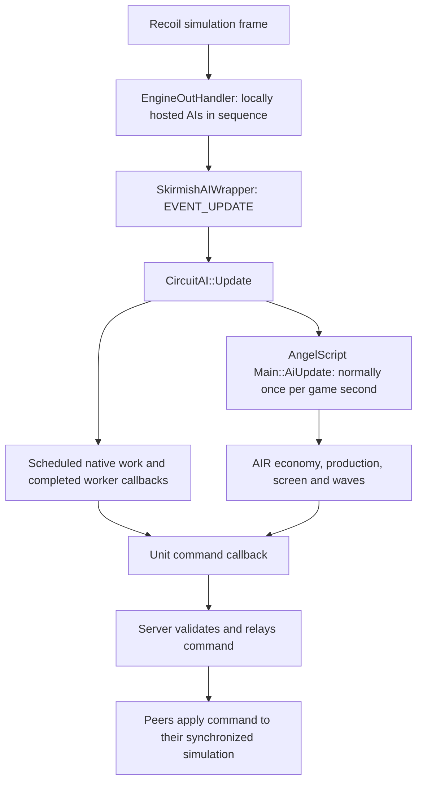

# AIR runtime and command-volume review

Date: 2026-10-02. Reviewed AI revision: `2c391ab6` (`smrt-test`).
Engine source revision: `92efda5e60fb6df54a8f17a87e4f4cdb4aa2de31` in the
trusted local Recoil checkout. Status: **Checked by source tracing and arithmetic;
not performance-profiled or Played as an optimization**. This review changes
documentation only. No FPS improvement, measured CPU duration, or measured
network saving is claimed.

The strongest opportunities are to stop replacing unchanged fighter orders,
retire AIR-owned empty route tasks, and consolidate repeated economy reads.
Bomber target selection and compound placement searches also contain substantial
nested work. Keep fast contact handling and the existing economic/strike rules;
reduce redundant work before reducing decision frequency.

The recent combat arenas demonstrate behavior and expose efficacy weaknesses,
but their accelerated runs, spawning, instrumentation and screenshots are not
CPU/FPS/APM benchmarks. See [their results](../air-combat-arena-results.md).

## How the engine runs the AI

The verified path is:

Recoil's `CGame::SimFrame` calls `eoh->Update()` directly, before the main
simulation block. `CEngineOutHandler::Update` loops over hosted AI instances;
`CSkirmishAIWrapper::Update` sends the frame event synchronously. There is no
independent, continuously running AIR decision loop. Unit lifecycle, visibility,
idle and damage events can also call the AI between periodic decisions.
See the upstream [simulation entry](https://github.com/beyond-all-reason/RecoilEngine/blob/master/rts/Game/Game.cpp),
[AI dispatcher](https://github.com/beyond-all-reason/RecoilEngine/blob/master/rts/ExternalAI/EngineOutHandler.cpp)
and [wrapper](https://github.com/beyond-all-reason/RecoilEngine/blob/master/rts/ExternalAI/SkirmishAIWrapper.cpp).
The findings use the pinned local source, at lines 1697/1748, 85/128 and 406 respectively;
the upstream links may subsequently move.

At normal speed there are 30 simulation frames per game second. The roughly
33.3 ms frame allowance belongs to the whole simulation, not each AI. Rendering
FPS, simulation speed and command latency are different measurements. A long
AI callback can delay simulation and drawing on its host; other peers do not
execute that host's AIR script, but do receive its orders and pay simulation
cost for applying them. The AI host and network server may be different processes.

[CircuitAI::Update](../../src/circuit/CircuitAI.cpp) (854) runs scheduled jobs
every frame, battle analysis once per second, script slow updates normally once
per second, and slices unit actions over 32 frames.
[TaskModule::Update](../../src/circuit/module/TaskModule.cpp) (158) visits
`floor(taskCount / 30) + 1` tasks per frame: a cycle takes at most about 30
frames for a stable nonempty list. It limits task **count**, not execution time.
A single expensive task still blocks that frame.
[Scheduler::ProcessJobs](../../src/circuit/scheduler/Scheduler.cpp) (128) executes
all due callbacks and drains all completed worker callbacks without a time budget.
Workers exist, but do not make script callbacks or arbitrary engine queries asynchronous.

The experimental [main hook](../../data/script/experimental_hard/main.as) (98)
also runs shared lane, amphibious, enemy-cache, donation and ferry work.
[Air_MainUpdate](../../data/script/src/roles/air.as) (400) runs build reconciliation,
economy, production/screen, optional drawing, lanes, quotas and waves. Profile
these separately: an AIR frame spike need not originate in `air.as` itself.

One incidental correctness finding is recorded as KI-465: the native slow-update
condition compares `frame % 30` with the raw AI ID. IDs 30 and above cannot match.
This does not explain ordinary IDs 0-15 in an 8v8 game, but is a real boundary
to handle in large/recreated-AI tests.
Use the valid AI ID modulo `TEAM_SLOWUPDATE_RATE` for the phase, keeping the
same phase for IDs 0-29. Verify one callback per second for IDs 0, 15, 29, 30
and 31, including load/recreation; do not claim all native AI events currently
stop, because only this script periodic condition is affected. The proposed
boundary fix is unimplemented and unplayed.

## What APM costs here

[CircuitUnit](../../src/circuit/unit/CircuitUnit.cpp) (287, 306) forwards move and
patrol commands to the engine wrapper. `CAICallback::GiveOrder` constructs a
`SendAICommand` network message; the server relays accepted commands, and peers
apply them through `CSelectedUnitsHandler::AINetOrder`. A query such as a position
or owned-ID read is an in-process call, not a network request. See
[AICallback](https://github.com/beyond-all-reason/RecoilEngine/blob/master/rts/ExternalAI/AICallback.cpp),
[server processing](https://github.com/beyond-all-reason/RecoilEngine/blob/master/rts/Net/GameServer.cpp)
and [peer command application](https://github.com/beyond-all-reason/RecoilEngine/blob/master/rts/Game/SelectedUnitsHandler.cpp).
Local source lines: 351, 1256/2029/2065, and 766.

The server has configurable bandwidth/packet accounting and waiting-packet
limits per AI link. It can delay or drop excess eligible packets. Consequently
raw bandwidth, short command bursts, queue delay, Lua command hooks and unit
command processing all matter. A UI APM number alone does not identify the
bottleneck. Raising those limits does not remove AI or peer CPU work.

`CmdWantedSpeed` (318) is currently an empty wrapper: do not count it as an
order. A two-point AIR patrol replacement emits **two** actual commands: an
unshifted move followed by a shifted patrol. The current screen does this to
every fighter on each refresh, including fighters whose patrol is unchanged.

| Home fighters | Refresh interval | Orders/game minute from these replacements | Protocol bytes/second at 1x, untracked commands |
| ---: | ---: | ---: | ---: |
| 60 | 10 s | 720 | 396 |
| 60 | 2 s | 3,600 | 1,980 |
| 300 | 10 s | 3,600 | 1,980 |
| 300 | 2 s | 18,000 | 9,900 |

These are **conditional source-derived rates**, not traffic captures: stable
live routes, every refresh consumed by its native task, no extra births/idles.
Formula: `2 * fighters * 60 / interval`. The protocol's untracked three-float
command is 33 bytes; tracked commands add four bytes. This excludes transport
framing, retransmits and server fanout, and does not imply one UDP datagram per
order. Sixty reflects the default home-target ceiling; 300 is a stress example,
not a claim about normal observed army size or a hard fighter limit. At faster
simulation speeds the wall-clock rate rises with achieved game speed.

## Ranked findings and safe remedies

### 1. P1: unchanged fighter routes repeatedly replace engine queues — KI-462

**Evidence.** [AirScreen::Tick](../../data/script/src/manager/air_screen.as) (105-181)
always calls `SetRoute` for every patrol. `Intercept` then replaces selected
routes. [CRouteTask::SetRoute / Update / IssueRoute](../../src/circuit/task/fighter/RouteTask.cpp)
(194, 125, 251) always marks a route dirty and reissues the whole patrol.
The two script writes normally coalesce before native execution; they are not
automatically four transmitted commands. However, even unchanged final routes
remain dirty. Any observed air contact anywhere selects the two-second cadence,
even if no raid qualifies in friendly territory.

**Recommendation.** Build each fighter's final desired mission once, then commit
only changed routes/modes. Keep patrol geometry and cell assignment separate
from interception membership. Retain the previous issued route and mission
identity. Exact equality suppression comes first; movement tolerances or sticky
targets are later, explicitly tested policy options. New threats, mission
changes and cleared/stuck queues must still trigger orders immediately through
their existing fast path. Identical destinations alone are not sufficient to
declare an empty engine queue healthy.

A native equality test alone is insufficient if script still writes patrol then
intercept: the intermediate route already marks the task dirty. Avoid both writes,
or compare the final desired route with the last issued version at dispatch.
Make new behavior opt-in for AIR; generic `SetRoute` also clears per-unit routes
used by amphibious units, so changing its semantics globally risks TECH.

**Expected benefit.** Eliminate essentially all periodic route-replacement orders
in a stable, quiet screen after initial assignment; preserve real interception
orders. This is a strong command-volume opportunity, not a promised overall FPS
percentage. Keep the two-second intercept check initially. A global APM cap or
ten-second combat throttle would sacrifice response and should not be the first fix.

### 2. P1: empty AIR route tasks accumulate over losses — KI-463

**Evidence.** A home fighter gets its own task in `AirScreen::TaskFor` (186).
`Removed` (200) drops dictionary entries without aborting that task.
[FighterTask::OnUnitDestroyed](../../src/circuit/task/fighter/FighterTask.cpp) (165)
removes the assignee; [UnitTask::RemoveAssignee](../../src/circuit/task/UnitTask.cpp)
(82) merely timestamps an empty task. Fighter tasks default to timeout zero.
`CRouteTask::RemoveAssignee` explicitly preserves empty tasks for factory-owned
spam routes. The military manager still owns and schedules them.

AIR's bomber/escort staging and Legion scout also create standalone route tasks.
Normal wave release aborts staging tasks, but deaths before release can leave
them empty. [AirProduction::Removed](../../data/script/src/manager/air_production.as)
(254) and [AirWaves::OnUnitRemoved](../../data/script/src/manager/air_waves.as)
(824) discard bookkeeping without retiring these tasks. Active `CAirWaveTask`
already aborts when its last member leaves; that is not the same defect.

**Recommendation.** Add an explicit native route lifetime option such as
`retireWhenEmpty`, default off, and enable it only for transient AIR routes after
assignment. Alternatively retain script ownership and retire them through safe
deferred lifecycle reconciliation. Handle destruction, transfer, reassignment,
role exit and reentrant task-removal callbacks. Preserve persistent Spam and
amphibious routes. Avoid aborting an unassigned task during the create/configure/
assign window.

**Expected benefit.** Bound scheduled AIR route tasks and memory by living
aircraft/missions instead of cumulative aircraft losses. Empty tasks are cheap
individually, but unbounded accumulation is particularly inappropriate for the
replenishing, effectively endless arena. Measure the slope over repeated waves.

### 3. P1: repeated economy reads multiply with workers and projects — KI-464

**Evidence.** [AirEconomy](../../data/script/src/manager/air_economy.as) (22, 77,
195, 218, 235) repeatedly scans ownership, mexes, reactors and support.
`GetOwnedUnitIds` [allocates and copies all team IDs](../../src/circuit/script/InitScript.cpp)
(272). The once-per-second `Tick` guard is useful, but does not protect separate
calls to `MexesReady`, `CompletedConstructors`, `CompletedAfus`, `RefreshSupport`
or `ExistingT2SupportReady`. Support readiness deliberately rereads current state
at order time to handle gifts, deaths and completion.

[AirBuild::FindAssistTarget](../../data/script/src/roles/air_build.as) (204) calls
`AssignedPower` (224), a whole-owned-unit scan, for each eligible project.
If `U` builders/turrets ask, `P` projects qualify and `N` units are owned, this
component can reach `O(U * P * N)` per decision burst. `AssistMex` has a similar
nested scan. Factory/nano asks also call this helper.
[AirGrowth](../../data/script/src/manager/air_growth.as) calls
[EcoPlanner::Read](../../data/script/src/manager/eco_planner.as), whose native
`GetStaticBuildPowerNear` and `GetUnfinishedCount` also scan owned units.
[AirProduction](../../data/script/src/manager/air_production.as) repeats finished/
unfinished fighter and crew counts per factory ask. `Mix` repeats home/escort
value scans per bay even though the mix is the same for a tier at that instant.

**Recommendation.** Build a typed AIR snapshot in one owned-unit pass: finished
and unfinished counts by def, mex/AFUS/reactor state, plant IDs, static turrets,
economy workers, power assigned by target ID, home/escort value and commitments.
Keep stable IDs, not borrowed native unit handles. Compute production mix once
per tier. Maintain static turret-to-bay ownership on layout/plant/turret changes,
with periodic reconciliation, rather than repeated nearest-bay searches.

Use distinct invalidation revisions for ownership/completion, task assignments,
pending recruits, layout and resource observations. A task assignment or enqueue
must update/invalidate the relevant aggregate **within the same frame**; a
one-second or frame-only cache could overbook construction or bypass the
twenty-turrets-per-existing-lab gate. Final order admission still validates
mutable claims, current resources, mex state, support and unit existence.
Subtract the candidate worker from cached assigned power as the current helper does.

**Expected benefit.** Replace repeated whole-army assistance scans with a shared
`O(N + P)` snapshot plus `O(P)` selection per asking worker, aside from reachability
and targeted validation. Bay mapping currently includes `O(T * B)` work for `T`
turrets and `B` bays; neither factories nor reservations are capped at six.
Implement the AIR snapshot first without changing TECH's chooser or build order.

### 4. P2: fighter assignment has quadratic work and birth bursts — KI-462

For `F` fighters, `C` contacts and `R` clustered raids, `Intercept` does
`O(C * R)` grouping, `O(R^2)` raid selection, and up to `O(F^2 + R * F)`
fighter-loop visits. Each chosen defender rescans all fighter IDs; 300 assignments
can visit 90,000 entries, with 45,150 eligible distance/lookup evaluations before
already-assigned entries are skipped. String-key conversion and host calls occur
inside that loop. `TaskFor` also calls `Tick` for every new assignment, bypassing
the interval via `changed`; a batch of arrivals repeatedly rebuilds the screen.

**Recommendation.** Read fighter IDs, positions, values and tasks once per pass.
Sort raid priority once with stable ties. For a small number of raids, sort or
heap eligible fighters once per raid instead of scanning for every selection
(`O(R * F log F)` sorting bound). For many raids, use a spatial index with exact
distance checks. Preserve the current first-cluster and tie semantics in an
initial exact optimization; spatial clustering must not silently merge raids.
There is no honest universal `O(F + C)` guarantee for exact nearest assignment.

Queue newly assigned units for a coalesced screen update, while giving each an
immediate valid initial route and keeping urgent interception available. Existing
fighters need new orders only if geometry, cell or mission changed. Cleanup before
the interval guard still costs `O(F)` each slow tick; lifecycle bookkeeping can
reduce it, but should retain a bounded reconciliation pass.

### 5. P2: bomber target planning nests enemy scans — KI-464

[CAirWaveTask::PickStrikeTarget](../../src/circuit/task/fighter/AirWaveTask.cpp)
(439) considers known hostile and peaceful structures. For every eligible target
it evaluates five ingress candidates, scans hostile units for nearby AA, and,
for early economic targets, scans peaceful units for nearby mex/wind value.
For `K` candidate targets, `H` hostiles, `E` peaceful entries and `S` threat
samples, this is `O(H + K * (H + E + S))` worst case. Filtering reduces actual
work. `_PlanWave` can do a second full scan when the preferred target class fails.

The route sampler itself is bounded: each segment has at most 129 sample points,
with at most three constant-time threat-grid lookups per point. `PlanIngress`
checks one direct and four edge routes including overrun exposure. Do not label
each threat sample an enemy-list scan. Weapon alpha is already cached per UnitDef
within the wave task. T1 and T2 target attempts already have ten-second guards.

**Recommendation.** Build a snapshot-scoped AA coverage index and an eco-neighbor
index, using exact radius filters after spatial lookup. Compute enemy army value
once. Reuse target/route results between preferred and fallback selection, keyed
by visibility/threat revision, origin, target position/health and strike policy.
Keep unknown-threat padding, learned resistance, exclusion regions and required
bomber minima. An arbitrary top-N target shortlist changes doctrine and can miss
the weak target; exact lower-bound pruning or an incrementally completed full
scan is safer. Revalidate the chosen target and budget before launch.

If measured planning still causes spikes, move pure scoring over owned immutable
snapshots to native background jobs, then validate/commit on the main thread.
Do not run borrowed unit pointers, live threat-map access or mutable AngelScript
globals on workers. Share/index data only within the proper ally visibility and
policy scope. A ten-second cache without invalidation would miss newly revealed
AA or newly exposed cheap targets.

### 6. P2: compound placement has large synchronous search bursts — KI-464

[AirLayout::Reserve](../../data/script/src/manager/air_layout.as) (126) loops through
the entire square at every ring, discarding its interior. Its two default passes
visit 187,475 loop cells to enumerate 12,202 perimeter positions, before early
success. [AirEcoLayout::Reserve](../../data/script/src/manager/air_eco_layout.as)
(57) does the same: defaults give rings 0-26, 26,235 loop iterations for 2,809
perimeter positions. The enumeration is `O(r^3)` although the distinct search
area is `O(r^2)`. These are upper-bound loop counts, not engine-call counts or
elapsed timings; early terrain/home checks reject many positions.

Each surviving position can call expensive native placement predicates.
[CanReserveBuilding / FactoryExitLanes](../../src/circuit/terrain/TerrainManager.cpp)
(1207, 3171) can rebuild an exit-lane vector by scanning **all reservations and
owned units per candidate**. `IsSlotFree` also checks local zones and footprint
cells. This multiplies placement work with a large late-game base. Allied
reservations are already spatially bucketed in
[AlliedReservations](../../src/circuit/terrain/AlliedReservations.h); replacing
that mechanism wholesale is unnecessary.

**Recommendation.** Enumerate ring perimeters directly, preserving current
row-major order and first-valid placement. Cache factory/assist-building exit
rectangles by reservation/ownership/facing revision; maintain their exact existing
semantics. Use a spatial index for local rectangles if profiling justifies it.
Share immutable geometry within a search; retain final engine buildability and
atomic allied reservation checks. A cache must change as soon as the search
itself adds/releases a slot or zone.

Then make unsuccessful speculative searches resumable, with a candidate budget
and a small measured main-thread time budget. Keep the ordering and reserve a
whole cluster atomically when committing; do not leave temporary partial claims
between frames. A geometry revision invalidates stale work. Protect the initial
campus and separate AFUS district before ordinary construction occupies them,
and preserve relocation at the first build in a blocked unused cluster. Do not
drop the six-T2-bay minimum, unlimited expansion or allied exclusion for speed.

Current backoffs (ten seconds for compound failures; three seconds for ordinary
economy/wind failures) are useful but do not bound one search. `PlanAhead` can
run an eco-module search and a factory-bay search in the same tick, plus the
starter when empty. Its comment about one compound search is not a global
budget. Wind placement also scans existing six-slot clusters, bays and spacing
neighbors per candidate; retain an index of fillable clusters and cached geometry.
Ordinary defense search is bounded at 360 candidates, a lower priority unless
its native placement calls dominate. Existing placement/lane stalls remain
[KI-419 and KI-433](../known-issues.md), rather than evidence of newly measured AIR timings.

### 7. P3: smaller overheads and optional structural changes

- `ComputeLines` does `O(W^2)` greedy bomber-slot assignment once per assembly.
  The default strike cap is 80: at most 6,400 inner visits, versus ongoing whole
  army scans elsewhere. Precompute positions/slots first; do not replace formation
  policy until this is measured as material. The release helper and T1 raid task
  deduplication also use quadratic task-list searches, once per launch.
- One task per home fighter costs scheduling/container work even after leaks
  are fixed. Shared tasks per screen cell/raid could reduce that overhead, but
  command effects remain per unit and ownership/reassignment becomes more
  complex. Treat this as a later option, not a prerequisite for duplicate-order
  suppression. Grouped network messages likewise reduce framing, not per-unit
  simulation work; the ordinary SkirmishAI callback currently sends individual
  commands, so batching would require additional interface work.
- Shared military threat/cost cache comments say roughly ten seconds, but all
  experimental main hooks call them each slow update without an internal timer.
  Their role reads are already aggregate native array lookups, not full enemy
  scans. Fuse the two small role loops and avoid rebuilding strings/dictionaries
  if useful; do not claim a major enemy-scan saving or make emergency contacts
  ten seconds stale. AIR quota computation traverses a fixed UnitDef roster,
  not every aircraft. This is lower priority than fleet-size-dependent work.
- Many disabled verbose logs still format strings before `LogUtil` checks the
  level. Guard expensive formatting at the call site; aggregate high-volume
  recruitment/task-swap diagnostics in production. Keep transitions, sampled
  measurements and invariant failures. AIR layout drawing defaults off and is
  gated to four seconds when on; do not blame a disabled overlay for normal FPS.

## Coverage and complexity map

`N`: owned units; `F`: home fighters; `W`: wave members; `P`: projects;
`B`: bays; `T`: turrets; `C/R`: air contacts/raids; `G`: battle-grid cells;
`Q`: candidate placement points. Dimensions are deliberately separate.

| Reviewed path | Frequency / scaling | Disposition |
| --- | --- | --- |
| `air.as`, `air_rules.as` | Fixed rule/roster loops, expensive helpers per builder/factory ask | Keep order/priorities; optimize reads |
| `air_build.as`, `air_growth.as` | Reconciliation each second; `O(P*N)` assistance per ask; queued/unfinished scans | P1 shared aggregates and fresh admission |
| `air_economy.as` | Guarded one-second sample; `O(N+B^2+T*B)` mapping plus repeated external scans and bay mix reads | Revision-aware snapshot |
| `air_production.as` | Factory/nano asks; `O(N+F)` scans plus assistance; one-second invariants | Cache exact aggregates; keep emergency/transport priority |
| `air_screen.as`, `air_home.as` | One-second bookkeeping; 2/10-second route logic, births force refresh; friendly tests scan team starts | P1 commands; P2 assignment; team count small |
| `air_waves.as`, `air_raids.as` | One-second lifecycle; target probes at most every ten seconds; per-launch release bookkeeping | Keep gates, index target scoring, retire staging tasks |
| `AirWaveTask.cpp`, `AirGeometry.h` | Bounded route samples plus nested target scans; ordinary mission ticks mainly `O(W)` | Preserve attack-issued/return progress guards and volley timing |
| `air_layout.as`, `air_eco_layout.as` | Reservation scans and synchronous candidate searches; growth is not fixed at six labs | P2 exact geometry cache and bounded search |
| `air_defence.as` | Three classes; at most 360 placement candidates per attempted class with five-second failure retry | Lower priority; reuse placement improvements |
| `air_math.as`, production/placement math | Pure scalar helpers, fixed small inputs | No meaningful asymptotic issue |
| Legacy AIR / dynamic factory configs | Opt-out fallback branches; fixed rosters plus shared native tasks | Avoid spending the first pass optimizing inactive policy |
| `BombTask`, `AntiAirTask`, `RaidTask`, scout/guard/rearm paths | Shared tasks scan known targets, use squad/path machinery and periodic/forced updates | Instrument separately; specialist/legacy units still use them |
| Ferry | Small team queues and event/state-driven operations; some factory lookup scans | Retain immediate request and handover behavior |
| `BattleAnalysis::Update` | Once/second `O(G + enemies + sum of observed water-weapon raster areas)` | Profile separately; not merely `O(C)` air contacts |
| Lanes / amphibious objectives | Background lane solving plus main-thread consumers; specialist terrain-route queries remain synchronous | Existing KI-433; meter expensive consumers, preserve shores/routes |
| Native scheduler / unit actions | Count-based slicing, all due completion callbacks, retained-task population | No hard time bound; retire dead work and stage heavy optional work |

Battle analysis's water coverage work matters even when the visible symptom is
air response. A future subscriber/dirty-region design may help, but must preserve
TECH/AIR amphibious safety and ally visibility. Do not disable it merely because
the role owns aircraft. Native threat grids already provide cheap local threat
queries. Flat `O(n)` is not a sufficient target if that scan repeats per unit,
per project, per bay, per AI or per candidate in the same frame.

## Implementation order and acceptance

1. Add inexpensive counters/timers, then fix transient route lifetime and final
   route/order deduplication. Keep policy and intervals unchanged.
2. Introduce the AIR state/assignment snapshot with explicit invalidation and
   exact native geometry caches. Keep final safety/claim checks live.
3. Optimize interception assignment and target neighborhood queries. Compare
   old/new decisions on identical snapshots before enabling them.
4. Budget placement and target work across frames; consider native background
   scoring only if those synchronous costs still dominate. Do not globally
   reorder the scheduler or modify TECH's sequence as an AIR optimization.
5. Consider shared fighter tasks and network batching only after measuring the
   remaining cost. They carry more lifecycle/integration risk.

Use existing `CIRCUIT_PROFILING`/Tracy support where available; add narrow timers
around AIR script phases, bomber target passes, reservation searches and worker
completion phases. Existing `SLOW` logs only catch some calls exceeding 20 ms;
absence of such a log does not prove a cheap callback. Record main-thread
p50/p95/p99/max, total host sim-frame time, achieved sim speed, draw-frame time,
allocations, scheduled/live/empty route counts, candidate/host-call counts,
actual commands by task/type, protocol bytes and peak 100-ms/one-second bursts.
Separate AI emit time, server relay delay, peer apply time and first useful
fighter interception. Aggregate counters in memory and emit summaries; do not
log every command during the primary timing run.

Run fixed-seed A/B cases on the same machine, engine, map, DLL build flags and
profile, first at 1x. Include warm-up and several seeds/repeats, then accelerated
throughput separately. Use the existing [arena runner](../../tools/playtest/air_arena.py)
and [case fixtures](../../tools/playtest/README.md), extended with scaling cases:

| Case | What it must prove |
| --- | --- |
| 0/60/300/1,000 fighters, quiet and simultaneous multi-direction incursions | Stable screen emits no periodic replacement orders; first-contact response and coverage do not regress; stress counts explicit |
| Repeated create/fight/die/transfer/role-exit cycles | Empty transient route count returns to baseline; no task/memory slope with cumulative losses |
| T1 economy targets, T2 mixed AA, edge raids, synchronized static assault | Same feasible target/risk/bomber budget on fixed snapshots; no degradation in survival, target damage, returns or timing |
| Many visible structures/AA with 10/20/80-bomber cohorts | Target-selection tail latency scales; no stale AA/health or missing feasible targets |
| 1/6/12+ T2 labs and growing wind/AFUS districts, blocked first slots | Exact support gate, safe relocation, six-wind clusters, atomic mutual reservations and unlimited expansion preserved |
| Natural AIR/TECH 8v8, early/mid/late game, births/losses during construction | Economy milestones/resource use do not regress; T2 workers return to economy; transport requests retain priority; TECH reclaim/build rules unchanged |
| 32+ AI identifiers including recreation | Slow-update ID boundary repaired independently of AIR policy |

For pure optimizations, require exact decisions on frozen inputs, same stable
tie order and unchanged safety checks. For live A/B games, decisions can diverge
after timing changes, so compare distributions across seeds: reaction latency,
protected targets, loss/value exchange, force arrival, resource overflow and
construction milestones. Do not declare efficacy preserved merely because an
arena integrity check passes. Keep screenshots and behavior updates in rendered
verification runs; collect primary timings in separate runs with capture disabled.
An engine/network peer test is required to substantiate relay-delay claims;
local accelerated arenas alone cannot do that.

Focused tests should cover unchanged versus changed final routes, queue-loss
recovery, create/configure/assign lifetime, same-frame ownership/task/claim cache
invalidation, old/new target and interceptor choices, and identical ordered
placement candidates. Native integration tests must also prove that opting AIR
into transient routes does not retire empty persistent routes used by other roles.

Set CPU budgets from the measured host baseline and its remaining 33.3-ms
simulation budget, with headroom for human armies and Lua. Acceptance should
include zero unchanged-screen refresh orders, bounded empty tasks, materially
lower p99 AI work/command bursts, and no worse response/mission/economy outcomes.
Do not promise zero FPS impact from any AI or prescribe a single APM cap before
observing task-specific traffic. Urgent interception, retreat, ferry handoff and
volley orders must bypass deferrable background work.

## Verification and decision record

The review traced the active experimental path and its native/shared dependencies,
including recent D-162/D-163/D-164 changes and the D-165 arena boundary. Engine
source was read locally; web access to pinned GitHub pages failed, so the checked
local revision is the evidence, not an assertion about an uninspected newer release.
Arithmetic independently checked the route-order rates and square/perimeter
counts. No gameplay files, live install, build output or runtime configuration
were changed. No new simulation was run for this documentation-only review.

Open findings are indexed as KI-462 through KI-465 in
[known issues](../known-issues.md). The deliberate review-only scope and preservation
requirements are [decision D-166](../decisions.md#d-166---air-performance-review-before-optimization).
Existing economy/combat efficacy issues remain open; reducing CPU work does not
itself resolve KI-457 or KI-461.

Documentation validation: the invariant checker reports zero findings and
`git diff --check` passes. The link checker reports only the eight existing
references to missing `doc/roles/hover.md` (KI-404); no new broken links.
