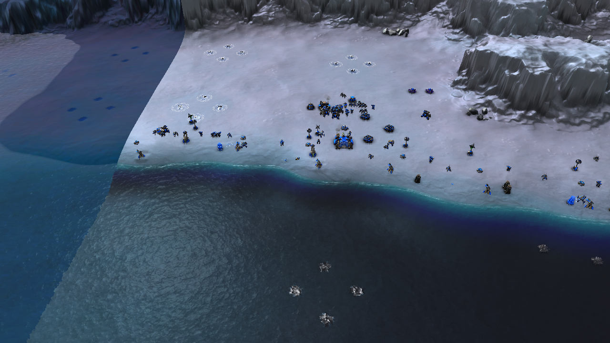

# SEA coastal recovery after losing water

## Scope

SEA alone receives this controller. The request's final loss-only condition takes
precedence: a donated land constructor enters coastal recovery when SEA has lost
its naval foothold. Receiving one during a functioning naval opening does not
switch the player to land defense. Other roles retain their decisions.

Implementation: [sea_coast.as](../../data/script/src/manager/sea_coast.as),
[pure state rules](../../data/script/src/helpers/sea_coast_math.as),
[settings](../../data/script/src/global.as). No new native API or DLL change is
needed; simulations use the matched D-216 binary.

## Game evidence

The official [naval guide](https://www.beyondallreason.info/guide/basics-on-sea-warfare)
describes naval scouting, sonar, constructors and defenses. The
[advanced mechanics guide](https://www.beyondallreason.info/guide/important-knowledge-on-advanced-mechanics)
explains why submerged units require sonar. Coastal launchers in the effective
roster have sonar and supplement the land radar screen.

The [Pit Bull guide](https://www.beyondallreason.info/unit/armpb) warns that it
cannot shoot over fortification walls. Walls therefore use two flanks and
staggered rows with a central firing/traffic gap. This is a partial barrier,
not an impermeable wall. Heavy amphibious attacks still need mobile defenders.

Shared unit knowledge and the local BAR constructor menus confirm ordinary
construction bots cannot build medium mines. Only a capable owned minelayer or
engineer receives mine orders. No extra vehicle factory is bought solely for
mines. Shared unit classifications remain unchanged.

## State and build order

1. Remember that SEA held its home connected water body; an opening with no
   factory is never a defeat. A live combat navy or safe operational shipyard/
   construction ship remains a foothold. After 30 continuous seconds without
   one, activate fallback. Abandoned tidals/mexes do not count as control.
2. Survey legal beaches in that sea. Exclude cliffs and enemy-side beaches.
   Assign friendly beaches to the closest allied SEA start, breaking exact ties
   by team ID. Include map-edge approaches.
3. Find a reachable dry bot-lab site at least 800 elmos inland from the sampled
   assigned coast. Reject known gun envelopes, unsafe routes, existing layout
   reservations and factory exits. Build lab, metal/energy storage, energy and
   useful build power. One T1 worker takes safe inland metal when multiple
   workers exist; the perimeter must not starve economic recovery.
4. Expand T1 turrets, radar, coastal torpedo/sonar coverage, T2 turrets, jammers,
   staggered fortification flanks and optional medium mines. Check actual build
   menus and resources. After the first T1 defense, a T2 lab requires +25 metal/
   +600 energy or its whole cost banked. Completing every beach is not a T2 gate.
5. Land labs produce constructors, then mixed direct-fire/rocket support.
   Persistent dispersed coast positions react to known landing contacts and
   use dry native routes.
6. A restored naval foothold must persist for 60 seconds before naval priority
   resumes. Retain existing frames; release temporary cap leases and garrisons.

The first T1 turret takes precedence over sensor expansion. Later sensors are
added beside defended sectors without waiting for the entire coast. A failed
Armada case exposed sensor work delaying the first turret; it remains in the
evidence rather than being relabeled. Rear energy pads can expand beyond the
initial recovery rectangle. Static nanos assist real unfinished land-lab
products, as the existing naval assist list does not enumerate those factories.

The [invasion controller](../../data/script/src/manager/sea_invasion.as) yields
its surviving land units on sea loss. Its factory sites and existing frames
remain intact. When control returns, unstarted fallback proposals are cancelled
and naval priorities resume. This avoids two controllers assigning competing
orders to the same amphibious units.

## Performance and ownership

Reuse SEA's owned IDs once per second; with adaptive fleet disabled obtain one
local snapshot. Stop at the first viable foothold. Beach geometry runs only in
fallback, once per minute, and copies the shared native advisory buffer.

Garrison identity lookup is a dictionary. Select contacts once per sector:
O(U + S*E) every five seconds. Stable goals retain their route tasks. Placement
and terrain paths are requested on demand, not each frame. This is not an O(1)
claim for planning or a measured FPS gain.

Native reservation pins own construction placement. Pending projects prevent
duplicate orders. Preserve player, external, retreat and enemy-reclaim tasks,
as well as existing frames. A cap lease restores only if another policy has
not changed it. No commands or promises are sent to human teammates.

The dormant path still performs a once-per-second owned-unit census; it is not
zero CPU work. Hull classification compares against a small fixed roster.
Placement checks include sector/project and known-threat scans and native path
queries. These are bounded by controller cadence and candidates, not constant
time in all inputs. No new threading, global command throttle, native unit
classification or shared combat-priority changes were introduced.

## Verification

Runner: [run_sea_coast.py](../../tools/playtest/run_sea_coast.py).
Checks: [coastal-fallback.json](../../tools/playtest/checks/sea/strategy/coastal-fallback.json).
The fixtures transfer actual units and execute real AI placement, recruitment
and routing. Liquidity is supplied and unrelated actors are frozen. They are
not natural-economy, win-rate or multiplayer-performance benchmarks.

The fixture removes the original naval assets at 2 minutes and transfers a T1
construction bot one second later. It supplies four advanced construction bots
at 5 minutes to exercise the advanced perimeter without waiting for an ordinary
economy. The 25-minute loss variant supplies six amphibious tanks, one Marauder
and a capable owned minelayer at 15 minutes. Enemy units receive a landing move;
the AI's buildings and defenders receive no fixture combat orders. Retake
restores a yard and ship at 12 minutes. These are controlled mechanism tests.

[analyze_sea_coast.py](../../tools/playtest/analyze_sea_coast.py) streams each
archived log and records original-verdict-linked transitions, completion counts,
construction orders and first observed invader damage. Its immutable supplemental
JSON does not turn a failed acceptance run into a pass. Counts include supplied
seed assets and are not surviving-army counts.

Initial Armada Supreme: PASS, archive
`build-theatres/games/sea/strategy/coast-lost-armada/supreme/20261006T141839Z-7661879f/runs/20261006T142041Z-ea0424c5`.
Loss frame 3600; fallback 4530; lab finished 8520; metal storage 10779;
energy storage 11586; first T2 turret 13601. This predates the economy-worker
and garrison lookup follow-up; retain it as initial evidence only.

Initial Cortex retake: FAIL, archive
`build-theatres/games/sea/strategy/coast-retake-cortex/supreme/20261006T142419Z-36c1c812/runs/20261006T142606Z-9bae671c`.
It correctly returned to navy 60 seconds after restored shipyard completion,
but the fixture restored it before defenses and failed to inject its advanced
constructor after a telemetry-hook change. Fixed the fixture with an asserted
hook and later restoration; the original verdict remains unchanged.

Six pure tests pass and the engine compiles the scripts. A first compile-only
run used an unrelated mex-expansion check file and retains its failed checks;
its clean compilation is not a gameplay PASS. Final evidence is appended below.

### Final results

All final runs use the same unchanged native DLL, SHA256
`45eb0f2e89a285e336bcafdddcc550246f79619c2e747a9a73ad628b3d8b67ff`.
Both loss arenas exercise the final controller including invasion task handover.

| Scenario | Result | Observed behavior |
| --- | --- | --- |
| Armada / Supreme / loss / 25 min | PASS | Lab 4.74 min; metal storage 6.00; energy storage 6.54; first T1 turret 7.75; radar, sonar launcher, jammer, walls and mines complete; attacker damaged at 15.08 min |
| Legion / Glacial / loss / 25 min | PASS | Lab 3.92 min; metal storage 6.01; energy storage 6.11; T1 turret 6.23; T2 turret 7.21; attacker damaged at 15.17 min |
| Armada / Supreme / held / 14 min | PASS | Donated land constructor does not trigger fallback while a viable naval foothold remains |
| Cortex / Supreme / retake / 15 min | PASS | Land rebuilding and T1/T2 defense pass; restored yard at frame 21600 exits fallback at 23430, after the 60-second stable-control window |
| Mixed 8v8 / Glacial / natural income / 10 min | FAIL overall | SEA yard completes at 0.75 min and first construction ship exits at 3.05; no coastal activation or script errors; TECH INV-013/019/029 keep the complete report failed |

Immutable final reports and screenshots:
[Armada loss](../benchmarks/records/sea/strategy/coast-lost-armada/2026-10-06/20261006T150451Z-59d7d108/README.md),
[Legion loss](../benchmarks/records/sea/strategy/coast-lost-legion/2026-10-06/20261006T145421Z-8f942e7e/README.md),
[held-sea control](../benchmarks/records/sea/strategy/coast-held-armada/2026-10-06/20261006T144814Z-21fe414c/README.md),
[Cortex retake](../benchmarks/records/sea/strategy/coast-retake-cortex/2026-10-06/20261006T150754Z-063c8c6c/README.md),
[mixed 8v8](../benchmarks/records/sea/economy/coast-regression/2026-10-06/20261006T145859Z-56caa74d/README.md).
The [benchmark index](../benchmarks/index/sea.md) also retains the earlier
iterations and original failed reports. Every bundle links its raw evidence
hashes and supplemental `coast-observations-v1.json`.

The Legion log records 6 T1 turrets, 14 T2 turrets, 6 radars, 11 coastal sonar
launchers, 9 jammers, 12 wall segments and 2 medium mines completed. Armada
records 4 T1 turrets, 12 T2 turrets, 6 radars, 10 coastal launchers, 8 jammers,
11 wall segments and 1 medium mine. These are completions during supplied
arenas, not claims of comprehensive coverage or surviving defenses. Enemy
damage occurred 5 seconds (Armada) and 10 seconds (Legion) after the wave spawn.

The earlier Armada loss case `20261006T143916Z-2f68d264` remains FAIL: its T1
turret completed at 19.09 minutes, beyond the 10-minute deadline. The first-T1
priority correction brings the final case to 7.75 minutes; do not interpret
that as a broad economy-speed benchmark. The earlier failing retake fixture
also remains archived unchanged.

The mixed 8v8 warnings match issue categories KI-423/KI-427 already reproduced
in previous controls. No claim is made that each individual warning has the
same cause; this run does not establish clean whole-game regression or an FPS
improvement. The recovery behavior remains SEA-gated in shared dispatch.

Validation: full native/AngelScript regression suite passes, including six new
coastal state-policy tests. Script/DLL API, invariant-practice and role-document
checks pass. Unit helper checking still reports the 170 existing findings
(KI-473/KI-481); documentation checking retains the eight missing-hover-document
links (KI-404). No new unit classifications, profiles or native code were changed
for D-219.

### Build output and storage

Published current `data/`, the stripped DLL and matching debug symbols together
to `C:/bardev/bar-RecoilEngine/build-amd64-windows/install/AI/Skirmish/BARb/stable`.
All 338 copied files were verified against their source hashes; the output's
script/DLL API check reports 310 members and zero findings. The live BAR install
was not modified.

All raw runs remain available. Lossless LZX compression of this task's eleven
idle copied symbol files saved 3,335,740,463 allocated bytes (3.11 GiB); every
before/after content hash matches. Reports, replays, logs and screenshots were
not deleted. The local audit is `build-theatres/coast-compression.json` and the
verified build manifest is `build-theatres/coast-build-output.json`.

## Limits

No guarantee of complete invasion denial, survival under hidden artillery,
full save/load equivalence or multiplayer FPS is implied. A coast without safe
reachable dry building space cannot host a legal fallback lab. Mines require
a capable worker. Long coasts take time and resources to fortify; one donated
constructor cannot immediately wall every landing.
