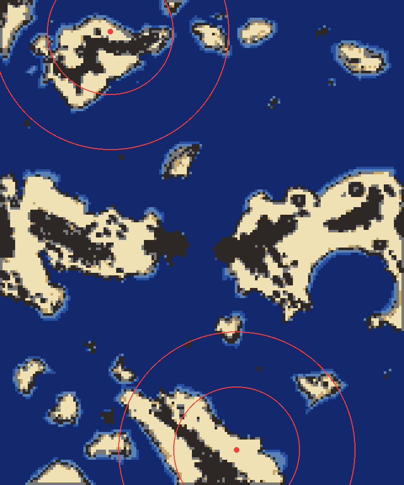
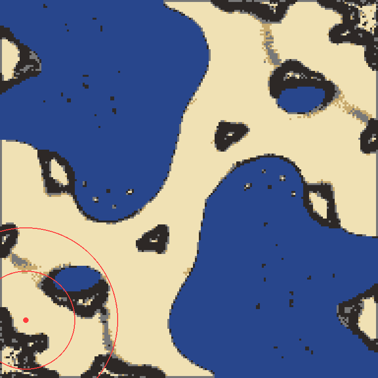

# TECH on cramped maps: measuring the ground and the harbour layout

Status: **built** as the harbour (D-121, [`tech_harbour.md`](tech_harbour.md)). The design below
was adjusted in play: the harbour is bootstrapped by a hover plant (a land
constructor cannot reach water deep enough for a shipyard), and it starts at the
second advanced fusion or 15 minutes in. The layout-choice survey at game start
is not built; the harbour keys on the map file's land-locked flag.

## What happened on Tundra Continents

TECH starts on a small island (north spot (2800, 800), south spot
(6000, 11400)). Played on build106 (16 AIs, TECH on the north island):

| Run | What TECH did |
| --- | --- |
| before D-120 | 4 units and +8 metal at 30 minutes. The factory pair did not fit, the layout switched **off**, and every reservation was refused ("layout is off for this AI"): no lab, no turbine, nothing. |
| reservations kept on | wind turbines and constructors, but still no lab: the start lab needs a pinned layout slot (slot -1). |
| first lab by ring search | lab, 33 turbines, +460 energy floating, **+13 metal** at 22 minutes. Converters ("no site" 1608 times), advanced solars and the advanced lab found no site: they are all placed relative to the factory pair and turret box, which do not exist here. |

The island has 3 metal spots within 2500 elmos. Every metal TECH gets beyond
about +15 must be converted from energy.

## Measuring the ground

`tools/playtest/widgets/build_area.lua` tests every 64-elmo cell with the
engine's build test. It checks a construction turret, a T1 bot lab and an
advanced fusion, counting trees as reclaimable, and sorts water by depth.
`tools/playtest/build_area.py` draws the survey and measures it around a spot.

| Map, TECH spot | Radius | Land | Lab ground | Largest connected lab patch | Floatable water (15+ deep) |
| --- | ---: | ---: | ---: | ---: | ---: |
| Supreme Isthmus (837, 10407) | 3000 | 15.4 Mm² | 10.0 Mm² | **9.1 Mm²** (2215 cells) | 0.9 Mm² |
| All That Glitters (4211, 609) | 3000 | 15.4 Mm² | 12.2 Mm² | **12.1 Mm²** (2949 cells) | 0 |
| Tundra north (2800, 800) | 1600 | 3.5 Mm² | 1.5 Mm² | **0.75 Mm²** (184 cells) | 2.6 Mm² |
| Tundra north | 3000 | 5.8 Mm² | 2.5 Mm² | **1.0 Mm²** (247 cells) | 12.0 Mm² |
| Tundra south (6000, 11400) | 3000 | 6.5 Mm² | 3.6 Mm² | **2.0 Mm²** (497 cells) | 12.3 Mm² |

Tundra: tidal 15, wind 1 to 16. The water off both islands is 25+ deep within
a few hundred elmos of the shore.

What a +200 metal economy needs when the metal comes from converters:
- 200 metal/s needs 11,600 E/s through about 19 advanced converters. That is
  4 advanced fusions, or 10 naval fusions.
- Footprints: an advanced fusion is 6x6 (96 elmos square), an advanced
  converter 4x4.
- The whole core, with turrets, is about 0.15 Mm².

So Tundra's island has enough total ground. What it lacks is one big flat
rectangle: the factory pair plus a 13-wide turret box needs one, and the patches
are split by the central ridge.

## Choosing the layout at the start

Measure once, at the start, with the script's own terrain tests:
- sample a 64-elmo grid within 2000 of the start with
  `aiTerrainMgr.CanReserveBuilding` (lab and turret), and `FlatFraction` and
  `BuildableFraction` over each cell;
- flood-fill the lab cells from the start;
- count floatable water with `GetElevationAt` below -15.

Then pick a layout:

| Layout | When | What it does |
| --- | --- | --- |
| **open** (today's) | largest lab patch ≥ 4 Mm² | the factory pair, turret box, forward and front clusters (D-085 to D-119) |
| **compact** | largest lab patch 0.5 to 4 Mm², little water | the pair and box shrink to fit the largest patch (fewer box columns, one turret row), clusters placed patch by patch |
| **harbour** (new) | the start is land-locked (`Global::Map::LandLocked`), or floatable water within 1600 exceeds lab ground | the land core below, most of the economy on the water beside it |

Tundra is **harbour** from both spots: floatable water 2.6 Mm² against 1.5 Mm²
of lab ground within 1600, and the start is land-locked.

## The harbour layout

Land keeps only what cannot float: mexes, the T1 and advanced labs, the
advanced fusions (land only, and 25% better per metal than the naval fusion),
and the nuke silo.

- **Land core.** The T1 lab at the commander. The advanced lab on the largest
  lab patch, facing its open side. Advanced fusions on the remaining lab
  patches, each patch taking whole ones only.
- **The quay.** One or two rows of floating construction turrets
  (`armnanotcplat` / `cornanotcplat` / `legnanotcplat`: 200 build power, 230
  metal, same as on land). They run along the shore nearest the labs, in water
  15+ deep, so their 400 reach covers the labs on land and the harbour behind
  them.
- **Harbour rows, seaward of the quay:**
  - tidal generators first (steady 15 E each on Tundra, 85 to 90 metal);
  - floating T1 converters early (`armfmkr` / `corfmkr`: 1 metal, 70 E, about
    1 metal/s);
  - floating advanced converters from T2 (`armuwmmm` / `coruwmmm`: identical to
    the land advanced converter, 600 E at 1.72%);
  - naval fusions in 25+ water (`armuwfus` / `coruwfus`: 1200 E) once no land
    patch takes another advanced fusion.
- **Build order:**
  1. mexes, T1 lab;
  2. tidals, plus a few turbines on leftover land;
  3. floating T1 converters;
  4. advanced lab, then T2 constructors;
  5. advanced fusion on land;
  6. quay turrets, then floating advanced converters in sets of 5 behind them;
  7. more advanced fusions while land lasts, then naval fusions.
- **Placement engine.** No new native code is needed for most of it:
  - `ReserveGrid` / `ReserveNanoBlockAt` already reserve rows;
  - `CanReserveBuilding` and D-116's engine test already check each footprint
    (the water variants refuse land by themselves);
  - one helper finds the shoreline strip: water cells 15 to 40 deep next to a
    land cell, nearest the labs.

## Combat on an island: air or sea

An island TECH's land units cannot reach anyone, so its T2 fast-assault rush
and spam labs are wasted there.
- **Air** by default: TECH already builds the T1 and advanced aircraft plants
  (D-103). Its endgame plans switch from the land assault to T2 air (bombers
  and gunships), keeping the nuke. Air needs one small land footprint and
  reaches every island.
- **Sea** when no allied SEA role exists and the enemy bases are on water
  routes: an advanced shipyard 30+ deep off the quay, then the underwater
  gantry. On Tundra, 9 of the 16 spots are SEA, so TECH goes air.
- The spam labs (D-117) are not built on a land-locked start. Spam is already
  off there (`Global::Spam::AllowLandLocked`); the front clusters must follow.

## Implementation plan

1. **Measure and choose** (script): `Layout::Survey()` at the start, with the
   numbers logged. The layout type is kept on `Layout` and read by everything
   that places.
2. **Harbour placement:**
   - the land-core placement for the advanced lab and advanced fusions;
   - the shoreline strip;
   - the quay turrets and harbour rows;
   - the water variants swapped in where the def has one. The T1 converter
     that found "no site" 1608 times becomes a floating converter.
3. **Build order:** tidal before wind on the harbour layout; floating
   converters in the chain.
4. **Combat:** the land-locked branch of the endgame plans: air (or sea, by
   the rule above); no front clusters or spam labs.
5. **Invariants:**
   - a harbour TECH has a lab within 5 minutes and an advanced lab within 15;
   - a structure that found no land site is tried on water before it gives up.
6. **Played:** Tundra north and south, plus Supreme Isthmus and All That
   Glitters to show the open layout is unchanged.
