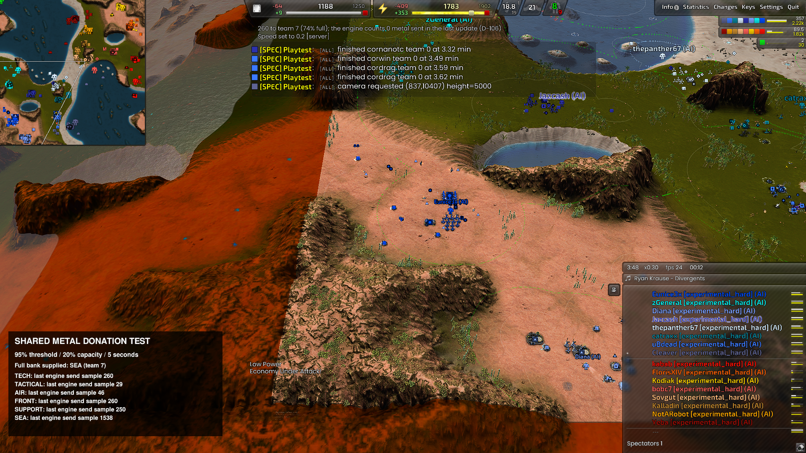

# Shared overflow metal donations

Implementation plan (2026-10-03): lift TECH's D-106 overflow donation into
`TeamEconomy`, called once by the shared economy callback for TECH, AIR, FRONT,
SEA, TACTICAL and SUPPORT in all three experimental profiles.

- Preserve the inclusive 95% metal-storage threshold, the 20% storage budget,
  five-second interval, 25-metal minimum transfer, and lowest-filled live ally
  ordering. Human allies remain eligible. Never send more than the remaining
  budget or the recipient's available storage.
- Preserve TECH's exact opening eligibility: a completed T1 bot lab or its
  existing T2-phase recovery exception. Other roles become eligible after a
  completed factory of any terrain/tier. Remember eligibility through factory
  reclaim/loss and role changes for the running instance.
- Keep the existing `Global::RoleSettings::Tech::TeamShare*` setting names as
  the single shared configuration, preserving existing overrides. Do not create
  six separately tunable copies.
- Leave TECH's dedicated-air-constructor maintenance in `TechBuild::Tick`;
  it was embedded in the donation function but is unrelated to sharing.
- Move INV-033's overflow check into the shared callback too. Extract and test
  the allocation arithmetic, compile/load each experimental profile, and run a
  rendered controlled game with all six roles and real resource transfers.

This change does not introduce roles into the legacy native-driven profiles.
It changes neither energy sharing nor constructor/unit donation.

Implemented as [D-175](decisions.md#d-175---one-metal-overflow-donation-policy-for-all-six-roles).
The native DLL is unchanged. Shared script ownership avoids separate per-role
timers or budgets. Allied snapshots are refreshed only on the existing donation
interval; there is no new per-unit scan.

## Validation

All six allocation tests pass, along with the complete native/AngelScript
regression suite (288 script policy tests total). All three experimental main
profiles compile. Script/DLL API parity, role documentation, invariant practice
and whitespace checks pass. The documentation link checker reports only the
eight existing links to the unwritten hover reference (KI-404).

Three rendered 16-AI games on Supreme Isthmus v1.7 ran for five game minutes,
with Armada, Cortex and Legion represented. The fixture supplies metal and
missing factories; it is a transfer-capability test, not a natural economy
benchmark. The pinned DLL SHA-256 is
`411a8924354ef767dd49a8999d8b487fcbe668682d87169766bd4e2ca5dfb65a`.
Game: `Beyond All Reason test-31479-433a460`; engine: `recoil_2026.07.04`.

| Profile and retained run | Sharing result | Strict match result |
| --- | --- | --- |
| balanced: `build-theatres/d175-share-balanced/runs/20261003-000806` | All six roles sent; AIR sent 250 from 1,250 storage at 95%, recipient independently recorded 250 received. Full-bank TECH opening sent nothing until after its lab completed. | PASS |
| hard: `build-theatres/d175-share-hard/runs/20261003-001225` | All six roles; 93 audited donation decisions. Budget, threshold, ally-only recipients, minimum gift, opening protection and five-second interval pass. | FAIL: TECH INV-008 at frame 7621 |
| terrible: `build-theatres/d175-share-terrible/runs/20261003-001228` | All six roles; 103 audited donation decisions, same checks pass. | FAIL: TECH INV-008 at frame 7741 |

No script errors or sharing invariant INV-033 failures occurred. INV-008 reports
two construction turrets not joining a TECH lab reclaim, an already tracked
category (KI-427). These runs do not isolate its cause and the strict failures
are retained. The final fixture adds first-factory completion witnesses used
by the hard/terrible transfer audits; the balanced preliminary fixture lacks
that full witness stream. Evidence is in
[the run manifest and audits](benchmarks/d175-team-sharing.json).

The screenshot overlay reports the engine's most recent send sample. That can
include automatic engine sharing as well as the explicit AI gift; exact policy
amounts come from the audited `[ROLE][Share]` lines, not the overlay alone.

## Reproducing the controlled test

Stage `playtest.py` on Supreme with `--roles all`, a pinned `--dll`/`--data`,
`--ai-option profile=experimental_hard` (or either other experimental profile),
`--minutes 5`, and rendered screenshots. Run
`prepare_team_share_check.py --dir build-theatres/<test-dir>` before launch.
Watch using `--checks team_share --keep-going`, then run
`audit_team_share.py build-theatres/<test-dir> --output <audit.json>`.
The audit is a focused donation verdict; it does not replace strict checks.

## Limits

The supplied full-team scenario also exposed repeated circulation between
nearly full allies. The requested TECH recipient rule is preserved; possible
hysteresis/absorption improvements are recorded separately as KI-484. The
native-driven legacy profiles have no role framework and retain their prior
sharing behavior (KI-483). Save/load in a factory-free recovery remains part of
the existing script-state limitation KI-209. Neither a human recipient nor a
save/load cycle was explicitly exercised here; the native allied-team resource
API is unchanged.
