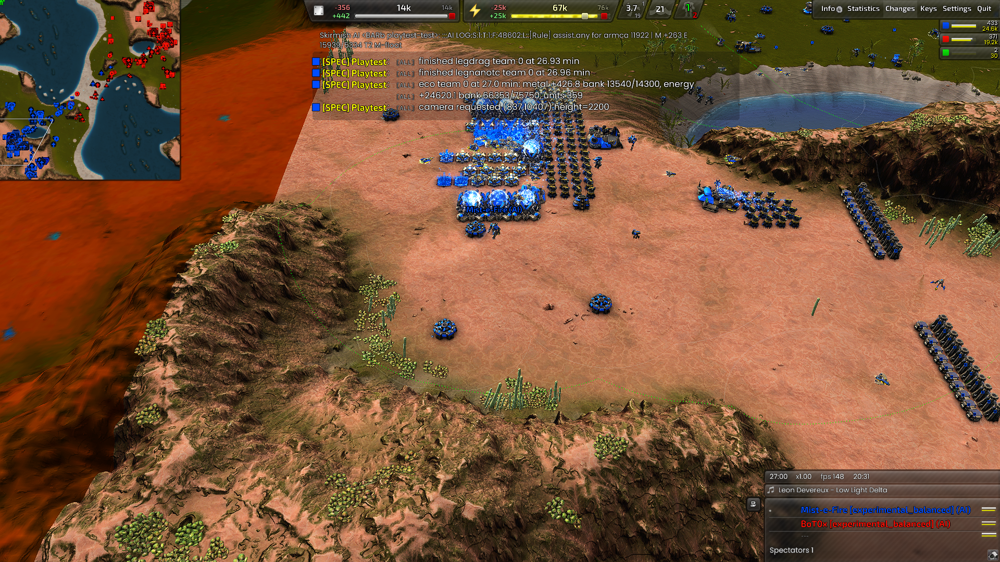
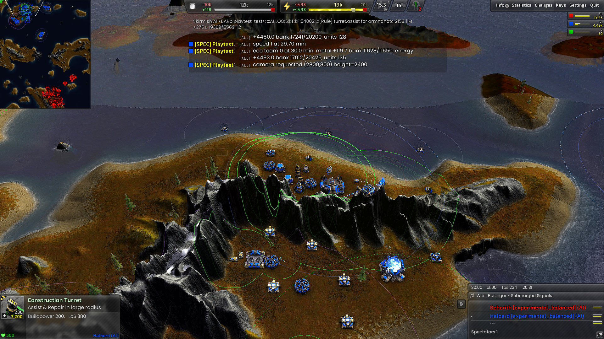

# TECH T2 recruitment by start type (D-182)

## Cause and correction

Supreme Isthmus marks both TECH starts `landLocked=false`. The normal TECH
T2 branch already selects Sprinters, Fiends or Hoplites for these starts.
However, `AmphibiousOps::Produce` ran before that branch and admitted a
Telchine whenever its separate +80 metal budget permitted. It never checked
the start flag, so it displaced normal ground production even on connected land.

TECH's optional Telchine producer now requires its own `Global::Map::LandLocked`
flag. The native fallback also excludes Telchines at other TECH starts when
amphibious waves are disabled. Temporary native-selection caps are restored
after the call. AIR auxiliary production, Marauder recruitment, already-owned
amphibious combat and all TECH economy/lab lifecycle rules are unchanged.

This does not lower TECH's ordinary combat income gate. An ordinary TECH start
below that gate continues its economic work instead of spending the Telchine
budget on premature ground combat. Legion's existing advanced-lab fast bot is
the Hoplite (`legstr`); Phobos (`legcen`) is not an advanced-lab build option.

## Verification

- 22 standalone amphibious policy tests pass, including ordinary TECH starts,
  landlocked TECH starts and unchanged AIR eligibility.
- Script/DLL API parity: 276 used members, zero findings.
- The isolated one-minute compilation game loaded both TECH AIs with no script
  error. Its generic smoke verdict is FAIL because its opening/screenshot
  expectations were not suitable for that headless one-minute compilation run;
  it is not counted as a passing gameplay test.
- Natural, rendered Supreme and Tundra checks both pass the focused recruitment
  audit. Their complete game verdicts remain **FAIL** for TECH invariant
  categories already tracked under [KI-472](known-issues.md#ki-472---full-invariant-and-performance-validation-remains-incomplete-after-metal-map-support).
  No script errors or INV-127 violations occurred. These are not clean full-game
  regression results, and there was no paired baseline to assign those other
  failures to this change.

| Map / team | Start flag | Completed by 40 minutes | First completion | Wrong choice started |
| --- | --- | --- | --- | --- |
| Supreme / Legion TECH | false | 107 Hoplites | 22:41 | 0 Telchines |
| Supreme / Armada TECH | false | 92 Sprinters | 22:16 | 0 amphibious bots |
| Tundra / Legion TECH | true | 22 Telchines | 24:49 | 0 Hoplites |

Supreme started 109 Hoplites; two were unfinished at the observation cutoff.
Tundra's Armada opponent did not complete an observed T2 bot, so it is not a
positive Armada island-production control. AIR/Marauder eligibility is covered
by unchanged call paths and pure scope tests, not new AIR/Marauder games.
The waves-disabled native fallback is code-reviewed but not separately played.

Immutable evidence: [Supreme](benchmarks/records/tech/combat/t2-ground-start/2026-10-03/20261003T233544Z-ff3c558b/README.md),
[Tundra](benchmarks/records/tech/combat/t2-landlocked-start/2026-10-03/20261003T233412Z-25a490df/README.md),
and [compilation run](benchmarks/records/tech/combat/t2-start-compile/2026-10-03/20261003T232706Z-5ea12e39/README.md).
Each natural record includes `start-selection-audit.json`, actual start flags,
counts, first completion times, invariant counts and the retained log hash.

Supreme's factory and economy at 27 minutes:

Tundra's island base and advanced bot lab at 30 minutes:

The screenshots show the operating bases; production counts come from the
independent engine observer, not visual inference from unit icons.

The observer records engine `UnitCreated` events with an actual builder and
their corresponding `UnitFinished` events. It supplies no units, resources or
orders. Both games use `EndgamePlan="t2rush"`, zero bonus, the map's real TECH
start positions, and `deathmode=neverend`. The pinned DLL is
`7be8085c281c3a0f` (7,774,393 bytes), Recoil `2026.07.04`, BAR
`test-31479-433a460`. These two-AI games validate recruitment, not 8v8 strength.

Reproduce with `tools/playtest/playtest.py run`, the
[`t2_ground_start`](../tools/playtest/checks/tech/combat/t2_ground_start.json) or
[`t2_landlocked_start`](../tools/playtest/checks/tech/combat/t2_landlocked_start.json)
check, and
[`tech_t2_start_watch.lua`](../tools/playtest/widgets/tech_t2_start_watch.lua).
Use `--role TECH --roles TECH --side legion --set 'EndgamePlan="t2rush"'
--minutes 40 --speed 20 --keep-going`, the named map and map configuration,
and the pinned DLL/game above. Allocate a fresh categorized run directory first.

Repository checks: invariant registration and role documentation pass. The
documentation-link checker retains eight pre-existing missing `hover.md` links
(KI-404). Storage migration verification confirms all 130 historical evidence
files are unchanged, but flags the active `air_build_power.json` definition
intentionally revised in D-181 (KI-492); its original migration hash is retained.
