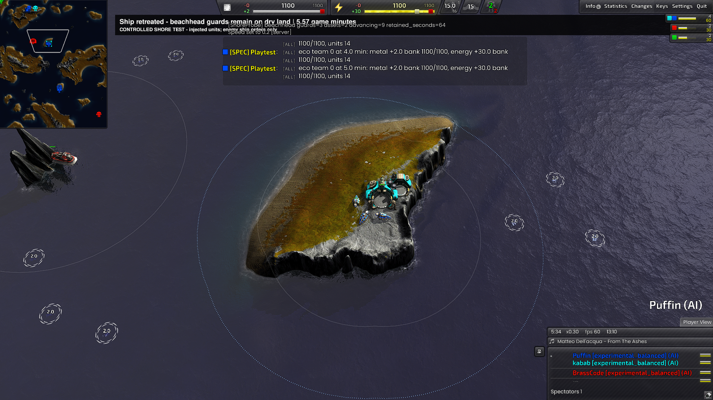
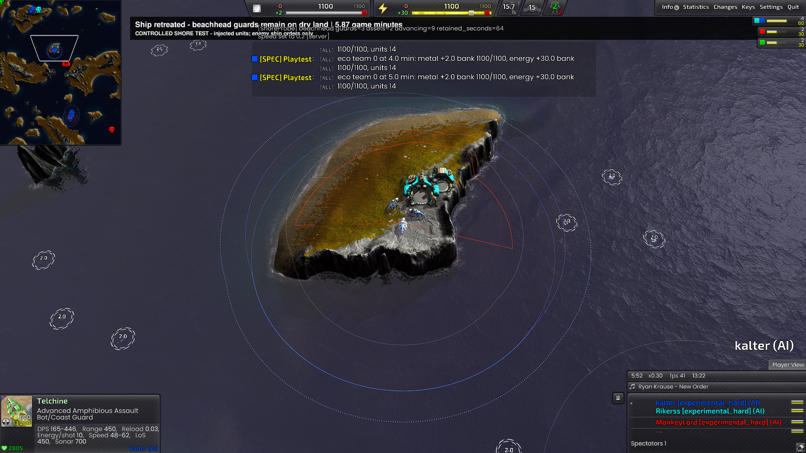
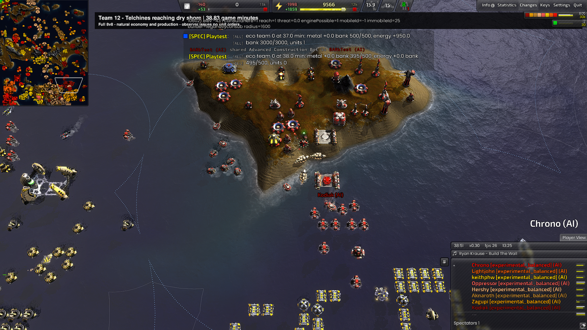
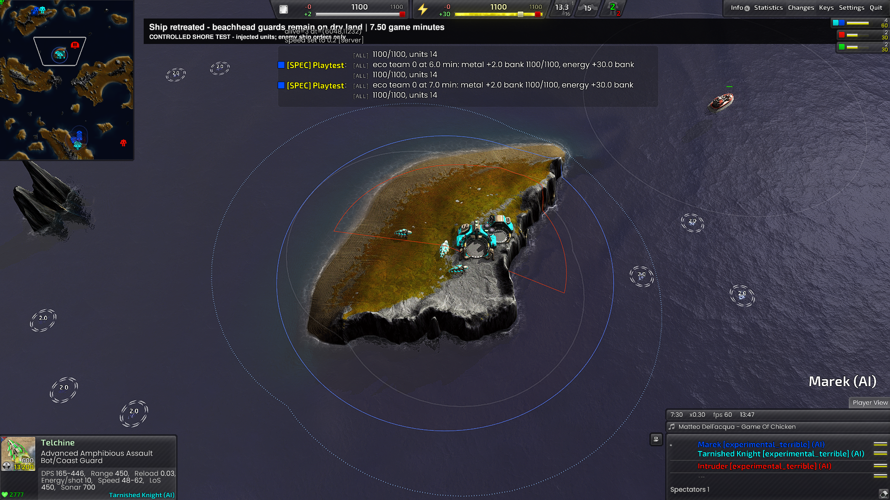
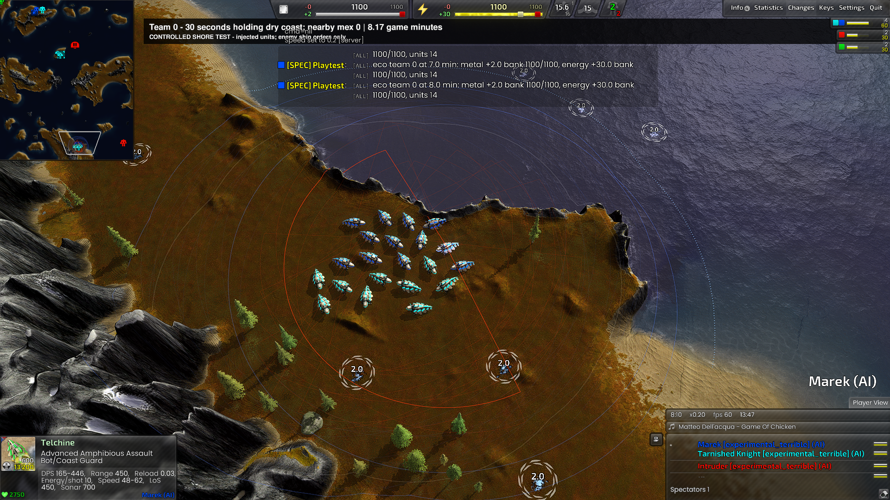

# Telchine beachhead changes and Tundra evidence (D-160)

The retained-guard policy and separate recruitment budget are implemented for
experimental TECH/AIR. TECH's lab reclaim/rebuild rules remain unchanged,
as explicitly chosen by the owner on 2026-10-01. The full-match arrival
constraint remains: a +80 unit gate cannot produce without an existing lab.

## Behavior

- Telchines require a complete ten-second minimum of +80 metal, their unit
  cost plus 300 metal in reserve, an energy buffer and no energy stall. The
  next admission waits long enough to budget at most 15% of measured metal
  income and 20% of measured energy income. Costs come from the UnitDef.
  These are initial configurable policy values, not a demonstrated optimal
  PvP build order. Constructor and transport obligations keep priority.
- No new ground factory is ordered. Marauders retain their existing general
  combat gate. Native fallback selection temporarily excludes these two
  managed definitions to prevent an unbudgeted batch.
- Shore candidates use actual completed allied mexes, geothermal structures
  and factories on the same dry component, with a bonus for an observed naval
  approach. Empty beaches have no guard value. No unseen enemy data is used.
- A six-unit Telchine wave can retain three guards while at least three
  attackers continue. At most two groups per AI guard economic beachheads.
  Allied claims expire after sixty seconds, refresh every twenty seconds and
  resolve simultaneous conflicts deterministically.
- Guards use hold-position and dry-component routes only. They can reposition
  locally toward a better firing position, but a ship never becomes their
  underwater destination. Loss of economic value or a winning allied claim
  releases the group. Initial landings retain the 240-elmo quorum; subsequent
  security tolerates dry dispersal within 360 elmos on that same landmass.

The official [Telchine reference](https://www.beyondallreason.info/unit/legamph)
supports shore firing and beachhead use and explicitly excludes firing while
submerged. The exact recruitment shares, reserves and guard bounds above are
our design choices. See the [written plan](telchine-beachhead-implementation-plan.md).

## Controlled scenarios

These supply units/assets, freeze economy and production, grant global LOS
and leave every Telchine command to the AI. The fixture orders only the enemy
ship/commander. They prove movement/coordination capabilities, not natural
production or competitive balance.

| Scenario | Result | Evidence |
| --- | --- | --- |
| TECH, balanced, twelve Telchines | PASS | Three guards, two surviving allied factories, nine attackers advanced; 180 dry hold samples, no pursuit, ship alive 1,440 elmos away. |
| AIR, hard, twelve Telchines | PASS | Three guards, two factories, nine attackers advanced; 180 dry hold samples, no pursuit, ship alive 1,420 elmos away. |

Archives: `build-theatres/d160-beachhead-01/runs/20261001-131146/` and
`build-theatres/d160-air-beachhead-hard-02/runs/20261001-132323/`. Both ran
twelve game minutes with no script errors, invariants or crashes.

The first AIR fixture mistakenly assigned TECH to the frozen asset-holder.
Its gifted T2 lab correctly triggered production/layout invariants. That
failed run is retained at `d160-air-beachhead-hard/runs/20261001-131859/`; the
repeat used a FRONT asset-holder without frozen TECH obligations.

The first combined TECH/AIR fixture,
`d160-allied-beachhead-terrible/runs/20261001-133647/`, failed: allied traffic
pushed landed units outside the original regroup circle. Twelve non-guards
waited indefinitely in SECURE. Claims correctly retained a single AIR guard
group, but the assault did not advance. The correction allows modest dry
dispersal after initial landing. The fixture now tracks either ally's guard
rather than assuming TECH wins the site.

## Natural sixteen-AI matches

Both sides use one TECH, one AIR, two TACTICAL and four SEA roles with matched
faction counts. Start coordinates are the real map positions; terrain is not
symmetric. All sixteen AIs use normal economy/production, without gifts,
resource boosts or global LOS. The table uses engine GameOver; the spectator
limitation below invalidates treating that as the competitive endpoint.

| Run | First Telchine | First shore | Completed by engine GameOver | Damage / kills | Match end |
| --- | --- | --- | --- | --- | --- |
| D-159 reference, original asymmetric roles | 32:58 | 35:06 | 7 | 0 / 0 | 38:37 |
| D-160 seed 1601, paired roles | 36:40 | 38:50 | 4 | 0 / 0 | 40:33 |
| D-160 seed 1602, paired roles | 35:55 | 38:22 | 18 | 0 / 0 | 45:46 |

Seed 1601 archive: `build-theatres/d160-natural-1601/runs/20261001-132809/`.
Three distinct units landed and one wave secured a foothold before engine GameOver.
No retained guard or naval encounter occurred before engine GameOver. Post-victory
activity is excluded. This is not evidence of improved combat effectiveness.

The strict report remains FAIL: 47 pre-victory TECH invariant lines
(INV-013:1, 016:5, 018:16, 052:1, 019:2, 008:2, 029:7, 015:8, 022:1, 017:4).
There are no script errors or amphibious INV-096/097 failures.

Seed 1602 archive: `build-theatres/d160-natural-1602/runs/20261001-134628/`.
Six distinct units landed (nineteen landfall events), six wave stops secured,
and no Telchine was lost. One fallback coastal hold occurred at an enemy
start; no asset-backed retained guard was created before GameOver. Zero
naval hits means pursuit restraint remains unexercised naturally. The strict
report is FAIL on eighty-one pre-GameOver TECH warnings, including new
occurrences of INV-053, which require separate blocked-set diagnosis.

**Harness limitation discovered during analysis:** the spectator's separate
team spawned a commander which did not die immediately as the harness comment
expects. In seed 1602 all eight northern AI teams were dead by the 26-minute
census (before any Telchine completed), while engine GameOver waited until 45:46. The observer commander
survived and recorded minor combat. Thus GameOver-based totals include some
after-competition activity and these are sixteen-AI natural-economy tests,
not clean PvP balance benchmarks. No combat-effectiveness claim is based on
that interval. Seed 1601 likewise had all eight northern AIs dead by the
38-minute census, before its first Telchine shore landing. Keep KI-453 and correct the spectator fixture before using
these runs for comparative win-rate or arrival-impact statistics.

The corrected combined encounter passed sixteen minutes, archive
`build-theatres/d160-allied-beachhead-terrible-03/runs/20261001-134844/`:
at 6:24 exactly three guards remained and twenty-one attackers had advanced.
At 6:28 a guard hit the enemy ship. At 7:29 all 180 samples were dry and in
hold-position, with no submerged ship attack, two surviving factories and
the living ship 1,421 elmos away. The guard persisted to sixteen minutes.
There were no script errors, invariants or crashes.

The intermediate repeat `d160-allied-beachhead-terrible-02/runs/20261001-134242/`
proved all twenty-one attackers advanced by twelve minutes, but its observer
started the ship encounter before the assault cleared, miscounting temporary
passers as guards. That failed report remains. The final observer waits for
exactly three at the beach and all twenty-one beyond it before starting the
same live-target, sixty-second no-pursuit check; no behavior threshold or
invariant forbid was relaxed.

## Actual screenshots

TECH holds the island after the ship retreats; nine attackers continued:

AIR repeats the same behavior:

Seed 1601's natural landfall at 38:51, before engine GameOver. This is an
allied-held island and no combat contribution is implied:

The final combined encounter: three guards and the surviving retreating ship:

All twenty-one other TECH/AIR units have reached the onward island:

## Other diagnoses and scope

Donation accepted any T2 constructor although requests are produced from the
bot-lab roster. Naval construction subs therefore consumed land-bot requests
and remained building while queued as ferry cargo. Admission now uses the
same bot roster as production; dedicated air-constructor claims are preserved.
The ferry row precedes discretionary harbour building. Seed 1601 has no
INV-041, versus nineteen before victory in D-159.

INV-018 incorrectly rejected a finished lab when the current enemy front
reversed. It now compares the saved construction facing and still rejects
physical exit obstruction. Cramped island layouts remain a separate problem:
`ReserveExitCone` is gated by `HasComplex`, while fallback labs still exist
and nearby native placements can crowd them. Offshore harbour factories also
reach an invariant intended for land turret-box tenants. These require
separate geometry/ownership fixes; they are not waived from strict checks.
Other TECH budget/packing/deadline warnings remain tracked in KI-427.

## Build and verification

Pinned DLL: `build-theatres/d160-build-01/SkirmishAI.dll`,
SHA-256 prefix `082783d682ef926e`, with matching debug symbols. Native snapshots
and checked task transfer were built together with the policy. Standalone
native suites pass; eighteen amphibious policy tests pass. API parity checks
265 used members without findings. All three experimental profiles have
loaded in-engine. The final DLL and matching 337,449,586-byte debug file were republished with
current data to the engine build output
`C:/bardev/bar-RecoilEngine/build-amd64-windows/install/AI/Skirmish/BARb/stable`.
Both hashes match the pin; DLL API parity is clean. The live game installation
was not modified.

Invariant-practice and role-document checks pass. Documentation checks retain
eight pre-existing links to missing `roles/hover.md` (KI-404). Unit-helper checks
retain the two existing unreachable sonar references (KI-425); this change
adds no new roster classifications. Failed reports remain archived.

Machine-readable audits: [seed 1601](telchine-natural-1601.json) and
[seed 1602](telchine-natural-1602.json). Their census warnings make the
spectator-endpoint limitation explicit.

Final hard-profile AIR repeat, `d160-final-hard/runs/20261001-135502/`:
PASS for twelve minutes with the final production code; three guards,
nine advancing attackers, 180 dry hold samples, ship alive 1,422 elmos away.

Final balanced-profile combined repeat, `d160-final-balanced/runs/20261001-135619/`:
PASS for sixteen minutes with the final production code. Twenty-one attackers
cleared the guarded island by 11:29; three guards retained both factories and
passed 180 dry hold observations after the ship escaped 1,421 elmos away.
This repeats the terrible-profile coordination/retreat result with different
actual congestion and timing. All final test engines were stopped.
