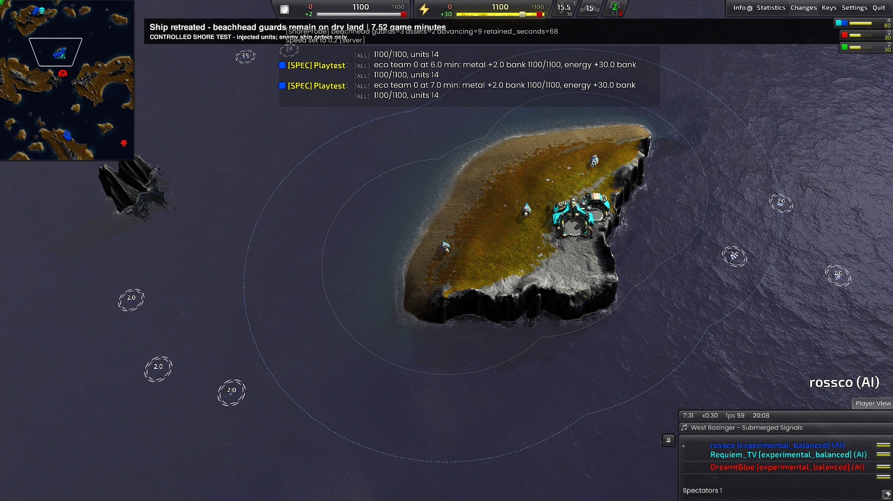
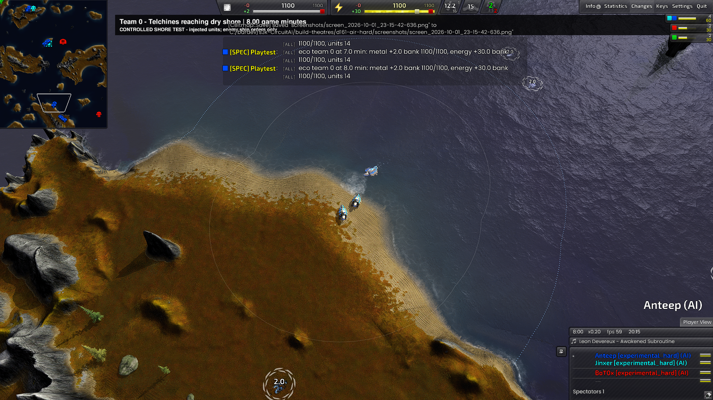
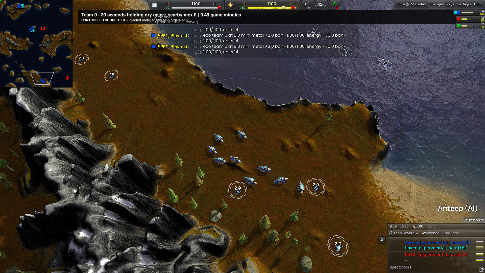
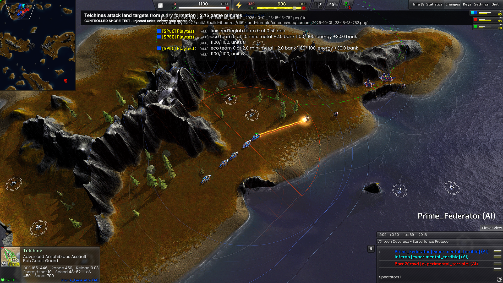

# Telchine terrain and formation results (D-161)

2026-10-01. The [plan](telchine-perimeter-plan.md) preceded production changes.
Scope: experimental TECH/AIR Telchines. TECH's exact lab reclaim/rebuild cycle,
recruitment budget, economy priorities and Marauder water preference are unchanged.

## Behavior and research

Telchines now try a strictly dry route before an amphibious route with water
cost 6 and land cost 1. Routes check the loaded movement footprint, fine slope
samples and the corridor between coarse cells, including seabed slopes. Allied
static structures block routes; occupied strategic anchors get nearby dry
approaches. A failed terrain query no longer becomes an unchecked short move.

The script assigns terrain-fitted dry firing positions, nominally 192 elmos
apart at the shore and 96 inland. Shore positions follow a local shoreline
tangent and fit available ground. Positions remain stable while late arrivals
join. A unit without a fitted slot retains the validated parent dry anchor;
constrained terrain can reduce the explicit slot count. In the successful TECH
guard, two explicit member slots plus one parent anchor produced three well
separated actual units. Do not interpret the nominal spacing as a guaranteed
exact distance between moving unit centres.

The [official Telchine reference](https://www.beyondallreason.info/unit/legamph)
states that neither weapon fires submerged, lists the heat ray's 450 range and
maximum-range damage falloff, and describes coastal defence and amphibious
assault. Dry mutual support, limited exposure during crossings and securing
intermediate land are tactical deductions from those mechanics. This work does
not establish an optimal competitive build order or measured PvP win-rate gain.

## Controlled Tundra results

Engine `recoil_2026.07.04`, game `Beyond All Reason test-31450-6562fb1`, map
`Tundra Continents v2.3.1`. The fixtures gift units, freeze builders/production
and enable global LOS. All friendly Telchine movement and firing remain AI-owned.
The observer orders the enemy ship to retreat after an attributed weapon hit.

| Run / profile | Duration | Outcome |
| --- | ---: | --- |
| `d161-tundra-05` / balanced TECH | 16 min | PASS: 3 guards, minimum spacing 304, span 654, 2 allied factories protected, 9 attackers advance |
| `d161-air-hard` / hard AIR | 16 min | PASS: 3 guards, minimum spacing 146, span 473, 2 allied factories protected, 9 attackers advance |
| `d161-land-terrible` / terrible TECH | 8 min | PASS: dry approach, actual land fire, 5 nearby dry Telchines spanning 402, all 6 injected targets destroyed |

Each shoreline run independently observed 180 guard samples over one minute
after the ship started retreating: zero wet positions, zero submerged ship
attack commands, zero non-hold states. The ships remained alive, respectively
1,421 and 1,422 elmos from the anchor. The terrain-only engine check accepted
all 3,048 TECH and 2,851 AIR movement targets sampled up to probe completion.
No script errors, invariant violations, illegal movement targets or crash markers
appeared in the final runs.

The Tundra land approach logged 5,188 dry elmos and zero water elmos. First
Telchine damage was observed at frame 3,855 (2:08.5); the sixth test target was
destroyed at frame 4,781 (2:39.4). The unit remained on ground height 45 when
first firing. The group secured the island before its onward water crossing.
The test proves actual land combat near a shoreline; it uses the coastal
formation there, as intended. Destroyed-target totals are observer counts;
first fire is individually attributed, not every kill. The archived Tundra
land log also satisfies the later ordering check because its first observed
fire occurs after formation deployment and minute one.

### Screenshots

TECH retains a spread dry perimeter after the ship retreats (7.52 game minutes):



AIR uses a beach landing on its onward route (8.00 game minutes):



AIR's advancing force regrouped on the next landmass (9.49 game minutes):



Tundra land contact: heat-ray fire from the dry coastal approach (2.15 game minutes):



## Inland Supreme check

`Supreme Isthmus v1.7`, balanced TECH, eight game minutes, same binary/game.
The first check (`d161-inland-supreme/runs/20261001-202208`) passed its original
checks, but first fire at frame 950 preceded formation deployment at 960.
That sample could describe the spawn cluster, so it was insufficient evidence
of combat after deployment. Tightened the observer to sample after game minute
one and require the formation event before both fire/spread checks.

`d161-inland-supreme-02/runs/20261001-202524` passed the stricter check:
603 dry route elmos, zero water, five fitted inland positions spanning 336 at
frame 960, then attributed fire at frame 1800 with four actual dry nearby units
spanning 319. All six targets were destroyed by frame 2275. Three of six
Telchines survived. The frozen economy had only +30 energy and an empty bank
at minute one, so casualty efficiency is confounded by weapon-energy shortage.
This is formation/route capability evidence, not a fair combat-value benchmark
(KI-456).
All strict invariants, terrain and error checks stayed clean through minute eight.
The repeat's automatic camera captured the wrong area; those empty images are
not presented as visual combat evidence. Tundra's inspected screenshots above
remain the visual proof of the coastal behavior and land fire.

## Iterations retained as evidence

Run paths below are relative to `build-theatres/`; archived logs and reports
remain local, and failed checks were never removed to obtain a passing result.

| Archive | Finding and correction |
| --- | --- |
| `d161-tundra-01/runs/20261001-194121` | Failed at frame 4,666 with Lua memory exhaustion; also caught stale arrival state after assigning slots. Arrival is recomputed. Memory allocation owner remains unproven (KI-454). |
| `d161-tundra-02/runs/20261001-194851` | Completed 16 min but terrain observer rejected targets: seabed slope and full-footprint sampling were incomplete. The naval fixture also fired before departing attackers cleared the island; it now waits for exactly 3 retained guards and 9 onward units. |
| `d161-tundra-03/runs/20261001-195510` | Completed 16 min with legal terrain and no invariant errors, but failed functional expectations. Slots could overlap allied buildings; deferred idle retries were being dropped. Corrected both; aligned member arrival tolerance at 128 elmos after actual centres stopped 97-106 away. |
| `d161-tundra-04/runs/20261001-200627` | Stopped after 8.3 min: the new building mask correctly rejected an occupied island anchor but caused the useful objective to be skipped. Added nearby reachable dry approaches. |
| `d161-tundra-05/runs/20261001-200957` | Strict balanced TECH perimeter PASS, full 16 min. |
| `d161-air-hard/runs/20261001-201648` | Strict hard AIR perimeter PASS, full 16 min. Watcher reattached with `--role AIR` during the same game; reported wall time covers only that final watcher. |
| `d161-land-terrible/runs/20261001-201913` | Strict terrible TECH land-combat PASS, full 8 min. |

## Verification and limits

- Native build completed successfully. Published stripped DLL, matching debug
  symbols and current data to the engine build output, never the live BAR install.
- Native/pure suite: layout 76, base geometry, lanes 8, strategic sites 6,
  terrain routes 18, production 128, placement 20, amphibious policy 19 passed.
- Terrain regressions include narrow cliffs between valid endpoints, footprint
  interior slopes, seabed cliffs, reachable ramps, diagonal rejection, allied
  obstacles, dry preference and preservation of Marauder route costs.
- API/DLL parity: 266 used members, zero findings. Role documentation and
  invariant checker: zero findings. Python fixture preparer compiles.
- Existing repository checks still report eight missing hover-document links
  (KI-404) and two sonar helper names (KI-425); these predate this change.
- No natural 8v8 or win-rate claim follows from these controlled runs. Existing
  natural-recruitment/economy and spectator-team limits remain KI-449/450/453.
- One initial memory failure remains KI-454; later stability does not prove its
  root cause. The generated shared amphibious firing note is wrong (KI-455);
  mechanics are corrected in shared handwritten guide
  `../rjm.bar.docs/knowledge/60-tactics/68-telchine-shoreline-tactics.md`.

Final binary SHA-256:

```text
DLL 2bb749a30c62e72c9abd21df8a08d0c50cab27237baa908dee1770622a231b03
DBG f6b46ce975d54376c6bd25ab6a55dd29ab4d4ab43cfbdf1845f3ff6793ffe886
```

The identical pair is pinned in `build-theatres/d161-build-04/` and published
in `C:/bardev/bar-RecoilEngine/build-amd64-windows/install/AI/Skirmish/BARb/stable`.
